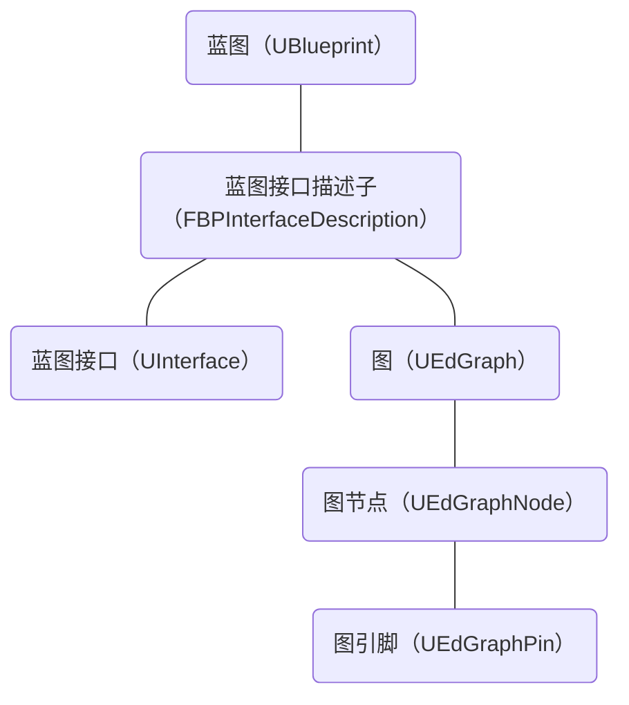
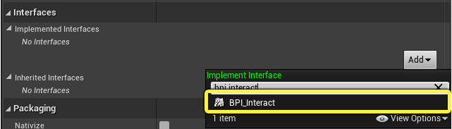
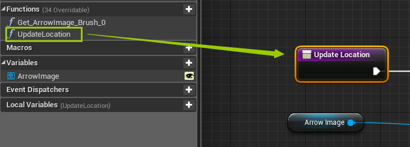
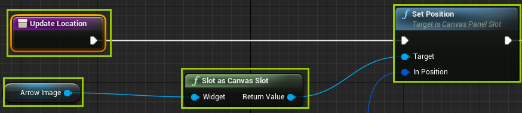
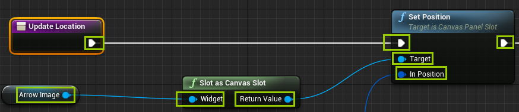
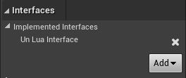
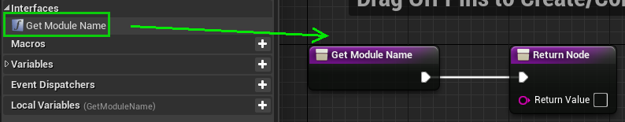

# 蓝图接口


## 蓝图接口的原理

蓝图类分为 C++ 蓝图类和纯蓝图类两种。对于前者，继承蓝图接口类的做法就是在声明时添加继承关系，做法固定且单一；以下主要讨论纯蓝图类的蓝图接口类继承。

蓝图接口类本质上是一种抽象类，在虚幻引擎中称为**蓝图接口（Blueprint Interface）**，对它的继承称为**实现（Implement）**。为了区分蓝图接口类和普通的类，以下统一使用【蓝图接口】和【实现】这两个术语。

蓝图中呈现的内容本质上都是由 C++ 代码实现的。一个蓝图通过蓝图接口描述子记录已经实现的蓝图接口；在蓝图接口描述子中，除了蓝图接口本身，还会以图的形式记录蓝图接口的内容；每个图包含若干图节点；每个图节点包含若干图引脚。整体结构如下：



### 蓝图接口描述子（Blueprint Interface Description）

在蓝图中，`UBlueprint` 的成员属性 `ImplementedInterface` 用于记录已经实现的蓝图接口，类型为 `TArray<FBPInterfaceDescription>`。这些蓝图接口以蓝图接口描述子的形式存在。



```c++
// 蓝图接口描述子，请见源码 Blueprint.h
USTURCT()
struct FBPInterfaceDescription
{
    GENERATED_USTRUCT_BODY()

    // 真正的蓝图接口
    UPROPERTY()
    TSubclassOf<class UInterface> Interface;

    // 蓝图接口包含的图
    UPROPERTY()
    TArray<UEdGraph*> Graphs;

    // ...
}
```

### 图（Graph）

在蓝图当中，一个蓝图函数由一个图所呈现。一个蓝图接口通常会包含若干图，表示蓝图接口的各个成员函数。



```c++
// 图，请见源码 EdGraph.h
UCLASS()
class ENGINE_API UEdGraph: public UObject
{
    GENERATED_UCLASS_BODY()

public:
    // 图包含的图节点
    UPROPERTY()
    TArray<UEdGraphNode*> Nodes;

    // ...
}
```

图的名称通常是蓝图函数的名称。

### 图节点（Graph Node）

一个图通常会包含若干图节点，表示蓝图函数中访问的变量，调用的函数，宏和异步事件，以及执行的语句等子步骤。



```c++
// 图节点，请见源码 EdGraphNode.h
UCLASS()
class ENGINE_API UEdGraphNode : public UObject
{
    GENERATED_UCLASS_BODY()

public:
    // 图节点包含的图引脚
    TArray<UEdGraphPin*> Pins;

    // ...
}
```

图节点的名称形如 `K2Node_{Name}_{ID}`，由具体子步骤的名称和实例 ID 共同决定。以上图的子函数 `SetPosition` 为例，它对应的图节点可能名为 `K2Node_SetPosition_0`，如果蓝图函数 `UpdateLocation` 被多次调用，或者其中还存在其他的 `SetPosition` 调用，就会产生 `K2Node_SetPosition_1`，`K2Node_SetPosition_2`，以此类推。此外，作为蓝图函数起始和结束的图节点，名称统一是 `K2Node_FunctionEntry_{ID}` 和 `K2Node_FunctionResult_{ID}`，例如上图的 `Update Location`，它是蓝图函数 `UpdateLocation` 的起始图节点，名称可能是 `K2Node_FunctionEntry_0`，`K2Node_FunctionEntry_1` 等。

### 图引脚（Graph Pin）

一个图节点通常会包含若干图引脚，表示图节点包含的参数，以及起始和结束。



```c++
// 图引脚，请见源码 EdGraphPin.h
class UEdGraphPin
{
public:
    // 图引脚的名称
    FName PinName;

    // 当图引脚表示图节点中某个具体的参数时，以文本形式记录参数的值
    FString DefaultValue;

    // ...
}
```

图引脚的名称通常是对应参数的名称，以上图的子函数 `SetPosition` 为例，两个输入参数的图引脚名称分别是 `Target` 和 `InPosition`。至于作为图节点起始和结束的图引脚，例如 `SetPosition` 中除 `Target` 和 `InPosition` 外的两个图引脚，名称统一是 `execute` 和 `then`。此外，在作为蓝图函数结束的图节点中，作为返回值的图引脚名称统一是 `ReturnValue`。


## 蓝图接口的实现

### 常规做法

让一个纯蓝图类实现一个蓝图接口，通常有两种做法：

1. 在纯蓝图类的类设置（Class Settings）中，找到接口（Interface）类别下已实现的接口（Implemented Interfaces），向其中添加需要实现的蓝图接口。

    这种做法的灵活性高，但是耗费人力，不适用于批量操作。

2. 创建一个实现了该蓝图接口的 C++ 蓝图类，然后让它作为该纯蓝图类的父类。

    这种做法支持批量操作，但是在变更纯蓝图类父类的过程中，存在数据丢失的风险。

因此，如果想要兼顾灵活性和批量操作的可行性，例如通过某个编辑器工具，对项目中的纯蓝图类批量进行蓝图接口的实现，可以尝试通过代码实现第一种做法，使其自动化。

### 代码做法

以下是通过代码，进行蓝图接口实现的步骤：

1. 检查蓝图接口的有效性

    ```c++
    // 蓝图接口的名称
    FName InterfaceName;
    UObject* Interface = StaticFindObject(UClass::StaticClass(), ANY_PACKAGE, *InterfaceName.ToString());
    if (Interface != nullptr && Interface->IsA<UClass>())
    {
        // 继续下一步
    }
    ```

    这一步的目的是提高代码的健壮性。因为接下来需要调用 `FBlueprintEditorUtils` 的成员函数 `ImplementNewInterface` 来实现蓝图接口，在 `ImplementNewInterface` 当中使用了断言检查蓝图接口的有效性，所以如果蓝图接口无效，调用 `ImplementNewInterface` 就会触发断点错误。

    ```c++
    // 请见源码 BlueprintEditorUtils.cpp
    bool FBlueprintEditorUtils::ImplementNewInterface(UBlueprint* Blueprint, const FName& InterfaceClassName)
    {
        check(InterfaceClassName != NAME_None);
        UClass* InterfaceClass = (UClass*)StaticFindObject(UClass::StaticClass(), ANY_PACKAGE, *InterfaceClassName.ToString());
        check(InterfaceClass);
        // ...
    }
    ```

2. 实现蓝图接口

    ```c++
    // 纯蓝图类对应的蓝图
    UBlueprint* Blueprint;
    FName InterfaceName;
    /**
     * 调用 FBlueprintEditorUtils 的成员函数 ImplementNewInterface 即可
     * 失败（返回 false）的情况有以下：
       1. 蓝图接口已经实现过
       2. 纯蓝图类中存在与蓝图接口成员函数同名的蓝图函数
     */
    if (FBlueprintEditorUtils::ImplementNewInterface(Blueprint, InterfaceName))
    {
        // 继续下一步
    }
    ```

至此，蓝图接口已经完成了实现。如果需要在此基础上进行其他的定制，就可以参考以下的流程。以 `UnLuaInterface` 为例，修改 `GetModuleName` 返回值的步骤如下：

1. 找到实现的蓝图接口

    

    ```c++
    UBlueprint* Blueprint;
    for (FBPInterfaceDescription Interface : Blueprint->ImplementedInterfaces)
    {
        FName InterfaceName = Interface.Interface->GetFName();
        // 从已经实现的蓝图接口中，找到名为“UnLuaInterface”的蓝图接口
        if (InterfaceName.IsEqual(TEXT("UnLuaInterface"), ENameCase::CaseSensitive))
        {
            // 继续下一步
        }
    }
    ```

2. 找到目标成员函数对应的图

    

    ```c++
    FBPInterfaceDescription Interface;
    for (UEdGraph* Graph : Interface.Graphs)
    {
        FName GraphName = Graph->GetFName();
        // 从 UnLuaInterface 中，找到名为“GetModuleName”的成员函数（图）
        if (GraphName.IsEqual(TEXT("GetModuleName"), ENameCase::CaseSensitive))
        {
            // 继续下一步
        }
    }
    ```

    遍历蓝图接口中的图，按名称检索是最严谨的做法，但是效率较低。如果对蓝图接口的定义十分明确，就可以采用下标访问的方式，以提高效率。

    ```c++
    if (Interfaces.Graphs.Num() == 1)
    {
        // UnLuaInterface 有且只有一个成员函数 GetModuleName
        UEdGraph* Graph = Interfaces.Graphs[0];
        // 继续下一步
    }
    ```

3. 找到目标图节点

    

    ```c++
    UEdGraph* Graph;
    for (UEdGraphNode* Node : Graph->Nodes)
    {
        FString NodeName = Node->GetName();
        /**
         * 找到 GetModuleName 的结束节点，即返回值所在的图节点
         * 之前提到，图节点的名称中带有不确定的实例 ID，因此需要采用部分匹配的检索方式
         */
        if (NodeName.Contains(TEXT("K2Node_FunctionResult"), ESearchCase::CaseSensitive))
        {
            // 继续下一步
        }
    }
    ```

    类似第2步，遍历图中的图节点，按名称检索是最严谨的做法，但是效率较低。因此可以尝试采用下标访问的方式，以提高效率。

    ```c++
    if (Graph->Nodes.Num() == 2)
    {
        // GetModuleName 的图有且只有两个图节点，其中第0个图节点表示起始，第1个图节点表示结束（返回值所在的图节点）
        UEdGraphNode* Node = Graph->Nodes[1];
        // 继续下一步
    }
    ```

4. 找到目标图引脚

    

    ```c++
    for (UEdGraphPin* Pin : Node->Pins)
    {
        // 作为返回值的图引脚，名称统一是“ReturnValue”
        if (Pin->PinName.IsEqual(TEXT("ReturnValue"), ENameCase::CaseSensitive))
        {
            // 继续下一步
        }
    }
    ```

    类似第2步，遍历图节点中的图引脚，按名称检索是最严谨的做法，但是效率较低。因此可以采用下标访问的方式，以提高效率。

    ```c++
    if (Node->Pins.Num() == 2)
    {
        // GetModuleName 中表示结束的图节点，有且只有两个图引脚，其中第0个表示图节点的起始（execute），第1个表示返回值
        UEdGraphPin* Pin = Node->Pins[1];
    }
    ```

5. 修改图引脚对应的参数值

    

    ```c++
    // 将 GetModuleName 的返回值修改为“GameLogic.Module.My.MyView”
    Pin->DefaultValue = FString(TEXT("GameLogic.Module.My.MyView"));
    ```
