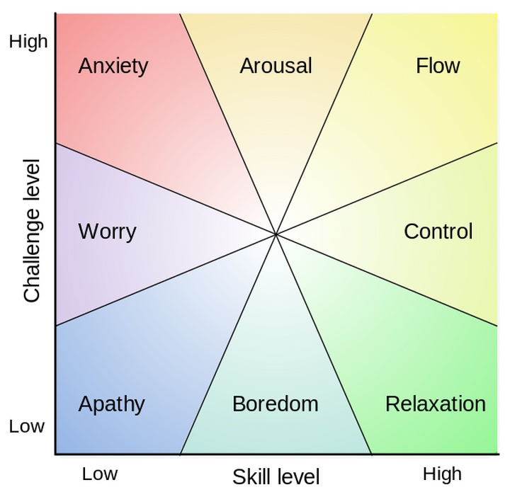

# 如何提升游戏品质

## 前言

说到游戏品质，我首先想到一个问题——游戏品质高低的评判标准是什么？

游戏的优劣与否和评价高低，取决于它的受众。就像餐厅里的一道菜品，它是好是坏，应该是由食客决定的，而非负责烹饪的厨师，或是将其呈上餐桌的服务员；如果它受到广泛好评，甚至能够频频招揽回头客，那么它就可以被认为是一道高品质的菜品。同样的道理，一款游戏如果能够 **拥有大量玩家** ，并且 **玩家粘性强** ，它就可以被认为是一款高品质的游戏。因此，如何提升游戏品质的问题，就变成了 **如何提升游戏吸引力** 的问题，这个问题要求我们转变思维，回归到游戏的受众，即从玩家的角度进行思考。

## 玩家能够理解什么

既然要从玩家的角度出发，我们就应该着眼于那些能够被玩家所理解的点。

在我看来，游戏中能够被玩家所理解的要素有这些：

+ 玩法：是否引人入胜

+ 稳定性：游戏功能是否正常，有无严重 Bug

+ 细节：游戏彩蛋，伏笔，场景中的植被交互，NPC 交互，UI 动画和特效等

+ 性能体验：游戏运行是否流畅，卡顿和掉线的情况是否频繁，设备是否发热过度等

+ 画面表现：UI，模型，特效等是否精美

+ 主旨和立意：是否具有深度（这一点仅为我个人偏好，不确定是否具有普适性）

我们不妨看看在游戏研发中，这些要素会受到哪些因素影响，以及对应哪些主要的研发环节：

| 游戏要素 | 受影响的因素 | 对应的研发环节 |
|-|-|-|
| 玩法 | 创意和研发水平 | 策划和技术 |
| 稳定性 | 需求的稳定性和程序架构的健壮性 | 策划和技术 |
| 细节 | 创意和研发水平 | 策划和技术 |
| 性能体验 | 程序的优化程度 | 技术 |
| 画面表现 | 美术的品质和规范性 | 美术 |
| 主旨和立意 | 世界观，文案等 | 策划 |

## 技术担任何种角色

根据前面的分析，我认为技术对于游戏吸引力的影响在于 **玩法** ， **稳定性** ， **细节** 和 **性能体验** 四点。其中，技术占主导作用的是稳定性和性能体验两点，玩法和细节则主要由策划把控。

+ 稳定性

	严格来说，稳定性受策划能力和程序架构水平的共同影响——策划能力的不足，导致研发人员对整体需求的认知模糊，对迭代方向的把握不准，从而频繁出现修改需求的情况，使得游戏的稳定性下降；而程序架构水平的低下，自然无法从容应对接踵而来的功能迭代和需求变化，加上研发时间紧迫，校验工作不够充分，不可避免地会在程序中埋下大量的错漏。不过，只要程序的架构足够出色，就能够在一定程度上弥补策划能力的缺失。

+ 性能体验

	性能体验基本上由技术把关，例如性能优化水平，服务器的稳定性和压力承受能力（可能也会和策划有一定的关联，例如服务器分区的合理性）。

因此，从技术的角度而言，提升游戏吸引力的关键是做好 **程序架构** 和 **性能优化** 两点。

可能有人会问，除了这两点之外，难道业务功能的巧妙实现，大量运用各种高深的算法和数据结构等因素，对于游戏吸引力的提升就不重要吗？我的回答是，这些因素实为具体的做法，固然重要，前提是它们能够融会贯通于程序架构和性能优化之中——例如在开发业务功能时，注重良好的编程风格和规范，保证业务功能的稳定且容易维护，这就是一种对于程序架构的重视；再例如使用了高端的算法改进了业务功能中某处原本效率低下的实现，这本质上是一种性能优化的体现。无论是什么做法，只要它回归到程序架构和性能优化这两点上，它就是一个有利于游戏吸引力提升的做法，否则它是一个意义不大的做法——例如抱着展示自己编程水平的心态而使用一些高级但晦涩的写法，尽管从技术的角度而言可圈可点，但是无法被玩家们所理解，终归是孤芳自赏，华而不实。我们应该时刻记得，技术服务于做好一款游戏，而不用作炫耀的手段。

## 非技术因素有哪些

对游戏吸引力产生影响的非技术因素有 **玩法** ， **细节** ， **画面表现** ，以及 **主旨和立意** 。

+ 玩法

	玩法是游戏的核心，也是游戏吸引力的根本来源。

	说到吸引力，这里引入一个心理学上的概念—— [心流理论（Flow）](https://en.wikipedia.org/wiki/Flow_(psychology)) 。

	

	心流是指一种将个人精力完全投入到某种活动上的感觉，这种感觉由两个维度的因素共同影响，分别是 技巧能力（Skill Level） 和 挑战程度（Challenge Level） 。如果将心流理论应用到玩家身上，我们可以得到这样的认知：在游戏体验中，需要时刻保证玩家的游戏水平（技巧能力）和游戏难度（挑战程度）处于一个平衡且稳定的状态，以此使得玩家的心流状态最大化，让玩家始终得到正面的游戏体验，从而专注于游戏之中；一旦它们之间的平衡被打破，就会让玩家产生负面体验，或感到力不从心（技巧能力低于挑战程度），或觉得枯燥乏味（挑战程度低于技巧能力），久而久之，游戏就会失去对玩家的吸引力。总的来说，心流理论强调的是游戏的奖励机制和玩家投入程度的绝妙平衡。

	心流理论提供了一个总体的方向，在此基础上我们需要量体裁衣，抓住不同玩家的心理，这里引入 [理查德·巴特尔（Richard Bartle）](https://en.wikipedia.org/wiki/Richard_Bartle) 提出的 [玩家分类理论（Bartle taxonomy of player types）](https://en.wikipedia.org/wiki/Bartle_taxonomy_of_player_types) 。

	

	巴特尔的玩家分类理论从行为目标和行为模式两个维度将玩家分为四类，其中行为目标有 游戏世界（World） 和 游戏玩家（Players） 两种，行为模式有 单方面影响（Acting） 和 交互（Interacting） 两种：

	+ 成就者（Achievers）：这类玩家倾向于对游戏世界产生单方面的影响，将达成游戏中的各种挑战和目标作为追求

	+ 探索者（Explorers）：这类玩家倾向于与游戏世界交互，善于深度发掘和分析游戏，例如找出游戏中的彩蛋

	+ 社交者（Socializers）：这类玩家倾向于与其他玩家交互，重视社交元素，例如聊天和交易系统

	+ 杀戮者（Killers）：这类玩家倾向于对其他玩家产生单方面的影响，热衷于不断强化自己的游戏角色，然后去挑战并打败其他玩家

	通过玩家分类理论，我们能够更好地了解不同玩家的核心需求。对于成就型玩家，他们无疑是心流理论的最佳印证者，我们需要在游戏数值的平衡上多下工夫；对于社交型和杀戮型玩家，我们需要仔细打磨游戏中的 PVP 玩法；当然，尽管现在的游戏充斥着各种各样的社交和 PVP 元素，我们也不能忽视探索型玩家的存在，在 PVE 玩法上也要充分斟酌。

+ 细节

	游戏细节的涉及面很广，像是让前后剧情衔接自然，产生呼应的伏笔，角色走动在地面上扬起的尘土，UI 切换时的淡入淡出效果等，这些都属于游戏细节。它们看似不起眼，却能够为游戏增添生气和代入感，淡化游戏的刻板和生硬感。

	举个例子，在 *侠盗猎车手 IV（Grand Theft Auto IV）* 中，下雨时，路人 NPC 会做出打伞的行为（[参考资料](https://www.zhihu.com/question/38075324/answer/75068483)），这就是一处精妙的细节设计。它就像赋予了路人 NPC 生命，让玩家感觉到它们是有血有肉的角色；它给玩家带来了厚重的代入感，让沉浸在虚拟世界中的他们仿佛置身于现实。

	另一个我了解到的正面例子是 *江南百景图* 这款游戏（[参考资料](https://www.zhihu.com/question/49057925/answer/1334294981)），因为我没有详细体验过这款游戏，所以就不展开叙述了。

	细节是一个很难把握的因素，把握不当很可能会给人画蛇添足的感受，还会降低游戏的性能。但是不可否认，优秀的细节设计确实能够极大地为游戏增色。

+ 画面表现

	除了玩法，游戏最不可或缺的当然就是美术了。优秀的游戏美术，画面表现力，自然是游戏吸引力的重要来源，例如精美的角色模型，宏伟的场景模型，炫酷的特效，友好的 UI 等。

	如果时间往前倒退几年，美术的重要程度应该没有到达如今的高度。一些游戏仅凭着优秀的玩法，就取得了不小的成就，例如 *Flappy Bird* 和 *2048* 。不过随着游戏行业的发展，大型作品越来越多，玩家的口味也变得越来越难以满足，这就要求我们在美术方面倾注更多的心血。

+ 主旨和立意

	具有深度的主旨和立意，或许可以让游戏的吸引力上升一个台阶。以我自己为例，体验一款游戏时会感觉是在阅读一本书，或者是观赏一场电影。一款有内涵的游戏，很可能会让我流连忘返，细细品味，甚至会对人生产生一些新的思考。

	以 *纪念碑谷2（Monument Valley 2）* 为例，这款游戏讲述了一名小女孩从一开始的跟随，到最后能够独自前行的经历，在探究神圣几何之谜的旅途中逐渐蜕变（[参考资料](https://www.zhihu.com/question/25984324/answer/727952266)）。这让玩家在游戏的过程中，也许会不自觉地对于人的成长有所思考。

## 总结

游戏的品质，或者说游戏的吸引力，它的提升要求研发团队中的各个环节齐心协力，在 **玩法** ， **稳定性** ， **细节** ， **性能体验** 和 **画面表现** 上做足功课。

对于技术而言，我们应该从 **程序架构** 和 **性能优化** 两方面入手。其中，优秀的程序架构，除了要求我们具备相当的技术能力，还要求我们具备一定的非技术思维——能够从玩家，或者是策划的角度去分析游戏，根据游戏品类和研发目标，对已知需求的合理性进行评估，甚至是对潜在的需求变动进行预估，从而在架构时做好充分的部署，并预留出足够的可操作空间，以应对各种各样的变化。这无疑是对游戏稳定性的一种保障。

除了技术，策划和美术也扮演着至关重要的角色。尤其是策划，在一款游戏立项之前应该做好详尽的长期规划，找准参照竞品，确定好基本方向和各个系统的设计，需求一旦确定后不要轻易变更，因为频繁地更改需求，相当于是人为制造不稳定因素，无论对技术还是美术都会产生巨大的负面影响。

以上是我个人对于游戏品质提升的粗浅见解，如有不当之处敬请指出。
