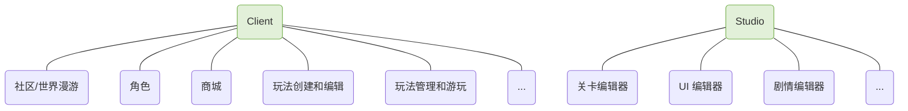
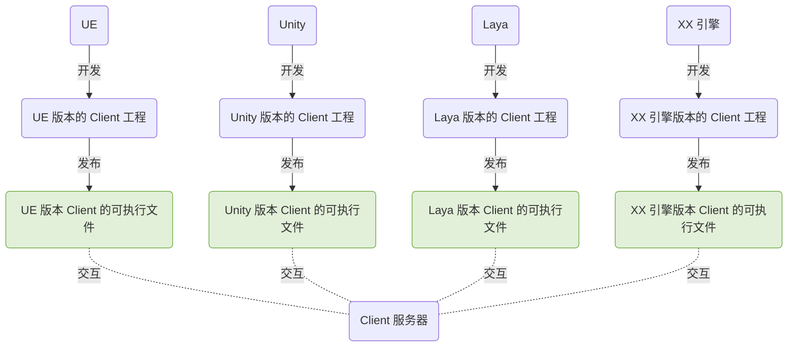
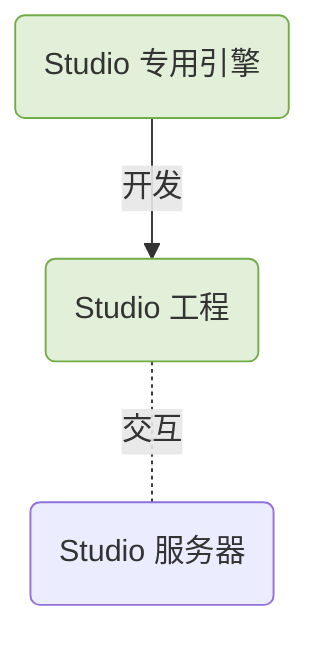
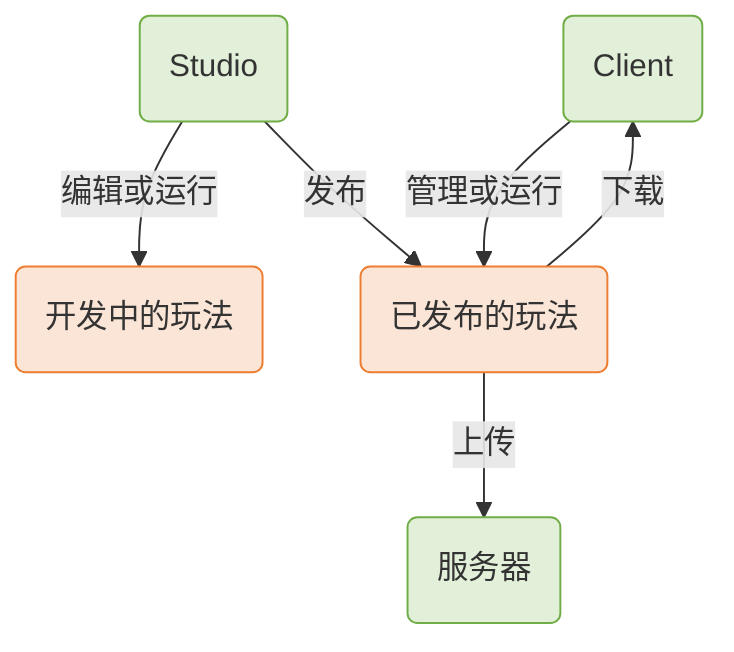
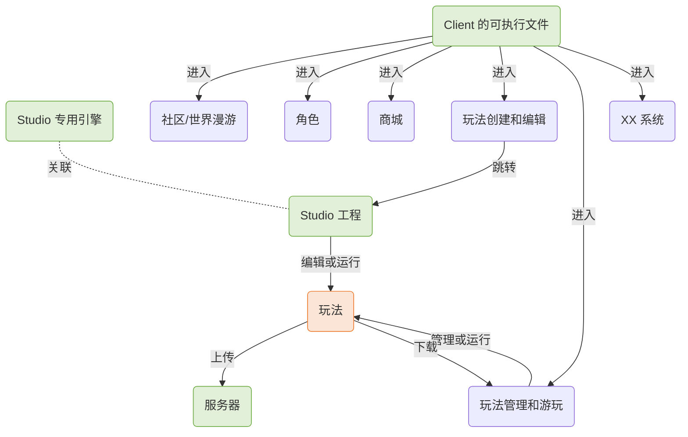

# UGC 项目客户端的设计

从产品的角度而言，UGC 项目主要参考了 *Core* 的做法。以下思路由此展开。

## 工程设计

### Client 和 Studio

UGC 项目的客户端包含 **Client** 和 **Studio** 两部分，需要拆分成两个工程进行开发。

这种设计的原因有两点：

1. **两者的开发思路和底层设计不同**；Client 提供社区，角色，商城，玩法编辑，玩法管理等 UGC 产品的常规功能，可以理解为一个“外壳”，而 Studio 提供核心的玩法编辑功能，包含各种编辑器工具

2. **支持多引擎开发**；作为“外壳”的 Client，理论上可以使用不同的引擎进行开发，让不同技术栈的客户端开发人员能够参与到 UGC 项目当中

Client 支持多引擎开发，每种引擎对应一个专属的 Client 工程，以发布特定的 Client 可执行文件。例如我们使用 UE，Unity 和 Laya 分别开发一个 Client，对接同一套协议和服务器，如此，各个 Client 之间就可以交互了。不同 Client 之间的差异，主要体现在引擎层和 API，它们当中每个功能模块的需求和实现思路可以是相同的。Client 部分向用户提供的是 **Client 的可执行文件**。

Studio 是 UGC 项目的核心，包含所有的编辑器工具。它使用一个 **专用引擎** 进行开发，不支持多引擎，原因有两点：一是 Studio 所用的引擎决定了玩法的底层机制，例如坐标系和游戏对象的实现方式，一个玩法在不同引擎之间转换的难度是极高的（试想将一个基于 Unity 开发的玩法，转换到 UE 中运行）；二是 Studio 的开发量大，需要保证通用性，避免重复造轮子。以 UE 为例，使用 UE 开发的 Studio 部分，会向用户打包提供 **精简后的专用引擎** 和 **Studio 工程**。

### 玩法

玩法是指用户通过 Studio 创建的游戏，它凝结了用户的智慧和心血。它的底层机制取决于 Studio，即取决于开发 Studio 所用的引擎。

每个玩法都应该有 **开发中** 和 **已发布** 两个版本。开发中的玩法，会通过 Studio 进行编辑或者运行；已发布的玩法，则会通过 Client 进行管理或者游玩。在 Studio 中完成一个玩法的编辑后，需要执行一个发布流程，生成发布后的玩法，然后上传至服务器，再由其他用户通过 Client 进行下载。

从多引擎的角度考虑，已发布的玩法应当是一个 **可独立运行的程序**，它不依赖于 Client。在 Client 中可以通过启动子进程的方式来运行玩法。

## 用户使用

最终提供给用户的 UGC 产品，包含 **Client 的可执行文件**，**Studio 专用引擎** 和 **Studio 工程** 三部分。其中，Client 的可执行文件会直接面向用户，而 Studio 专用引擎和工程，则会经过必要的加密和打包，不会直接暴露给用户。

用户通过运行 Client 的可执行文件来运行 UGC 产品，完成登录验证后，就可以进入 Client 的各个系统。在 **玩法创建和编辑** 系统内，可以跳转至 Studio 工程，从而创建和编辑玩法；编辑完成后可以在 Studio 中试运行玩法，最后将玩法上传至服务器。在 **玩法管理和游玩** 系统内，可以从服务器下载玩法，管理下载过的玩法，以及进入玩法进行游玩。

