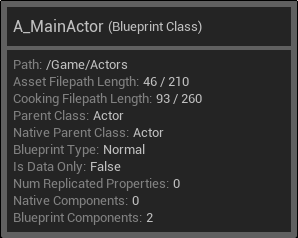

# 资产数据 (AssetData)

`FAssetData` 类型用于表示一个可以被引擎识别的资产，它可能已经加载至内存，也可能尚未加载。以下是对该类型的介绍。


## 1. 资产信息访问

如果需要访问一个资产的具体信息，例如它的蓝图类型和继承关系，常规做法是将资产加载至内存，得到 `UObject` 类型的资产对象，然后访问资产对象中存储的信息。不过这种做法存在比较大的性能消耗，应当谨慎使用。

那么，在不加载资产的情况下，是否也可以获取到资产的信息？如果可以，可以获取到哪些信息？在回答这两个问题之前，我们不妨看看以下两个例子：




以上分别是 Actor 蓝图资产和 UserWidget 蓝图资产提示信息的示例。无论资产是否已经加载到内存，它的提示信息功能都是生效的，说明 **提示信息功能显示的资产信息并不依赖于资产的加载** 。由此，我们可以参考提示信息功能，达到在不加载资产的情况下访问资产信息的目的。提示信息功能的实现请见源码 AssetViewWidgets\.h 和 AssetViewWidgets\.cpp，`SAssetViewItem` 和 `SAssetViewItemToolTip` 类。

提示信息功能显示的资产信息，主要存储在 `FAssetData` 对象的 `TagsAndValues` 属性中。该属性是一个键值对集合，键类型是 `FName`，值类型是 `FAssetTagValueRef`，源码请见 AssetData\.h 和 AssetDataTagMap\.h。`TagsAndValues` 属性的键统一定义在 `FBlueprintTags` 类型中，请见源码 BlueprintSupport\.h 和 BlueprintSupport\.cpp。由于不同的资产通常会包含不同的信息，建议在访问某个资产的信息之前，先通过它的提示信息功能来了解可以获取到哪些资产信息，并且在 `FBlueprintTags` 类型中找到对应的键。

以下是部分常用资产信息的说明：

### 基类（Parent Class）

对应的键是 `FBlueprintTags::ParentClassPath` 。当资产是一个蓝图资产时，表示资产对象 **上一级的 C\+\+ 基类或者蓝图基类** 。

```cpp
// 资产数据
const FAssetData AssetData;
const FAssetTagValueRef& ParentClassPathRef = AssetData.TagsAndValues.FindTag(FBlueprintTags::ParentClassPath);
/**
 * 得到资产对象基类的路径
 * 注意在调用 AsString 函数前，必须确保 ParentClassPathRef 有效，否则会导致内部断言失败
 */
const FTopLevelAssetPath ParentClassPath(ParentClassPathRef.IsSet() ? ParentClassPathRef.AsString() : FString());
```

### C++ 基类（Native Parent Class）

对应的键是 `FBlueprintTags::NativeParentClassPath` 。当资产是一个蓝图资产时，表示资产对象 **上一级的 C\+\+ 基类** 。

```cpp
// 资产数据
const FAssetData AssetData;
const FAssetTagValueRef& NativeParentClassPathRef = AssetData.TagsAndValues.FindTag(FBlueprintTags::NativeParentClassPath);
/**
 * 得到资产对象 C++ 基类的路径
 * 注意在调用 AsString 函数前，必须确保 NativeParentClassPathRef 有效，否则会导致内部断言失败
 */
const FTopLevelAssetPath NativeParentClassPath(NativeParentClassPathRef.IsSet() ? NativeParentClassPathRef.AsString() : FString());
```

### 蓝图类型（Blueprint Type）

对应的键是 `FBlueprintTags::BlueprintType` 。当资产是一个蓝图资产时，表示资产的 **蓝图类型** 。蓝图类型对应源码 Blueprint\.h 中声明的枚举类型 `EBlueprintType` 。

```cpp
// 资产数据
const FAssetData AssetData;
const FAssetTagValueRef& BlueprintTypeRef = AssetData.TagsAndValues.FindTag(FBlueprintTags::BlueprintType);
/**
 * 得到资产的蓝图类型
 * 注意在调用 AsString 函数前，必须确保 BlueprintTypeRef 有效，否则会导致内部断言失败
 */
const FString& BlueprintTypeName = BlueprintTypeRef.IsSet() ? BlueprintTypeRef.AsString() : FString();
if (BlueprintTypeName.IsEmpty())
{
    // 没有对应的蓝图类型，说明不是蓝图资产
}
else
{
    // 蓝图资产，请通过 EBlueprintType 的枚举值进行判断
    if (BlueprintTypeName == FString(TEXT("BPTYPE_Normal")))
    {
        // 蓝图类，例如 Actor 蓝图资产和 UserWidget 蓝图资产
    }
    else if (BlueprintTypeName == FString(TEXT("BPTYPE_MacroLibrary")))
    {
        // 蓝图宏库
    }
    else if (BlueprintTypeName == FString(TEXT("BPTYPE_Interface")))
    {
        // 蓝图接口类
    }
    else if (BlueprintTypeName == FString(TEXT("BPTYPE_LevelScript")))
    {
        // 关卡（场景）蓝图
    }
    else if (BlueprintTypeName == FString(TEXT("BPTYPE_FunctionLibrary")))
    {
        // 蓝图函数库
    }
}
```


## 2. 资产扫描

引擎提供了 `UObjectLibrary` 类型，用于扫描特定类型的资产。常用的接口是 `LoadAssetDataFromPath` 和 `LoadAssetDataFromPaths` ，这两个接口可以获取资产的必要信息，以 `FAssetData` 类型返回，并不会真正将资产加载到内存。

示例：

```cpp
/**
 * 创建一个专用于扫描控件蓝图的库
 *
 * @param InBaseClass             资产类型
 * @param bInHasBlueprintClasses  是否包含 InBaseClass 子类的资产
 * @param bInUseWeak              是否以弱引用形式引用资产
 */
UObjectLibrary* const Library = UObjectLibrary::CreateLibrary(UWidgetBlueprint::StaticClass(), true, true);

/**
 * 资产目录
 * 以项目的 Content 目录作为根目录，格式是 "/Game/aa/bb/cc"
 */
const FString AssetDirectory;
// 递归扫描 AssetDirectory 下的资产
Library->LoadAssetDataFromPath(AssetDirectory);

TArray<FAssetData> AssetDatas;
// 获取扫描得到的资产信息
Library->GetAssetDataList(AssetDatas);
for (const FAssetData& AssetData : AssetDatas)
{
    // 资产的名称，不含路径信息
    const FName& AssetName = AssetData.AssetName;
    // 资产的路径，格式是 "/Game/aa/bb/cc/asset.asset" ，可用于加载资产
    const FSoftObjectPath& AssetPath = AssetData.ToSoftObjectPath();
    // ...
}
```


## 3. 资产检索

如果需要指定访问某个资产的信息，例如判断资产是否存在，可以使用 `IAssetRegistry` 类的 `GetAssetByObjectPath` 接口。

示例：

```cpp
// 资产路径，以项目的 Content 目录作为根目录，格式是 "/Game/aa/bb/cc/asset.asset"
const FString AssetPath;

/**
 * 获取资产信息
 * 注意 GetAssetByObjectPath 的参数列表从 UE5.1 开始有所变化
 */
IAssetRegistry& AssetRegistry = FModuleManager::GetModuleChecked<FAssetRegistryModule>(FName(TEXT("AssetRegistry"))).Get();
#if ENGINE_MAJOR_VERSION == 5 && ENGINE_MINOR_VERSION >= 1 || ENGINE_MAJOR_VERSION > 5
const FAssetData& AssetData = AssetRegistry.GetAssetByObjectPath(FSoftObjectPath(AssetPath));
#else
const FAssetData& AssetData = AssetRegistry.GetAssetByObjectPath(FName(AssetPath));
#endif

// 通过资产信息的有效性来判断资产是否存在
const bool bIsAssetExisted = AssetData.IsValid();
```
