# UE 蓝图风格

## 1、经验分享

UE 当中的蓝图是图形化编程的一种具体形式，本质上也是一种代码，很多理念和文字形式的代码是相通的。因此在使用蓝图开发的时候，可以参考编写高可读性代码的思路，从 **命名** ， **长度** ， **排版** ， **注释** 和 **内聚性** 五个方面提升蓝图的可读性。

### 1.1、命名

在蓝图当中，函数和变量的命名要求 **含义明确** 。

错误示例：

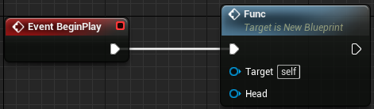

我们无法通过 `Func` 这个命名得知这个函数的作用。

正确示例：

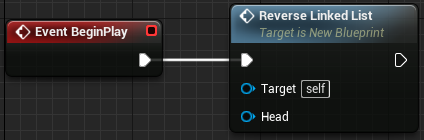

通过 `ReverseLinkedList` 这个命名，我们可以容易得知这个函数的作用是将链表反转。

### 1.2、长度

在蓝图当中，函数要求 **简炼** 和 **功能单一** 。

错误示例：

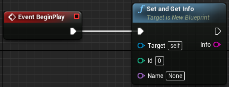

`SetAndGetInfo` 函数冗长且功能复杂，不利于复用。

正确示例：

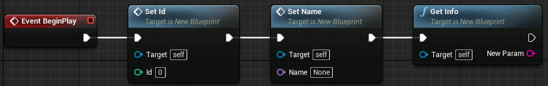

`SetId`，`SetName` 和 `GetInfo` 三个函数拆分自 `SetAndGetInfo` 函数，相比之下具有更高的复用性。

### 1.3、排版

蓝图不需要像代码那样考虑花括号和缩进的情况，不过这不代表蓝图没有排版的问题。蓝图的排版问题主要体现在 **连线** 和 **节点布局** 两个方面，这里提两个建议。

1. 连线尽可能保持平直，节点之间的白色连线优先于变量之间的彩色连线

    错误示例：

    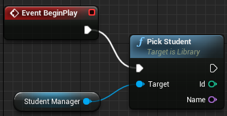

    对于这种情况，我们可以右键白色连线的其中一个引脚，选择 `将连线变直`，让白色连线自动变直：

    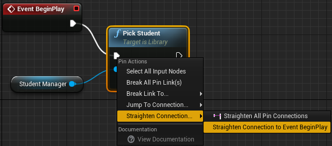

    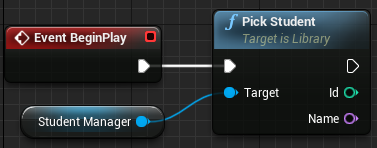

    我们看到白色连线变直之后，变量之间的蓝色连线仍然弯曲，这是可以接受的。当然。我们可以尝试对蓝色连线做同样的处理，但前提是蓝色连线变直之后，节点 `Student Manager` 和 `Event BeginPlay` 没有重叠；我们也不能只让蓝色连线变直，而让白色连线保持弯曲，因为这不符合“白色连线优先”的原则。

2. 尝试重设连接，避免连线被遮挡

    错误示例：

    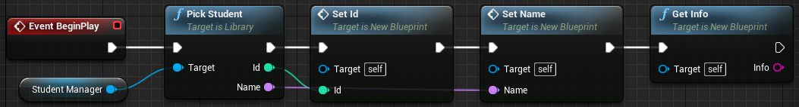

    我们看到变量 `Name` 之间的粉色连线被节点 `SetId` 遮挡了。对于这种情况，我们可以右键粉色连线的其中一个引脚，选择 `添加转折节点`，让粉色连线绕开节点 `SetId`：

    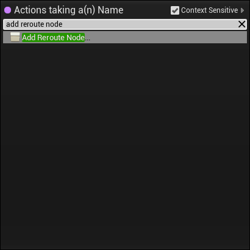

    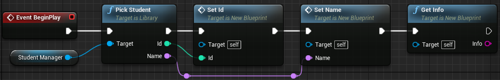

    我们总共添加了两个转折节点，可以看到粉色连线既绕开了节点 `SetId`，也在一定程度上保持了美观。其实不仅是变量之间的彩色连线，对于节点之间的白色连线，也可以使用这种方法来解决连线被遮挡的问题。

### 1.4、注释

蓝图是支持注释的，虽然我们不建议滥用注释，但是 **适当的注释** 有助于快速了解一段蓝图的作用。

我们可以在空白处右键，选择 `添加注释`，创建一个注释节点，然后调整它的大小和位置，以包裹住需要注释的蓝图片段：

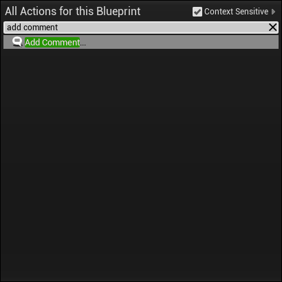

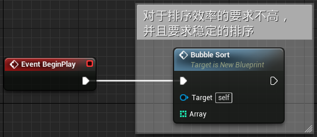

在填写注释内容的时候，应该遵循 “描述为什么而非做什么” 的原则，这一点和代码注释相同。

### 1.5、内聚性

蓝图对于内聚性的要求，和编写代码的时候是相同的。我们在使用蓝图开发的时候，需要注意 **降低蓝图类之间的耦合程度** 。

我们以 “学生去图书馆借书” 的例子，看看它在蓝图当中的实现。

错误示例，`Student` 和 `Book` 类之间产生耦合：

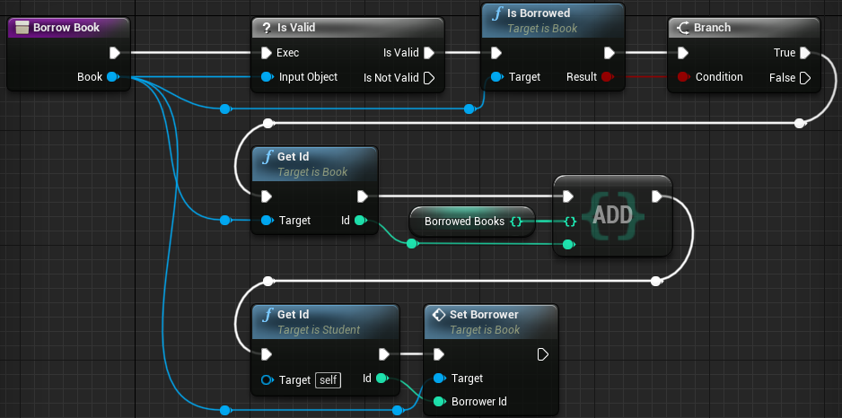

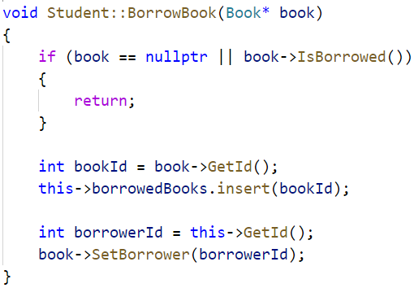

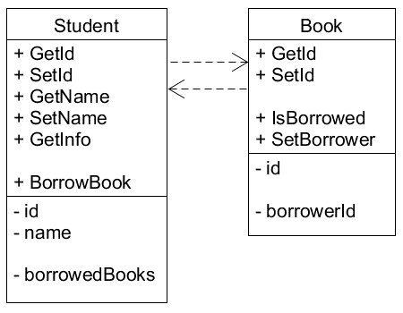

正确示例，增加 `Library` 类实现借书功能，恢复 `Student` 和 `Book` 类的内聚性：

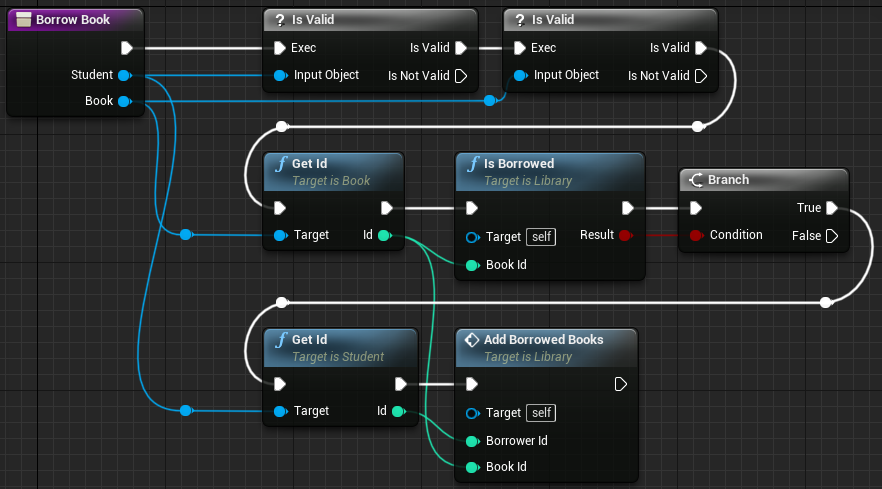

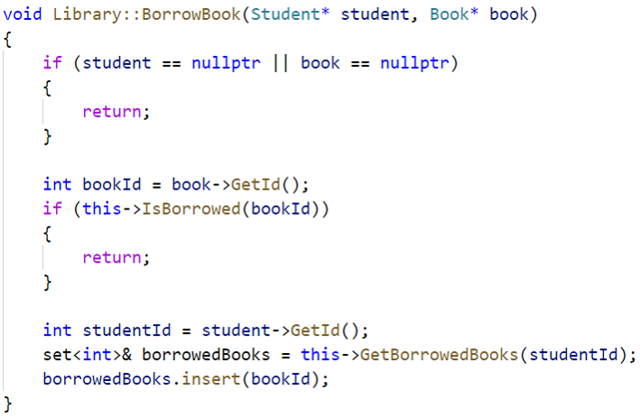

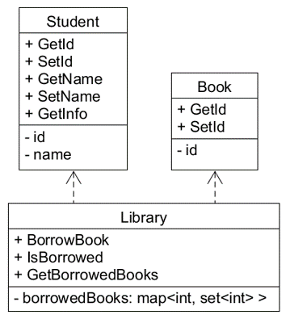

尽管蓝图的可视化程度非常高，但是相较于代码，它更加厚重，两三行代码就能够实现的功能，使用蓝图实现可能会比较复杂，这就意味这蓝图容易变得 “凌乱” 。因此，提升内聚性，降低耦合程度，有利于降低蓝图的复杂程度，对于蓝图的阅读和维护有着非常重要的作用。

## 2、参考资料

+ 官方的风格指南，侧重于 **代码** 和 **资产命名** 方面的规范

    + [蓝图编程指南](https://docs.unrealengine.com/4.27/zh-CN/ProgrammingAndScripting/Blueprints/TechnicalGuide/Guidelines/)

    + [节点连接范例](https://docs.unrealengine.com/4.27/zh-CN/ProgrammingAndScripting/Blueprints/BP_HowTo/ConnectingNodes/)

    + [代码规范](https://docs.unrealengine.com/4.26/zh-CN/ProductionPipelines/DevelopmentSetup/CodingStandard/)

    + [资产命名规范](https://docs.unrealengine.com/4.27/zh-CN/ProductionPipelines/AssetNaming/)

+ Github 上的开源 UE 风格指南，内容丰富，包括 **资产命名** ， **目录结构组织** ， **蓝图开发** 等方面的规范

    + [原始链接（包含完整章节）](https://github.com/Allar/ue5-style-guide)

    + [中文版链接（缺少部分章节）](https://github.com/skylens-inc/ue4-style-guide/blob/master/README.md)

+ 知乎问题 “虚幻引擎 UE4 中，如何创造强大，而又清晰易读的蓝图程序？有什么蓝图设计模式？” ，侧重于 **蓝图开发** 方面的经验分享

    + [链接](https://www.zhihu.com/question/346378288)
