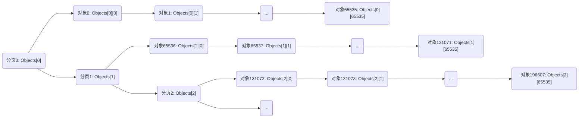
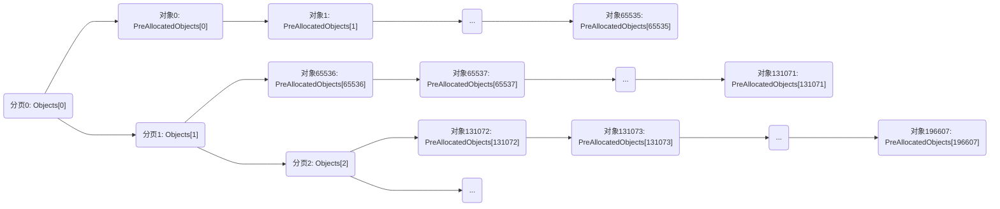
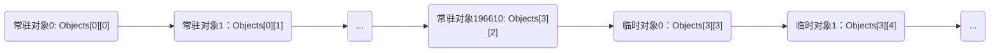

# 对象的管理

在引擎内部，对象（即 `UObject` 类的实例，以下统称为【对象】）通过一个特殊的容器进行管理。容器具有**分页**和**预分配**的机制，容器内的对象分**常驻**对象和**临时**对象两种。


## 对象的底层形式

每个对象以 `FUObjectItem` 类实例的形式被管理。

`FUObjectItem` 类的定义请见引擎源码 UObjectArray\.h 和 UObjectArray\.cpp，它具有以下成员属性：

+ `Object`

    ```c++
    UObjectBase* Object;
    ```

    对象的真正引用（`UObjectBase` 是 `UObject` 的最底层基类，在引擎层面的抽象性更高）

+ `Flags`

    ```c++
    int32 Flags;
    ```

    对象标签（Flags）的掩码

    每个对象都会携带一系列类型为 `EInternalObjectFlags` 的标签，每个标签表示一种对象的状态，通过位运算可以将标签组成掩码。与 `FObjectItem` 直接相关的枚举值有 `Unreachable`，`PendingKill` 和 `RootSet`，具体说明请见 [对象的生命周期](unreal_engine/object_lifecycle.md)

+ `ClusterRootIndex`

    ```c++
    int32 ClusterRootIndex
    ```

    对象组（Cluster）的索引

    引擎的垃圾回收（Garbage Collect，简称 GC），存在将对象分组，按组为单位清理对象的机制。在每个分组当中，会有一个对象作为其他对象的根对象，`ClusterRootIndex` 就是这个根对象的索引，也可以理解为组别的索引。

+ `SerialNumber`

    ```c++
    int32 SerialNumber;
    ```

    弱指针（Weak Pointer）序列号

    主要用于判断两个弱指针是否指向同一个对象——弱指针创建时，会记录对象的弱指针序列号，如果两个弱指针的弱指针序列号相同，就表示它们指向同一个对象。


## 对象的容器

### 底层容器

`FUObjectItem` 直接容器的类型为 `FChunkedFixedUObjectArray`，它具有分页（Chunk）和预分配的机制。

`FChunkedFixedUObjectArray` 类的定义请见引擎源码 UObjectArray\.h 和 UObjectArray\.cpp，它具有以下成员属性：

+ `Objects`

    ```c++
    FUObjectItem** Objects;
    ```

    对象的容器

    因为分页机制的存在，所以 `Objects` 使用了二维指针的形式，其中第一维的指针指向各个分页。

+ `PreAllocatedObjects`

    ```c++
    FUObjectItem* PreAllocatedObjects;
    ```

    对象的预分配容器

    在关闭预分配功能时，每个对象都是动态创建，并且按照分页规则添加到 `Objects` 当中的，`PreAllocatedObjects` 始终为空；在启用预分配功能时，`PreAllocatedObjects` 就会在初始化时为对象分配一段连续的内存空间，`Objects` 会按照分页规则将指针映射到 `PreAllocatedObjects` 当中，此时 `PreAllocatedObjects` 就相当于是 `Objects` 的一个镜像。

+ `MaxElements`

    ```c++
    int32 MaxElements;
    ```

    容器内对象的数目上限

+ `NumElements`

    ```c++
    int32 NumElements;
    ```

    容器内已有对象的数目

+ `MaxChunks`

    ```c++
    int32 MaxChunks;
    ```

    容器分页的数目上限

+ `NumChunks`

    ```c++
    int32 NumChunks;
    ```

    容器内已有分页的数目

### 分页和预分配机制

在 `FChunkedFixedUObjectArray` 类当中，定义了每个分页内对象数目的上限，这个值是 65536。

```c++
/** UObjectArray.h */

class FChunkedFixedUObjectArray
{
    enum
    {
        /** 64 * 1024 = 65536 */
        NumElementsPerChunk = 64 * 1024;
    }
    // ...
}
```

因此，对于 `FChunkedFixedUObjectArray`，分页的数目是 `MaxElements` / 65536 + 1，每个分页内最多有 65536 个对象，形成如下图所示的结构：



在启用预分配功能时，`PreAllocatedObjects` 就会发挥作用，作为 `Objects` 的一个镜像，形成如下图所示的结构：



### 顶层容器

引擎使用了 `FUObjectArray` 类作为对外公开的容器类型，对 `FChunkedFixedUObjectArray` 进行封装，提供对象访问，添加和移除，对象事件监听等接口。

在编写业务代码时，可以通过全局变量 `GUObjectArray` 访问对象。

```c++
/** 声明处：UObjectArray.h */
extern COREUOBJECT_API FUObjectArray GUObjectArray;

/** 定义处：UObjectHash.cpp */
FUObjectArray GUObjectArray;
```

`FUObjectArray` 类的定义请见引擎源码 UObjectArray\.h 和 UObjectArray\.cpp，它的关键成员属性如下：

+ `ObjObjects`

    ```c++
    typedef FChunkedFixedUObjectArray TUObjectArray;
    TUObjectArray ObjObjects;
    ```

    对象的容器

+ `ObjAvailableList`

    ```c++
    TLockFreePointerListUnordered<int32, PLATFORM_CACHE_LINE_SIZE> ObjAvailableList;
    ```

    容器内可用的索引

    `TLockFreePointerListUnordered<int32, PLATFORM_CACHE_LINE_SIZE>` 可以简单理解为 `std::stack<int>`，它是引擎提供的一个线程安全的栈类型。

    因为容器本质上是一个数组，所以其中的每个对象都对应一个唯一的索引。如果容器在某个索引处的对象被移除，这个索引就会变为可用，然后被添加到 `ObjAvailableList` 当中。

+ `ObjAvailableCount`

    ```c++
    FThreadSafeCounter ObjAvailableCount;
    ```

    `ObjAvailableList` 的长度

    `FThreadSafeCounter` 类可以简单理解为一个整数类型，它是引擎提供的一个线程安全的计数器类型。

+ `ObjFirstGCIndex`

    ```c++
    int32 ObjFirstGCIndex;
    ```

    容器内第一个临时对象的索引

    容器从索引 0 处开始存放常驻对象，从索引 `ObjFirstGCIndex` 处开始存放临时对象；`ObjFirstGCIndex` 用于确定常驻对象和临时对象的索引边界，通常等于 `ObjLastNonGCIndex` + 1。

+ `ObjLastNonGCIndex`

    ```c++
    int32 ObjLastNonGCIndex;
    ```

    容器内最后一个常驻对象的索引

    与 `ObjFirstGCIndex` 作用类似，用于确定常驻对象和临时对象的索引边界，通常等于 `ObjFirstGCIndex` - 1。

+ `MaxObjectsNotConsideredByGC`

    ```c++
    int32 MaxObjectsNotConsideredByGC;
    ```

    容器内常驻对象的数目上限

+ `OpenForDisregardForGC`

    ```c++
    bool OpenForDisregardForGC;
    ```

    是否启用常驻对象的机制

### 索引的管理

容器内的每个对象都对应一个唯一的索引，由于分页机制的存在，索引相当于转换后的容器（二维数组）下标。

通过 `FUObjectArray` 类的成员函数 `ObjectToIndex` 和 `IndexToObject`，可以实现索引和对象的互相访问。

```c++
/** UObjectArray.h */

class COREUOBJECT_API FUObjectArray
{
    // ...
    /** 返回对象的索引 */
    int32 ObjectToIndex(const UObjectBase* Object) const;
    /** 返回索引处的对象 */
    FUObjectItem* IndexToObject(int32 Index);
    // ...
};
```

对象的创建和销毁是相当频繁的操作，而且容器本质上是线性的，为了降低开销，引擎没有在销毁对象后，将容器内的对象整理为连续存储的处理，因此对象在容器内的存储经常是不连续的，容器也因此产生了“孔”，即曾经存储过对象，但是当前没有存储对象的位置。这些位置显然是可以被重新利用的，这就是 `ObjAvailableList` 和 `ObjAvailableCount` 属性存在的意义。

对象在创建之后，需要添加到容器内进行管理，引擎通过 `FUObjectArray` 类的成员函数 `AllocateUObjectIndex` 为它分配一个未被使用的索引。分配索引时，优先复用 `ObjAvailableList` 中的索引，其次将对象添加至容器末尾（相当于分配一个新的索引）。当对象销毁时，需要从容器内移除，引擎通过 `FUObjectArray` 类的成员函数 `FreeUObjectIndex` 将对象的索引回收至 `ObjAvailableList` 当中，留待下一次创建对象时使用。

```c++
/** UObjectArray.h */

class COREUOBJECT_API FUObjectArray
{
    // ...
    /**
     * 创建对象时，为对象分配一个索引
     * @param bMergingThreads 表示是否支持多线程；截至引擎4.27，对象的创建始终只允许在游戏线程中进行，不存在多线程的情况，因此暂时不需要关注这个参数；根据引擎源码中的注释推测未来可能会支持多线程
     */
    void AllocateUObjectIndex(UObjectBase* Object, bool bMergingThreads = false);
    /**
     * 销毁对象时，回收对象的索引
     */
    void FreeUObjectIndex(UObjectBase* Object);
    // ...
};
```

根据 `AllocateUObjectIndex` 和 `FreeUObjectIndex` 的实现可以知道，对象的创建和销毁都应该确保在**主线程**中进行。

```c++
/** UObjectArray.cpp */

void FUObjectArray::AllocateUObjectIndex(UObjectBase* Object, bool bMergingThreads = false)
{
    int32 Index = INDEX_NONE;
    /**
     * InternalIndex 是 UObjectBase 类的成员属性，记录对象的索引
     * 因为对象的索引是在当前函数中进行分配的，所以如果在执行当前函数之前对象已经持有一个有效的索引，
       就意味着出现了线程冲突的问题，除非当前函数支持多线程（bMergingThreads 为 true）；但是截至
       引擎版本4.27，当前函数尚不支持多线程
     */
    check(Object->InternalIndex == INDEX_NONE || bMergingThreads);
    // ...
    /**
     * FUObjectArray 类拥有成员属性 ObjObjectsCritical 作为信号量，以确保当前函数是线程安全的；
       但是无法确保 THREADSAFE_UOBJECTS 宏开关总是打开的，因此在调用当前函数，即创建对象时，应该
       确保在游戏线程中进行
     */
#if THREADSAFE_UOBJECTS
    FScopeLock ObjObjectsLock(&ObjObjectsCritical);
#else
    check(IsInGameThread());
#endif
    // ...
}

void FUObjectArray::FreeUObjectIndex(UObjectBase* Object)
{
    /**
     * 调用当前函数，即销毁对象时，应该确保在游戏线程，或者在垃圾回收线程中进行
     * 对象因垃圾回收而被销毁时，可以确保处于垃圾回收线程；而在业务代码中主动销毁对象时，需要确保
       处于游戏线程
     */
    check(IsInGameThread() || IsInGarbageCollectorThread());
    // ...
}
```

### 常驻对象和临时对象

容器内的对象绝大部分是生命周期有限的临时对象，在游戏运行的过程中至少会经历一次垃圾回收，然后被销毁，与之相对，容器内也存在不受垃圾回收影响的常驻对象。在编写业务代码时，可能会通过 `UObjectBaseUtility` 类的成员函数 `AddToRoot` 将一个对象设为常驻状态。

请注意，上面两句话中分别提到的“常驻”属于不同的概念，前者是对象管理中的一种优化策略/机制，后者是对象的一种状态/标签；以下为了区分，将前者称为“常驻对象”，将后者称为“常驻状态”。对象的创建和销毁是有一定开销的，引擎为了优化这些开销，允许让一部分对象成为常驻对象。当启用常驻对象的机制时，只要容器内常驻对象的数目还没有到达上限，每一个新建的对象都会自动成为常驻对象；当关闭常驻对象的机制，或者容器内常驻对象的数目已经到达上限时，每一个新建的对象就会自动成为临时对象。总而言之，常驻对象与是否设为常驻状态无关，一个对象即使没有被设为常驻状态，它也有可能是常驻对象，一个临时对象被设为常驻状态后，它也能够像常驻对象那样不受垃圾回收的影响。

常驻对象机制的启用和关闭，可以通过 `FUObjectArray` 类的成员函数 `OpenDisregardForGC` 和 `CloseDisregardForGC` 来完成；当 `FUObjectArray` 类成员函数 `IsOpenForDisregardForGC` 和 `DisregardForGCEnabled` 的返回值同时为 `true` 时，常驻对象的机制才能生效。引擎默认不启用常驻对象的机制。

```c++
/** UObjectArray.h */

class COREUOBJECT_API FUObjectArray
{
    // ...
    /** 启用常驻对象的机制 */
    void OpenDisregardForGC();
    /** 关闭常驻对象的机制 */
    void CloseDisregardForGC();
    /** 是否启用常驻对象的机制 */
    bool IsOpenForDisregardForGC() const
    {
        return OpenForDisregardForGC;
    }
    /**
     * 能否添加常驻对象
     * 它与 IsOpenForDisregardForGC 并不冲突；常驻对象机制的生效，需要同时满足 IsOpenForDisregardForGC 和 DisregardForGCEnabled 两个条件
     */
    bool DisregardForGCEnabled() const
    {
        return MaxObjectsNotConsideredByGC > 0;
    }
    // ...
};
```

常驻对象和临时对象在容器内的存储并不会出现穿插，因为常驻对象的索引固定从 0 至 `ObjLastNonGCIndex`，临时对象的索引则固定从 `ObjFirstGCIndex` 至容器末尾。它们在容器内的存储方式如下图所示：



### 容器的初始化

容器的初始化时机为 CoreUObject 模块初始化完成后，调用栈如下：

1. 函数 `FUObjectArray::AllocateObjectPool`

    进行顶层容器的初始化

    位于引擎源码 UObjectArray\.cpp

2. 函数 `UObjectBaseInit`

    函数 `FUObjectArray::AllocateObjectPool` 的调用点

    位于引擎源码 UObjectBase\.cpp

3. 函数 `StaticUObjectInit`

    函数 `UObjectBaseInit` 的调用点

    位于引擎源码 Obj\.cpp

4. 函数 `InitUObject`

    函数 `StaticUObjectInit` 的调用点

    位于引擎源码 Obj\.cpp

5. 函数 `FCoreUObjectModule::StartupModule`

    将 `InitUObject` 注册为 `FCoreDelegates::OnInit` 的回调

    位于引擎源码 CoreNative\.cpp


## 相关的引擎源码

+ UObjectArray\.h 和 UObjectArray\.cpp

+ UObjectHash\.h 和 UObjectHash\.cpp

+ UObjectBase\.h 和 UObjectBase\.cpp

+ UObjectBaseUtility\.h 和 UObjectBaseUtility\.cpp

+ Obj\.cpp
