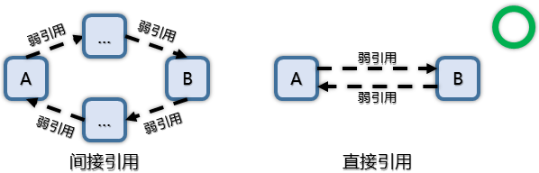

# 对象的引用和依赖


## 循环引用

在引擎中，两个对象之间允许存在的循环引用关系，包括：

+ 软引用（Soft Reference）形式的循环引用

    

+ A 软引用 B，B 硬引用（Hard Reference）A

    

虚幻引擎不允许两个对象之间存在硬引用形式的循环引用


根据虚幻引擎的设计，一个对象会在构造的时候，首先尝试构造它的子对象，包括被它硬引用的对象。如果两个对象互相硬引用，他们的构造过程就会陷入不断的递归之中，直至出现堆栈溢出的错误。请见引擎源码 UObjectArchetype\.cpp，函数 `GetArchetypeFromRequiredInfoImpl` 。


## 引用查找

查找某个对象所引用的对象，有两处参考：

+ 引用查看器（Reference Viewer）

    理论上适用于常规功能的开发，示例代码如下：

    ```cpp
    if (FAssetRegistryModule* Module = FModuleManager::LoadModulePtr<FAssetRegistryModule>(TEXT("AssetRegistry")))
    {
        // 引用方式，通常使用 EDependencyCategory::Package
        using EDependencyCategory = UE::AssetRegistry::EDependencyCategory;
        // 引用类型，具体实现请见 FDependencyQuery
        using EDependencyQuery = UE::AssetRegistry::EDependencyQuery;

        // 引用发起者的名称，可以通过 GetFName 获取
        const FName ReferencerName;
        // 被引用对象的信息
        TArray<FAssetIdentifier> References;
        // 通过接口 UAssetRegistryImpl::GetDependencies 获取所有直接引用
        Module->Get().GetDependencies(FAssetIdentifier(ReferencerName), References, EDependencyCategory::Package, EDependencyQuery::SearchableNameMask);

        // 可以使用递归，广搜或者深搜的方式重复调用 GetDependencies，以获取所有间接引用
    }
    ```

    请见引擎源码 AssetRegistry\.h，AssetRegistry\.cpp 和 AssetRegistryInterface\.h 。

+ 垃圾回收机制（Garbage Collection）

    涉及 `UClass` 类成员属性 `ReferenceTokenStream` 的处理，该属性似乎专用于垃圾回收，不建议用于常规功能的开发。请参考 `TFastReferenceCollector` 的实现，关键函数是 `CollectReferences` 和 `ProcessObjectArray` 。

    请见引擎源码 FastReferenceCollector\.h 。

+ 引用查找归档

    似乎可以直接使用 `FFindReferencersArchive` 类的接口来查找引用，使用方法暂时未知。

    请见引擎源码 FindReferencersArchive\.h 和 FindReferencersArchive\.cpp 。
