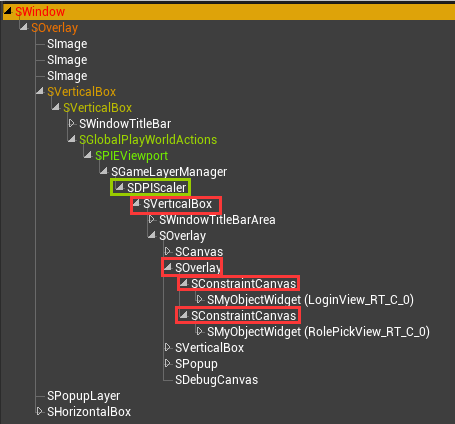

# 屏幕适配的改进


## 主要思路

主要思路是针对 [引擎原生支持](screen_compatibility_engine.md) 的两点问题进行改进：

+ 对于 Android 平台支持程度有限的问题

	可以使用自研 SDK 进行解决——例如对于 Android 9.0 或以上的设备，通过自研 SDK 获取正确的刘海高度。

2. 操作繁琐的问题

	了解过原生支持的实现原理后，应该意识到，在 UI 的屏幕适配当中，SafeZone 只是作为裁剪区大小的传递媒介，真正的核心是 `FDisplayMetrics`，因此 SafeZone 控件是可以被替代的；如果能够找到一个合适的替代者，就可以省去为 UI 批量添加 SafeZone 控件的操作了。


## SafeZone 控件的替代

作为 SafeZone 控件的合适替代者，应当满足以下条件：

+ 不需要对 UI 进行额外的修改

	这意味着在游戏运行的时候，作为替代的控件能够由引擎自动创建，而且不属于 UI 控件树的一部分。

+ 对所有 UI 都能生效

	这意味着作为替代的控件，必须直接或者间接作为各个 UI 的父控件（属于 `SPanel` 的子类）。

利用控件反射器（Widget Reflector），查看游戏运行时的完整（Slate 层）控件树，尝试从中找到合适的替代者。示例如下：



从示例当中可以得知，满足以上两个条件的候选替代者有以下几个：

+ `SConstraintCanvas`：当一个 UI 绘制到视窗（Viewport）上时，引擎会自动创建一个 `SConstraintCanvas` 作为它的父控件

+ `SOverlay`：作为各个 UI 父控件（`SContraintCanvas`）的父控件

+ `SVerticalBox`：作为 `SDPIScaler` 的子控件

+ `SDPIScaler`：作为 `SViewport`（视窗控件）的子控件，每个视窗有且只有一个 `SDPIScaler` 实例

因为 `SConstraintCanvas`，`SOverlay` 和 `SVerticalBox` 属于游戏中大量使用的控件，可控性较低，所以不适合作为替代者。

`SDPIScaler` 本身只用于屏幕分辨率的适配，在同一个视窗下为单例，因此相对而言是最理想的替代者。

接下来就需要对 `SDPIScaler` 进行修改，让它能够发挥类似 `SSafeZone` 的作用，作为裁剪区大小的传递媒介。修改方法主要是增加一个记录裁剪区大小的成员属性，然后在 `OnArrangeChildren` 和 `ComputeDesiredSize` 函数中，参考 `SSafeZone` 的做法将裁剪区大小应用到 UI 布局的计算当中，示例代码如下：

```c++
/** SDPIScaler.h */

class SLATE_API SDPIScaler : public SPanel
{
public:
	SLATE_BEGIN_ARGS(SDPIScaler)
		// ...
		/**
		 * 裁剪区大小属性
		 */
		SLATE_ATTRIBUTE(FMargin, CutoutSize)
		// ...
	SLATE_END_ARGS()
	// ...
	/**
	 * 裁剪区大小的设置接口
	 */
	void SetCutoutSize(TAttribute<FMargin> InCutoutSize);
	// ...
protected:
	// ...
	/**
	 * 裁剪区大小属性
	 */
	TAttribute<FMargin> CutoutSize;
	// ...
};
```

```c++
/** SDPIScaler.cpp */

void SDPIScaler::SetCutoutSize(TAttribute<FMargin> InCutoutSize)
{
	/**
	 * 与设置屏幕分辨率类似，设置裁剪区大小也是一种会影响 UI 布局的操作，因此参考 SetDPIScale 的实现即可
	 */
	if (SetAttribute(CutoutSize, InCutoutSize, EInvalidateWidgetReason::Layout))
	{
		InvalidatePrepass();
	}
}

void SDPIScaler::OnArrangeChildren(const FGeometry& AllottedGeometry, FArrangedChildren& ArrangedChildren) const
{
	// ...
	/**
	 * 用于计算屏幕分辨率的缩放
	 */
	const float DPIScaleValue = DPIScale.Get(1.0f);
	/**
	 * 裁剪区大小的默认值为（0, 0, 0, 0）
	 * 参考 SSafeZone::OnArrangeChildren，临时变量 CutoutSizeValue 相当于 SlotPadding
	 */
	const FMargin& CutoutSizeValue = CutoutSize.Get(FMargin(0.0f));
	/**
	 * 请注意，AllottedGeometry.GetLocalSize() 返回的是当前几何体的显示大小，它是几何体的实际大小经过屏幕分辨率缩放后的结果，而 CutoutSize 为裁剪区的实际大小，因此需要先计算出几何体的实际大小，再计算偏移数据，否则会使得偏移数据的计算结果有误
	 */
	AlignmentArrangeResult XAlignmentResult = AlignChild<Orient_Horizontal>(AllottedGeometry.GetLocalSize().X / DPIScaleValue, ChildSlot, SlotPadding);
	AlignmentArrangeResult YAlignmentResult = AlignChild<Orient_Vertical>(AllottedGeometry.GetLocalSize().Y / DPIScaleValue, ChildSlot, SlotPadding);
	ArrangedChildren.AddWidget(
		AllottedGeometry.MakeChild(
		ChildSlot.GetWidget(),
		FVector2D(XAlignmentResult.Offset, YAlignmentResult.Offset),
		FVector2D(XAlignmentResult.Size, YAlignmentResult.Size)
		)
	);
	// ...
}

FVector2D SDPIScaler::ComputeDesiredSize(float) const
{
	// ...
	const float DPIScaleValue = DPIScale.Get(1.0f);
	/**
	 * 参考 SSafeZone::ComputeDesiredSize，临时变量 CutoutSizeValue 相当于 SlotPadding
	 */
	const FMargin& CutoutSizeValue = CutoutSize.Get(FMargin(0.0f));
	/**
	 * 保留 SDPIScaler 原本对于自身大小的计算方法，与 SSafeZone 有所不同
	 */
	FVector2D BaseDesiredSize = ChildSlot.GetWidget()->GetDesiredSize() + ChildSlot.SlotPadding.Get().GetDesiredSize();
	return DPIScaleValue * (BaseDesiredSize + CutoutSizeValue.GetDesiredSize());
}
```

完成 `SDPIScaler` 的修改之后，每当裁剪区大小更新时（通过引擎接口或者自研 SDK），就可以调用接口 `SetCutoutSize` 将裁剪区大小传递给 `SDPIScaler`，以进行 UI 屏幕适配了。示例代码如下：

```c++
/**
 * 获取更新后的裁剪区大小
 */
FMargin CutoutSize;
/**
 * SDPIScaler 是 SGameLayerManager 的唯一子控件
 * SGameLayerManager 可以通过视窗对象（GameViewportClient）获取
 */
if (TSharedPtr<SGameLayerManager> GameLayerManager = GEngine->GameViewport != nullptr ? StaticCastSharedPtr<SGameLayerManager>(GEngine->GameViewport->GetGameLayerManager()) : nullptr)
{
	FChildren* Children = GameLayerManager->GetChildren();
	if (Children != nullptr && Children->Num() > 0)
	{
		TSharedRef<SDPIScaler> DPIScaler = StaticCastSharedRef<SDPIScaler>(Children->GetChildAt(0));
		DPIScaler->SetCutoutSize(CutoutSize);
	}
}
```


## 特殊机型的自动适配

如果自研 SDK 无法识别某些特殊设备的刘海，就需要自行记录这些特殊设备，进行针对性处理。

对此，可以在项目设置中增加一个特殊设备的清单，这个清单可以写出到 ini 格式的配置文件中，例如 DefaultGame\.ini，DefaultEngine\.ini 等，然后对清单上的机型进行针对性适配。这个配置文件通常需要支持热更新，因为在项目开发当中，DefaultGame.ini，DefaultEngine.ini 等配置文件热更新的需求较低，所以建议为特殊设备的清单单独创建一个配置文件，而非整合到现有的配置文件中，以控制热更新的粒度。示例代码如下：

```c++
/**
 * 定义 UI 屏幕适配相关的配置项
 */
UCLASS(config = ScreenCompatibility, defaultconfig)
class UScreenCompatibilitySettings : public UDeveloperSettings
{
	GENERATED_BODY()

public:
	/**
	 * 特殊设备的清单
	 */
	UPROPERTY(config, EditDefaultsOnly)
	TSet<FString> SpecialDeviceNames;
};
```

特殊设备的清单可以在代码中访问，以判断当前的设备是否属于特殊设备。

尽管引擎原生支持 ini 格式配置文件的热更新，但是因为引擎在热更新之前就完成了配置文件的加载，并且在热更新完成后不会自动重新加载配置文件，所以默认情况下配置文件的热更新是不生效的。为了让特殊设备清单所在配置文件的热更新生效，需要在热更新完成后手动重新加载这个配置文件。示例代码如下:

```c++
/**
 * 热更新完成的事件委托
 * 建议定义在单独的非 C++ 类中，或者作为全局变量，作为热更新和 UI 屏幕适配两个功能之间的纽带；因为两个功能的生命周期无法确保一致，如果将事件委托定义在其中之一，就会容易出现非法访问的问题
 */
DECLARE_MULTICAST_DELEGATE(FOnHotUpdateFinished);
FOnHotUpdateFinished GOnHotUpdateFinished;


/**
 * UI 屏幕适配初始化时，注册热更新完成的回调
 */
void FSCreenCompatibility::Initialize()
{
	// ...
	GOnHotUpdateFinished.AddRaw(this, &FScreenCompatibility::OnHotUpdateFinished);
	// ...
}

/**
 * 热更新完成后，重新加载特殊设备清单所在的配置文件；然后重新检查当前设备是否属于特殊设备
 */
void FScreenCompatibility::OnHotUpdateFinished()
{
	// ...
	FString FileName;
	FConfigCacheIni::LoadGlobalIniFile(FileName, TEXT("ScreenCompatibility"));
	// ...
}
```
