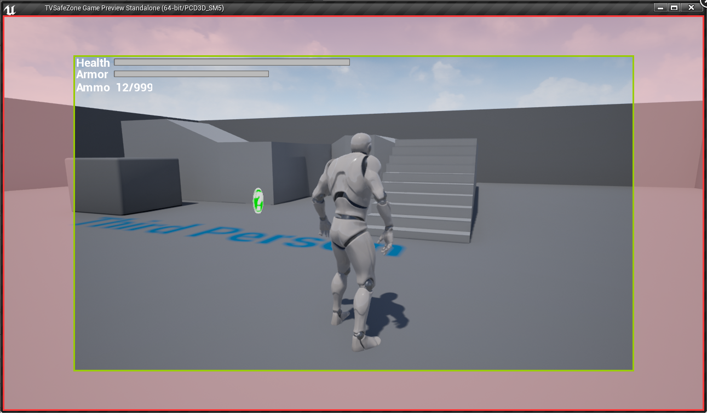
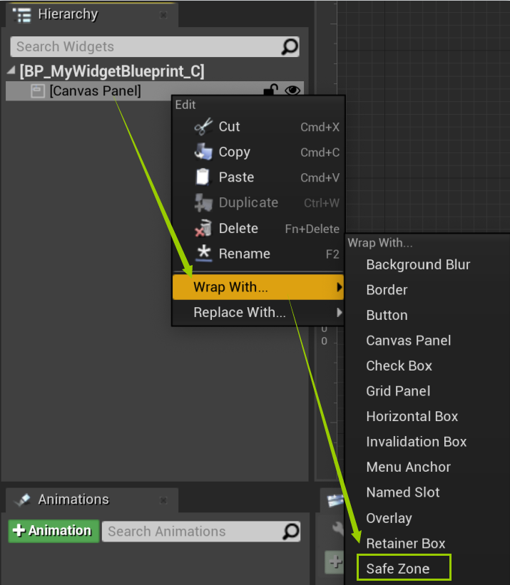
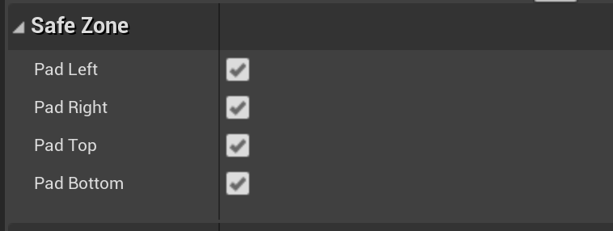
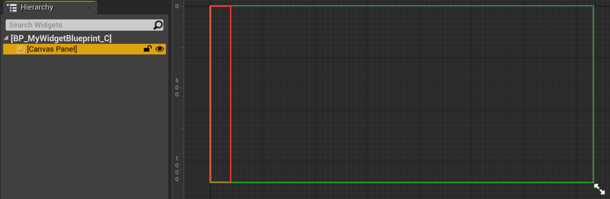
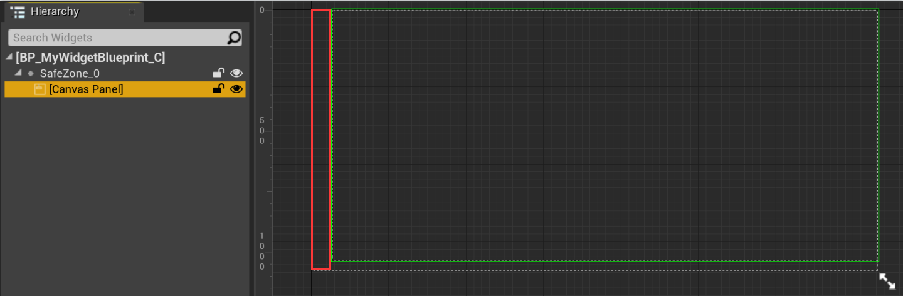
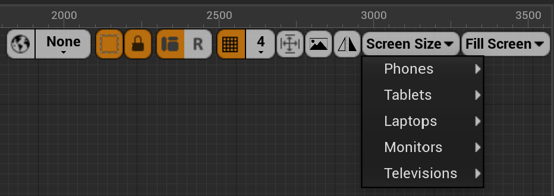

# 屏幕适配的引擎支持


## 基本概念

市面上的设备，尤其是移动设备，可能存在异形屏（或者称为“刘海屏”，“水滴屏”等）的设计，因此就会出现 UI 被遮挡的问题；为了解决这个问题，需要进行屏幕适配。

在屏幕适配当中，有两个重要的概念： **安全区（Safe Zone）** 和 **裁剪区（Cutout）** 。安全区是屏幕上的一个不大于屏幕的区域，用于限定 UI 的绘制范围；裁剪区是在安全区和屏幕之间，不绘制 UI 的区域，通常也是刘海等内容的所在区域。如下图所示，红框表示屏幕的范围，绿框表示安全区的范围，淡红色部分表示裁剪区。



如果 UI 的绘制范围超出了安全区，进入了裁剪区，就很有可能出现被刘海等内容遮挡的问题，因此屏幕适配的关键就是设置合适的安全区大小（也可以反过来理解——设置合适的裁剪区大小)。

裁剪区可以理解为屏幕上四个不绘制 UI 的边缘区域，因此它的大小包含四个分量： **左侧（Left）** ， **顶部（Top）** ， **右侧（Right）** 和 **底部（Bottom）** ，每个分量是一个浮点类型的数值，表示边缘的宽度。需要注意的是，大家常说的“刘海高度”，只是裁剪区大小的其中一个分量（通常是指 Top 分量），而非整个裁剪区的大小。

对于屏幕适配，虚幻引擎提供了一定程度的支持。在 UMG 系统中，可以使用 SafeZone 控件来实现适配。


## 使用方法

SafeZone 控件提供的适配效果，作用于以 SafeZone 控件为根控件的控件树。

对于需要做适配的 UI（即 UserWidget，以下统称为 UI），使用 SafeZone 控件作为根控件即可。由于绝大多数 UI 的根控件为 CanvasPanel，常规的做法是使用 SafeZone 控件将根控件 CanvasPanel 进行包装。



在 SafeZone 控件的细节面板中，可以设置适配方向（对应裁剪区的四个分量），默认四个方向全部适配。



| 适配方向 | 说明 |
|-|-|
| Pad Left | 是否适配屏幕左侧，针对异形屏设计存在于屏幕左侧的情况 |
| Pad Right | 是否适配屏幕右侧，针对异形屏设计存在于屏幕右侧的情况 |
| Pad Top | 是否适配屏幕顶部，针对异形屏设计存在于屏幕顶部的情况 |
| Pad Bottom | 是否适配屏幕底部，针对异形屏设计存在于屏幕底部的情况 |

以 iPhone X 为例：

+ 使用 SafeZone 控件之前，UI 的显示范围（绿框部分）为整个屏幕；由于 iPhone X 的屏幕上存在刘海（红框部分），部分 UI 可能会被遮挡

	

+ 使用 SafeZone 控件之后，UI 的显示范围（绿框部分）自动避开了刘海区域（红框部分），从而达到了适配的目的

	

+ 使用 SafeZone 控件之后，去除屏幕左侧的适配，可以看到在横屏模式下，重新出现了 UI 被刘海遮挡的问题

	

在 UMG 编辑器中，可以在 Screen Size 菜单中查看 SafeZone 控件支持的主要设备型号，以及它们的适配效果。



当然，Screen Size 菜单中罗列的设备型号仅作为参考，并不意味着菜单中缺失的设备型号都不受 SafeZone 控件的支持，建议以实际测试结果为准。


## 屏幕适配的实现原理

想要了解虚幻引擎对于屏幕适配的实现原理，可以从 SafeZone 控件的实现入手。首先是对应的 Slate 层控件，即 `SSafeZone`，从源码 SSafeZone\.cpp 当中可以了解到以下信息：

1. 当屏幕的安全区发生变化时，例如屏幕旋转，引擎会广播事件 `FCoreDelegates::OnSafeFrameChangedEvent`

2. `SSafeZone` 监听事件 `FCoreDelegates::OnSafeFrameChangedEvent`

3. 当事件 `FCoreDelegates::OnSafeFrameChangedEvent` 广播时，`SSafeZone` 会通过接口 `FSlateApplicationBase::GetSafeZoneSize` 获取更新后的裁剪区大小（请注意，这个接口返回的是裁剪区大小，而非安全区大小，它的命名存在误导性），并记录在成员属性 `SafeMargin` 当中

4. 当 `SSafeZone` 绘制子控件时，将成员属性 `SafeMargin` 应用到 UI 布局的计算当中

关键源码如下：

```c++
/** SSafeZone.cpp */

void SSafeZone::Construct(const FArguments& InArgs)
{
	// ...
	OnSafeFrameChangedHandle = FCoreDelegates::OnSafeFrameChangedEvent.AddSP(this, &SSafeZone::UpdateSafeMargin);
}

SSafeZone::~SSafeZone()
{
	FCoreDelegates::OnSafeFrameChangedEvent.Remove(OnSafeFrameChangedHandle);
}

void SSafeZone::UpdateSafeMargin() const
{
	// ...
	TSharedPtr<ISlateViewport> ViewportInterface;
	const FIntPoint ViewportSize = ViewportInterface->GetSize();
	/**
	 * 成员属性 SafeMargin 的类型是 FMargin，表示裁剪区的大小，包含 Left，Top，Right 和 Bottom 四个分量
	 */
	FSlateApplication::Get().GetSafeZoneSize(SafeMargin, ViewportSize);
	// ...
}

/**
 * OnArrangeChildren 是在 OnPaint 中调用的一个函数，用于绘制子控件之前，收集子控件的布局数据
 */
void SSafeZone::OnArrangeChildren(const FGeometry& AllottedGeometry, FArrangedChildren& ArrangedChildren) const
{
	// ...
	/**
	 * 临时变量 SlotPadding 相当于成员属性 SafeMargin 的一个拷贝
	 * GetSafeMargin 函数内部额外计算了调试 SafeZone 控件时使用的缩放因子，这个缩放因子默认为1
	 */
	const FMargin SlotPadding = GetSafeMargin(AllottedGeometry.Scale);
	/**
	 * 计算水平方向的偏移数据：Offset 等于裁剪区的 Left 分量，Size 等于屏幕宽度减去裁剪区 Left 和 Right 分量后的大小
	 */
	AlignmentArrangeResult XAlignmentResult = AlignChild<Orient_Horizontal>(AllottedGeometry.GetLocalSize().X, ChildSlot, SlotPadding);
	/**
	 * 计算垂直方向的偏移数据：Offset 等于裁剪区的 Top 分量，Size 等于屏幕高度减去裁剪区 Top 和 Bottom 分量后的大小
	 */
	AlignmentArrangeResult YAlignmentResult = AlignChild<Orient_Vertical>(AllottedGeometry.GetLocalSize().Y, ChildSlot, SlotPadding);
	/**
	 * 在绘制子控件时，将计算好的偏移数据应用到 UI 布局的计算当中
	 */
	ArrangedChildren.AddWidget(
		AllottedGeometry.MakeChild(
		ChildSlot.GetWidget(),
		FVector2D(XAlignmentResult.Offset, YAlignmentResult.Offset),
		FVector2D(XAlignmentResult.Size, YAlignmentResult.Size)
		)
	);
	// ...
}

/**
 * 计算 SSafeZone 控件的绘制大小
 */
FVector2D SSafeZone::ComputeDesiredSize(float LayoutScale) const
{
	// ...
	const FMargin SlotPadding = GetSafeMargin(LayoutScale);
	FVector2D BaseDesiredSize = SBox::ComputeDesiredSize(LayoutScale);
	/**
	 * SSafeZone 控件本身的大小加上裁剪区的大小
	 */
	return BaseDesiredSize + SlotPadding.GetDesiredSize();
	// ...
}
```

下一步，就需要了解接口 `FSlateApplicationBase::GetSafeZoneSize` 的实现。从源码 SlateApplicationBase\.cpp 当中可以了解到以下信息：

1. `FSlateApplicationBase` 是 `FSlateApplication` 的父类，接口 `GetSafeZoneSize` 是在父类 `FSlateApplicationBase` 中定义的

2. 在 `GetSafeZoneSize` 中，通过 `GetCachedDisplayMetrics` 获取成员属性 `CachedDisplayMetrics`，以进行裁剪区大小的计算

3. 成员属性 `CachedDisplayMetrics` 通过 `GetDisplayMetrics` 进行更新。更新过程由引擎自动完成，与事件 `FCoreDelegates::OnSafeFrameChangedEvent` 无关

关键源码如下：

```c++
/** SlateApplicationBase.cpp */

void FSlateApplicationBase::GetSafeZoneSize(FMargin& SafeZone, const FVector2D& OverrideSize)
{
	// ...
	FDisplayMetrics Metrics;
	GetCachedDisplayMetrics(Metrics);
	// ...
}

void FSlateApplicationBase::GetCachedDisplayMetrics(FDisplayMetrics& OutDisplayMetrics)
{
	OutDisplayMetrics = CachedDisplayMetrics;
}

void FSlateApplicationBase::GetDisplayMetrics(FDisplayMetrics& OutDisplayMetrics)
{
	FDisplayMetrics::RebuildDisplayMetrics(OutDisplayMetrics);
	CachedDisplayMetrics = OutDisplayMetrics;
	// ...
}
```

`FSlateApplicationBase` 的源码引出了两个问题：`FDisplayMetrics` 是什么，以及 `FDisplayMetrics::RebuildDisplayMetrics` 做了什么。接下来就需要了解 `FDisplayMetrics` 的定义，从源码 GenericApplication\.h 当中可以了解到以下信息：

1. `FDisplayMetrics` 是一个记录屏幕和裁剪区大小的数据类型

2. `RebuildDisplayMetrics` 在不同的平台下有着不同的实现，返回当前屏幕和裁剪区的大小

3. 在虚幻引擎中，屏幕适配分为 UI 屏幕适配和场景屏幕适配两种，后者指游戏世界中的非 UI 内容，例如游戏场景，游戏角色等画面内容的适配，不在本文的讨论范围内

关键源码如下：

```c++
/** GenericApplication.h */

struct FDisplayMetrics
{
	// ...
	/** 屏幕宽度 */
	int32 PrimaryDisplayWidth;
	/** 屏幕高度 */
	int32 PrimaryDisplayHeight;
	/** UI 屏幕适配专用的裁剪区大小 */
	FVector4 TitleSafePaddingSize;
	/** 场景屏幕适配专用的裁剪区大小，默认与 TitleSafePaddingSize 保持相同 */
	FVector4 ActionSafePaddingSize;
	/**
	 * 更新 FDisplayMetrics 中的数据；在不同的平台上有着不同的实现，共六种：
	   * Android 平台请见 AndroidApplication.cpp
	   * iOS 平台请见 IOSApplication.cpp
	   * Windows 平台请见 WindowsApplication.cpp
	   * Mac 平台请见 MacApplication.cpp
	   * Linux 平台请见 LinuxApplication.cpp
	   * HoloLens（一种微软开发的 VR 平台）平台请见 HoloLensApplication.cpp
	 */
	APPLICATIONCORE_API static void RebuildDisplayMetrics(struct FDisplayMetrics& OutDisplayMetrics);
	// ...
};
```

至此，可以得知裁剪区的大小是在接口 `FDisplayMetrics::RebuildDisplayMetrics` 中，根据各自平台的底层接口计算得到的。以 Android 平台为例，从源码 AndroidApplication\.cpp 当中可以了解到以下信息：

1. 接口 `FAndroidWindow::GetSafezone` 可以根据屏幕的旋转方向（横屏/竖屏），返回裁剪区大小四个分量（与屏幕大小）的比值

2. `RebuildDisplayMetrics` 在得到裁剪区大小四个分量的比值后，根据屏幕大小计算出具体的分量值，然后返回计算后的裁剪区大小

关键源码如下：

```c++
/** AndroidApplication.cpp */

void FDisplayMetrics::RebuildDisplayMetrics(FDisplayMetrics& OutDisplayMetrics)
{
	// ...
	{
		FVector4 SafeZoneRect = FAndroidWindow::GetSafezone(bIsPortrait);

		Inset_Left = SafeZoneRect.X * OutDisplayMetrics.PrimaryDisplayWidth;
		Inset_Top = SafeZoneRect.Y * OutDisplayMetrics.PrimaryDisplayHeight;
		Inset_Right = SafeZoneRect.Z * OutDisplayMetrics.PrimaryDisplayWidth;
		Inset_Bottom = SafeZoneRect.W * OutDisplayMetrics.PrimaryDisplayHeight;
	}
	OutDisplayMetrics.TitleSafePaddingSize.X = (Inset_Left >= 0.0f) ? Inset_Left : OutDisplayMetrics.TitleSafePaddingSize.X;
	OutDisplayMetrics.TitleSafePaddingSize.Y = (Inset_Top >= 0.0f) ? Inset_Top : OutDisplayMetrics.TitleSafePaddingSize.Y;
	OutDisplayMetrics.TitleSafePaddingSize.Z = (Inset_Right >= 0.0f) ? Inset_Right : OutDisplayMetrics.TitleSafePaddingSize.Z;
	OutDisplayMetrics.TitleSafePaddingSize.W = (Inset_Bottom >= 0.0f) ? Inset_Bottom : OutDisplayMetrics.TitleSafePaddingSize.W;
	OutDisplayMetrics.ActionSafePaddingSize = OutDisplayMetrics.TitleSafePaddingSize;
}
```

最后一步是了解接口 `FAndroidWindow::GetSafezone` 的实现，源码是 AndroidWindow\.cpp：

1. 全局变量 `GAndroidLandscapeSafezone` 和 `GAndroidPortraitSafezone` 分别对应横屏和竖屏时的裁剪区大小（分量为比值的形式）

2. 全局变量 `GAndroidLandscapeSafeZone` 和 `GAndroidPortraitSafezone` 通过 native 函数 `nativeSetSafezoneInfo` 进行更新；这个函数在 Java 层的 `GameActivity` 类中声明和调用，在 C\+\+ 层的 AndroidWindow\.cpp 中定义

3. 根据第2点，裁剪区的大小实际上是通过 Android 操作系统的接口获取的；因为裁剪区的访问和操作系统的版本有关，所以 `nativeSetSafezoneInfo` 函数只会在 SDK 级别为 28 或以上时才会调用，即仅对 Android 9\.0 或以上的设备有效，这就使得它对于 Android 平台的支持程度十分有限

关键源码如下：

```c++
/** AndroidWindow.cpp */

FVector4 FAndroidWindow::GetSafezone(bool bPortrait)
{
	return bPortrait ? GAndroidPortraitSafezone : GAndroidLandscapeSafezone;
}

#if USE_ANDROID_JNI
JNI_METHOD void Java_com_epicgames_ue4_GameActivity_nativeSetSafezoneInfo(JNIEnv* jenv, jobject thiz, jboolean bIsPortrait, jfloat left, jfloat top, jfloat right, jfloat bottom)
{
	if (bIsPortrait)
	{
		GAndroidPortraitSafezone.X = left;
		GAndroidPortraitSafezone.Y = top;
		GAndroidPortraitSafezone.Z = right;
		GAndroidPortraitSafezone.W = bottom;
	}
	else
	{
		GAndroidLandscapeSafezone.X = left;
		GAndroidLandscapeSafezone.Y = top;
		GAndroidLandscapeSafezone.Z = right;
		GAndroidLandscapeSafezone.W = bottom;
	}
}
#endif
```

```java
/** /Engine/Build/Android/Java/src/com/epicgames/ue4/GameActivity.java.template */

public class GameActivity extends ...
{
	// ...
	/** 裁剪区的大小（分量为比值的形式） */
	private RectF safezoneF;

	@Override
	public void onCreate(Bundle savedInstanceState)
	{
		// ...
		if (Build.VERSION.SDK_INT > 19)
		{
			mainRootView.setOnApplyWindowInsetsListener(new View.OnApplyWindowInsetsListener() {
				@Override
				public WindowInsets onApplyWindowInsets(View v, WindowInsets insets)
				{
					if (Build.VERSION.SDK_INT >= 28)
					{
						// ...
						android.graphics.Point displaySize;
						nativeSetSafezoneInfo(displaySize.y > displaySize.x, safezoneF.left, safezoneF.top, safezoneF.right, safezoneF.bottom);
						// ...
					}
					return insets;
				}
			});
		}
		// ...
	}
	// ...
}
```


## 局限性

引擎提供的原生支持主要有两点不足：

1. 对于 Android 平台的支持程度有限

	市面上 Android 设备的规格参差不齐，部分 Android 9\.0 以下的设备可能也会存在刘海的设计。

2. 操作繁琐

	需要对游戏中的所有 UI 进行批量操作，为每个 UI 的根控件增加一个 SafeZone 控件进行包装。


## 参考资料

+ [Setting TV Safe Zone Debugging](https://docs.unrealengine.com/4.26/en-US/SharingAndReleasing/TVSafeZoneDebugging/)

+ [UMG Safe Zones](https://docs.unrealengine.com/en-US/InteractiveExperiences/UMG/UserGuide/UMGSafeZones/index.html)

+ [Android O（SDK 8.0）新特性，刘海屏](https://www.daimajiaoliu.com/daima/4ed1c9e849003e0)
