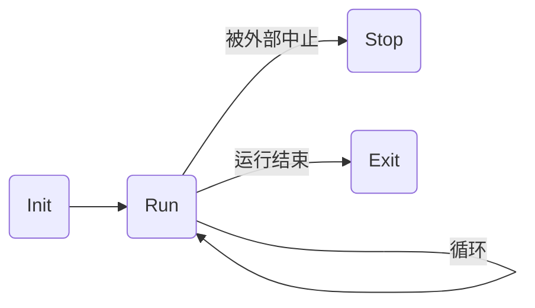
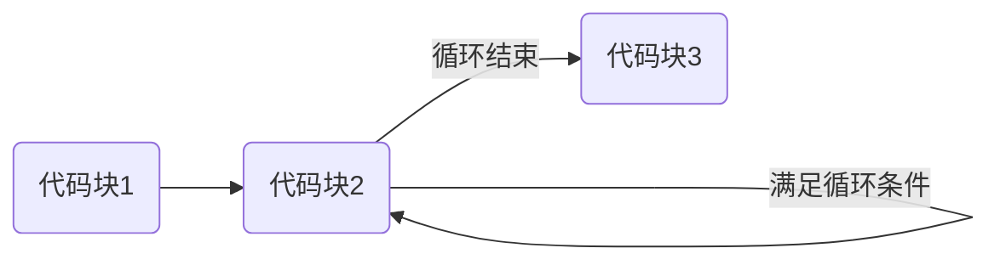

# 多线程的定制


## 概述

引擎的 Core 模块提供了定制多线程的支持，让开发者能够实现更加灵活的线程行为。关键的类型有 `FRunnable`，`FSingleThreadRunnable` 和 `FRunnableThread`。

`FRunnable` 和 `FSingleThreadRunnable` 是线程执行主体的基类，它们是可以被线程管理和调度的单位；每个线程执行主体都会运行在一个线程的上下文中。前者用于实现真正意义上的多线程（针对当前平台支持多线程的情况），后者用于模拟多线程（针对当前平台不支持多线程的情况）。判断当前平台是否支持多线程的方法，请见 [多线程的支持](unreal_engine/thread_summary.md#多线程的支持) 。

`FRunnableThread` 是线程的基类。引擎根据不同的平台实现了几种派生类，例如 Unix 平台的 `FRunnableThreadUnix` 类，Apple 平台的 `FRunnableThreadApple` 类和 Android 平台的 `FRunnableThreadAndroid` 类。此外，引擎提供了 `FFakeThread` 类，当平台不支持多线程功能时，用于模拟线程。无论使用哪种线程类型，在代码中统一以基类指针 `FRunnableThread*` 的形式进行管理。

多线程的定制，主要是创建一个线程执行主体的派生类，在其中定义线程主体函数以及维护一个线程，通过控制线程的挂起和恢复来实现灵活的线程行为。


## 线程执行主体

### FRunnable

`FRunnable` 类提供了线程执行主体的基本功能。无论当前平台是否支持多线程，每个自定义的线程执行主体类都需要继承 `FRunnable` 类。

`FRunnable` 类提供了五个虚函数，其中 `Init`，`Run`，`Stop` 和 `Exit` 用于表示线程运行时的关键阶段，它们的执行顺序如下图所示：



#### Init: 线程执行主体的初始化

`Init` 函数的返回值为 `true` 时，线程才能够正常运行，否则线程不会运行。它会在线程创建完成后自动调用，不需要手动调用。它的调用栈在**子线程**中。

#### Run: 线程主体函数

`Run` 相当于线程主体函数。因为是纯虚函数，所以必须要在派生类中重写。它的返回值类型是 `uint32`，表示线程结束运行时的终止码（Exit Code），通常返回0即可。它会在线程开始运行时自动调用，不需要手动调用。它的调用栈在**子线程**中。

`Run` 函数在线程运行过程中只会调用一次，因此如果需要在线程中实现持久性的逻辑，例如 Tcp 连接状态的维护，就需要在其中**实现一个循环体，并且处理好线程的挂起和恢复**。示例如下：

```c++
uint32 FMyRunnable::Run()
{
    {
        // 代码块1
    }
    while (bRunning)
    {
        // 代码块2：循环体

        // 线程的挂起和恢复
        FPlatformProcess::Sleep(0.1f);
    }
    {
        // 代码块3
    }
    return 0u;
}
```

以上示例的执行流程如下图所示：



实现循环体时需要注意：

+ 明确循环条件

    明确循环条件，一是当线程正常运行时，始终满足循环条件，从而执行循环体，二是当外部尝试中止线程时，应当不再满足循环条件，从而让 `Run` 函数正常执行完毕。尤其是第二点，如果仍然满足循环条件，就会导致循环体无限执行，使得线程无法正常中止。

    在以上的示例中，循环条件是 `bRunning == true`。这就要求当线程正常运行时，变量 `bRunning` 始终为 `true`，当外部尝试中止线程时，需要及时将变量 `bRunning` 设置为 `false`。

+ 明确线程的挂起时间

    引擎接口 `FPlatformProcess::Sleep` 的作用是在每执行完一次循环后，将线程挂起一段时间，将运行资源让给其他线程，等待下一次循环的执行。线程的挂起时间应当根据实际情况进行调整，不宜过小或者过大，过小会导致当前线程占用过多的运行资源，从而阻塞其他线程，过大则会阻塞当前线程。

#### Stop: 线程被外部中止

`Stop` 函数会在线程被外部中止，即 `FRunnable::Kill` 函数调用时自动调用，不需要手动调用。它的调用栈在**主线程**中。

线程被外部中止时，往往还没有结束运行，因此在 `Stop` 函数中应当修改线程执行主体的某些成员变量，确保循环体的循环条件不再满足。如此，在执行下一次循环时就会正常退出循环体，从而结束线程的运行，否则就会导致线程无法中止。示例如下：

```c++
void FMyRunnable::Stop()
{
    // 让循环条件不再满足
    bRunning = false;
}
```

#### Exit: 线程运行结束

`Exit` 函数会在线程结束运行时调用，不需要手动调用。它的调用栈在**子线程**中。

#### GetSingleThreadInterface: 获取线程执行主体

`GetSingleThreadInterface` 是 `FRunnable` 类提供的第五个虚函数，当平台不支持多线程时，它用于向引擎返回一个单线程执行主体，当返回值为空指针时多线程的模拟就会失败。

常规的做法是让线程执行主体类同时继承 `FRunnable` 类和 `FSingleThreadRunnable` 类，如此在 `GetSingleThreadInterface` 函数中返回自身即可。

```c++
FSingleThreadInterface* FMyRunnable::GetSingleThreadInterface()
{
    // 当前的线程执行主体类型应当继承自 FSingleThreadRunnable 类
    return this;
}
```

### FSingleThreadRunnable

除了 `FRunnable` 类，线程执行主体类还需要继承 `FSingleThreadRunnable` 类，以便当平台不支持多线程时能够模拟多线程。

`FSingleThreadRunnable` 类提供了 `Tick` 这个纯虚函数，作为平台不支持多线程时的线程主体函数。

> 因为还没有在不支持多线程的环境下进行测试，所以还不清楚 `Init`，`Run`，`Stop` 和 `Exit` 四个函数是否仍然起作用


## 线程

### FRunnableThread

`FRunnableThread` 类提供了以下几个重要的接口。

#### Create: 创建线程

`Create` 接口是一个静态函数，用于创建一个线程实例。注意这个过程涉及内存的动态分配，在销毁线程时应当**手动回收内存**，或者使用智能对象封装线程。

```c++
// RunnableThread.h

/**
 * @param   InRunnable              与之关联的线程执行主体
 * @param   ThreadName              线程的识别名称
 * @param   InStackSize             堆栈空间，为0引擎会分配一个默认的空间
 * @param   InThreadPri             优先度，请见 EThreadPriority
 * @param   InThreadAffinityMask    亲和性掩码，与平台相关，请见 FPlatformAffinity
 * @param   InCreateFlags           在 UE4.27 ~ UE5.1 中，这个参数在各个平台版本的线程类中都没有使用
 * @return  当前平台专属的一个线程类实例
 */
static FRunnableThread* Create(
    class FRunnable* InRunnable,
    const TCHAR* ThreadName,
    uint32 InStackSize = 0,
    EThreadPriority InThreadPri = TPri_Normal,
    uint64 InThreadAffinityMask = FPlatformAffinity::GetNoAffinityMask(),
    EThreadCreateFlags InCreateFlags = EThreadCreateFlags::None);
```

#### Kill: 中止线程

`Kill` 接口用于中止一个线程的运行。它会触发线程执行主体 `Stop` 函数的执行，通知线程即将结束运行。

调用这个接口后，引擎会暂时让待中止的线程占据所有的运行资源，线程执行主体在结束 `Run` 函数的执行后会执行 `Exit` 函数以结束线程的运行。假如在线程执行主体的 `Stop` 函数中没有做好处理，使得循环体的循环条件仍然满足，就会让循环体无限执行，从而导致游戏卡死。如果选择强制中止线程，就会使得线程执行主体 `Run` 函数的余下流程和 `Exit` 函数都不会执行，这可能会引起内存泄漏的问题。因此，在线程执行主体的 `Stop` 函数中做好处理，然后在中止线程时等待线程结束运行，这是最妥当的做法。

```c++
// RunnableThread.h

/**
 * @param   bShouldWait true 表示等待线程主体函数结束执行，false 表示强制中止线程
 * @return  总是返回 true
 */
virtual bool Kill(bool bShouldWait = true) = 0;
```

#### Suspend: 挂起/恢复线程

`Suspend` 接口用于挂起和恢复线程。线程挂起后，引擎不再为它分配运行资源；线程恢复后，会重新参与引擎的多线程调度。

```c++
// RunnableThread.h

/**
 * @param   bShouldPause true 表示挂起线程，false 表示恢复线程
 */
virtual void Suspend(bool bShouldPause = true) = 0;
```

### 线程的维护

每个线程都应该由对应的线程执行主体来维护，因此在每个线程执行主体类中，都需要声明一个 `FRunnableThread` 指针类型或者智能指针类型的成员。然后，在线程执行主体中处理线程的创建和销毁，通常的做法是在线程执行主体类的构造函数中创建线程，在析构函数中销毁线程。至于线程的挂起，恢复，设置优先度等操作，则按需添加。示例如下：

```c++
FMyRunnable::FMyRunnable()
{
    Thread = FRunnableThread::Create(this, TEXT("MyRunnableThread"));
}

FMyRunnable::~FMyRunnable()
{
    if (Thread)
    {
        Thread->Kill();
        delete Thread;
        Thread = nullptr;
    }
}
```

另外，线程创建后就会立即开始执行，如果不想使用 `Suspend` 接口，就需要在线程执行主体类中提供两个公开的成员函数，分别用于创建和销毁线程，让线程的管理更加可控。


## 注意事项

### 不能在抽象的线程执行主体类中创建线程

考虑以下的示例，为了统一和简化线程执行主体类的写法，我们实现了一个 `IMyRunnableBase` 类，在这个类当中实现了 `Init`，`Run`，`Stop` 和 `Exit` 函数，其他的派生类只需要继承 `IMyRunnableBase` 类，然后实现虚函数 `LoopBody`：

```c++
// 基类
class IMyRunnableBase : public FRunnable
{
protected:
    // 由派生类重写以提供线程主循环的逻辑
    virtual void LoopBody() = 0;

    virtual bool Init() override
    {
        bRunning = true;
        return true;
    }

    virtual uint32 Run() override
    {
        while (bRunning)
        {
            LoopBody();
            FPlatformProcess::Sleep(0.01f);
        }
        return 0;
    }

    virtual void Stop() override
    {
        bRunning = false;
    }

    virtual void Exit() override
    {
        // ...
    }

protected:
    bool bRunning;
};

// 派生类1
class FMyRunnableA : public IMyRunnableBase
{
private:
    virtual void LoopBody() override
    {
        // ...
    }
};

// 派生类2
class FMyRunnableB : public IMyRunnableBase
{
private:
    virtual void LoopBody() override
    {
        // ...
    }
};
```

在这个示例当中，`IMyRunnableBase` 是一个抽象类，其中的 `LoopBody` 是纯虚函数，不能执行，而在 `FMyRunnableA` 和 `FMyRunnableB` 类当中实现的 `LoopBody` 才是可以正常执行的虚函数。

线程执行主体类在实例化之后，就需要创建一个线程与之绑定，我们通常会在线程执行主体类的构造函数当中创建线程，对于以上的例子我们可以有两种做法：

+ 在 `IMyRunnableBase` 类的构造函数当中创建线程

    ```c++
    class IMyRunnableBase : public FRunnable
    {
        // ...

    protected:
        IMyRunnableBase(const TCHAR* ThreadName)
        {
            Thread = FRunnableThread::Create(this, ThreadName);
        }

        FRunnableThread* Thread;
    };
    ```

    这种做法可以减少 `IMyRunnableBase` 派生类的代码量，在派生类当中不需要自行创建线程。然而，在 `FRunnableThread::Create()` 的调用栈当中，会依次执行线程执行主体类的 `Init` 和 `Run` 函数；因为这种做法相当于是在 `IMyRunnableBase` 类的上下文当中创建线程，所以在调用栈当中执行的 `Init` 和 `Run` 函数均来自 `IMyRunnableBase` 类。那么当调用 `IMyRunnableBase` 类 `Run` 函数的时候，就会调用到纯虚函数 `LoopBody`，从而出错。

    根据 C++ 多态的原理，在调用虚函数 `LoopBody` 的时候，应该会调用到 `IMyRunnableBase` 派生类的重写版本，而非 `IMyRunnableBase` 类当中的纯虚函数。不过经过测试，在**第一次线程循环**时调用的 `LoopBody` 函数，确实是 `IMyRunnableBase` 类的纯虚函数，在此之后调用的 `LoopBody` 函数，才是派生类的重写版本。

    总而言之，这种做法必然会导致线程出错，表现为**线程启动时出现崩溃，而且在日志当中找不到相关的错误信息**。

+ 在 `IMyRunnableBase` 派生类的构造函数当中创建线程

    ```c++
    class FMyRunnableA : public IMyRunnableBase
    {
        // ...
    protected:
        FMyRunnableA()
        {
            Thread = FRunnableThread::Create(this, TEXT("MyRunnableA"));
        }

        FRunnableThread* Thread;
    };

    class FMyRunnableB : public IMyRunnableBase
    {
        // ...
    protected:
        FMyRunnableB()
        {
            Thread = FRunnableThread::Create(this, TEXT("MyRunnableB"));
        }

        FRunnableThread* Thread;
    };
    ```

    这种做法是在非抽象线程执行主体类的上下文当中创建线程，即使是在第一次线程循环时调用的 `LoopBody` 函数，也会是派生类的重写版本。

当然，我们也可以在派生类实例化之后再来创建线程，由于抽象类不能实例化，那么我们自然就不会遇到这种问题。示例如下：

```c++
// IMyRunnableBase 类不能实例化，出现编译错误
IMyRunnableBase* RunnableBase = new IMyRunnableBase();
RunnableBase->Thread = FRunnableThread::Create(RunnableBase, TEXT("MyRunnableBase"));

// 在 FMyRunnableA 类的上下文当中创建线程
IMyRunnableBase* RunnableA = new FMyRunnableA();
RunnableA->Thread = FRunnableThread::Create(RunnableA, TEXT("MyRunnableA"));
```

无论如何，我们都不应该在抽象的线程执行主体类当中创建线程，以免在启动线程的时候出现错误。


## 完整示例

线程执行主体类的完整示例请见 [MyRunnable.h](unreal_engine/thread_runnable/MyRunnable.h) 和 [MyRunnable.cpp](unreal_engine/thread_runnable/MyRunnable.cpp) 。


## 参考资料

+ [官方案例](https://wiki.unrealengine.com/index.php?title=Multi-Threading:_How_to_Create_Threads_in_UE4)
