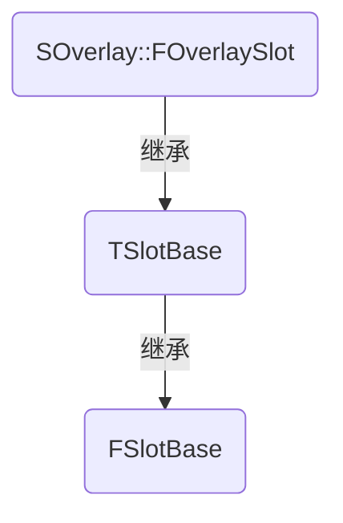
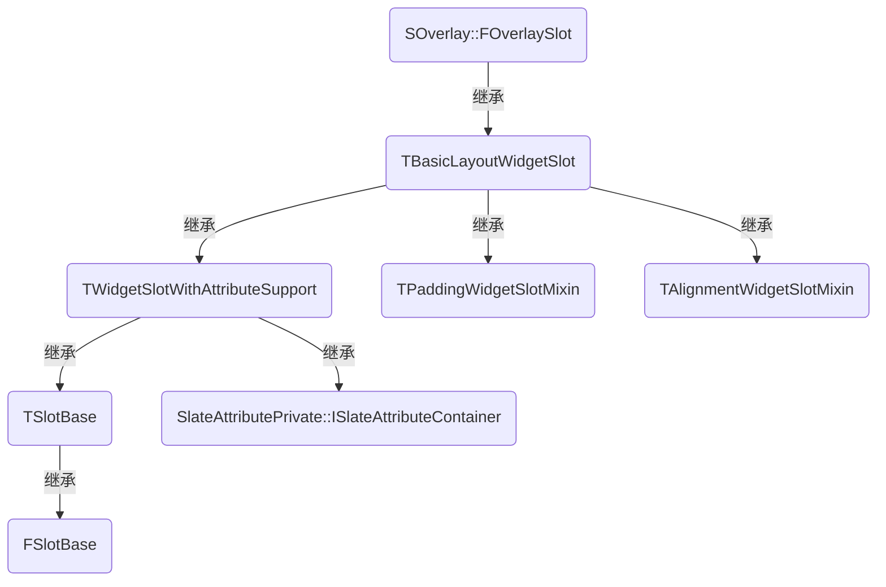

# UE5 API 变更记录

以下是将引擎版本从 4\.27 升级至 5\.0 和 5\.1 时遇到的 API 变更，并不涵盖所有的 API 变更。


<details>

<summary>UObjectBaseUtility 类</summary>

`UObjectBaseUtility` 类的声明请见 UObjectBaseUtility\.h。

+ `MarkPendingKill` 函数

    从 UE5\.0 开始被 `MarkAsGarbage` 函数所替代。

    ```cpp
    UObject* const Object;
    #if ENGINE_MAJOR_VERSION >= 5
        Object->MarkAsGarbage();
    #else
        Object->MarkPendingKill();
    #endif
    ```

+ `ClearPendingKill` 函数

    从 UE5\.0 被 `ClearGarbage` 函数所替代。

    ```cpp
    UObject* const Object;
    #if ENGINE_MAJOR_VERSION >= 5
        Object->ClearGarbage();
    #else
        Object->ClearPendingKill();
    #endif
    ```

+ `IsPendingKill` 函数

    从 UE5\.0 被全局函数 `IsValid` 或者 `GetValid` 所替代。这两个函数的定义请见 Object\.h。

    根据引擎的注释，除了以上两个函数外，还可以使用全局函数 `IsValidChecked`，功能类似于 `IsValid`。然而我们并不建议使用该函数，因为该函数内部存在断言，如果待检查的对象为空就会导致断言失败，从而引起崩溃。

    ```cpp
    UObject* const Object;
    #if ENGINE_MAJOR_VERSION >= 5
        // 或通过 GetValid(Object) 进行检查，Object 有效时返回 Object，反之返回空指针
        const bool bValid = IsValid(Object);
    #else
        const bool bValid = Object->IsPendingKill();
    #endif
    ```

</details>


<details>

<summary>UEditorLevelLibrary 类</summary>

`UEditorLevelLibrary` 类的声明请见 EditorLevelLibrary\.h。

从 UE5\.0 开始，`UEditorLevelLibrary` 中的蓝图函数被移至各个 Subsystem 类中，这里举几个例子： 

+ `GetEditorWorld` 和 `GetGameWorld` 函数

    被移至 `UUnrealEditorSubsystem` 类中，请见 UnrealEditorSubsystem\.h。

    ```cpp
    // 以 GetEditorWorld 和 GetGameWorld 为例

    #if ENGINE_MAJOR_VERSION >= 5
        UWorld* EditorWorld = nullptr;
        UWorld* GameWorld = nullptr;
        if (UUnrealEditorSubsystem* const Subsystem = GEditor->GetEditorSubsystem<UUnrealEditorSubsystem>())
        {
            EditorWorld = Subsystem->GetEditorWorld();
            GameWorld = Subsystem->GetGameWorld();
        }
    #else
        UWorld* const EditorWorld = UEditorLevelLibrary::GetEditorWorld();
        UWorld* const GameWorld = UEditorLevelLibrary::GetGameWorld();
    #endif
    ```

+ `LoadLevel` 函数

    被移至 `ULevelEditorSubsystem` 类中，请见 LevelEditorSubsystem\.h。

+ `DestroyActor` 函数

    被移至 `UEditorActorSubsystem` 类中，请见 EditorActorSubsystem\.h。

+ `SpawnActorFromClass` 函数

    被移至 `UEditorActorSubsystem` 类中，请见 EditorActorSubsystem\.h。

</details>


<details>

<summary>UNiagaraComponent 类</summary>

`UNiagaraComponent` 类的声明请见 NiagaraComponent\.h。

+ `GetSystemInstance` 函数

    从 UE5\.0 开始被废弃。

    从 UE5\.0 开始，`FNiagaraSystemInstance` 的函数改为通过 `FNiagaraSystemInstanceController` 来调用。注意这并不是指前者的函数被移至后者，而是指后者绑定了前者，通过后者来调用前者的函数。后者是 UE5\.0 新增的类型。

    ```cpp
    // 以 FNiagaraSystemInstance::IsComplete 函数的调用为例

    UNiagaraComponent* const Component;
    #if ENGINE_MAJOR_VERSION >= 5
        const bool bComplete = Component->GetSystemInstanceController()->IsComplete();
    #else
        const bool bComplete = Component->GetSystemInstance()->IsComplete();
    #endif
    ```

</details>


<details>

<summary>UNiagaraEmitter 类</summary>

`UNiagaraEmitter` 类的声明请见 NiagaraEmitter\.h。

+ `GetRenderers` 函数

    从 UE5\.1 开始，该函数被迁移到 `FVersionedNiagaraEmitterData` 结构体中。后者是 UE5\.1 新增的类型，在 `FNiagaraEmitterInstance` 类中可以通过 `GetCachedEmitterData` 函数来返回。

    `FVersionedNiagaraEmitterData` 结构体的声明请见 NiagaraEmitter\.h，`FNiagaraEmitterInstance` 类的声明请见 NiagaraEmitterInstance\.h。

    ```cpp
    const TSharedRef<FNiagaraEmitterInstance> Instance;
    #if ENGINE_MAJOR_VERSION == 5 && ENGINE_MINOR_VERSION >= 1 || ENGINE_MAJOR_VERSION > 5
        if (FVersionedNiagaraEmitterData* const EmitterData = Instance->GetCachedEmitterData())
        // 或者：
        // if (FVersionedNiagaraEmitterData* const EmitterData = Instance->GetCachedEmitter().GetEmitterData())
        {
            const TArray<UNiagaraRendererProperties*>& Renderers = EmitterData->GetRenderers();
        }
    #else
        if (UNiagaraEmitter* const Emitter = Instance->GetCachedEmitter())
        {
            const TArray<UNiagaraRendererProperties*>& Renderers = Emitter->GetRenderers();
        }
    #endif
    ```

+ `SimTarget` 属性

    从 UE5\.1 开始，该属性被迁移到 `FVersionedNiagaraEmitterData` 结构体中。

+ `bLocalSpace` 属性

    从 UE5\.1 开始，该属性被迁移到 `FVersionedNiagaraEmitterData` 结构体中。

</details>


<details>

<summary>USkinnedMeshComponent 类</summary>

`USkinnedMeshComponent` 类的声明请见 SkinnedMeshComponent\.h。

+ `SetSkeletalMesh` 函数

    从 UE5\.1 开始被 `SetSkinnedAssetAndUpdate` 函数所替代。这对于派生类 `USkeletalMeshComponent` 也有影响。

    在派生类 `USkeletalMeshComponent` 中，`SetSkeletalMesh` 仍然可用，但是不再作为蓝图函数。

    ```cpp
    USkinnedMeshComponent* const SkinnedMeshComponent;
    USkeletalMeshComponent* const SkeletalMeshComponent;
    USkeletalMesh* const SkeletalMesh;
    #if ENGINE_MAJOR_VERSION == 5 && ENGINE_MINOR_VERSION >= 1 || ENGINE_MAJOR_VERSION > 5
        // 参数类型是 USkinnedAsset，但是因为 USkeletalMesh 是 USkinnedAsset 的派生类，所以可以直接传递
        SkinnedMeshComponent->SetSkinnedAssetAndUpdate(SkeletalMesh);

        // 蓝图函数调用，与 SetSkeletalMesh 等价
        SkeletalMeshComponent->SetSkinnedAssetAndUpdate(SkeletalMesh);
        // 非蓝图函数调用，与 SetSkinnedAssetAndUpdate 等价
        SkeletalMeshComponent->SetSkeletalMesh(SkeletalMesh);
    #else
        // 蓝图函数调用
        SkinnedMeshComponent->SetSkeletalMesh(SkeletalMesh);

        // 蓝图函数调用
        SkeletalMeshComponent->SetSkeletalMesh(SkeletalMesh);
    #endif
    ```

</details>


<details>

<summary>UObject 类</summary>

`UObject` 类的声明请见 Object\.h。

+ `PreSave` 函数

    从 UE5\.0 开始，参数类型发生变化。

    ```cpp
    #if ENGINE_MAJOR_VERSION >= 5
        virtual void PreSave(const class ITargetPlatform* TargetPlatform);
    #else
        virtual void PreSave(FObjectPreSaveContext SaveContext);
    #endif
    ```

</details>


<details>

<summary>UUserWidget 类</summary>

`UUserWidget` 类的声明请见 UserWidget\.h。

+ `DuplicateAndInitializeFromWidgetTree` 函数

    从 UE5\.1 开始，参数列表发生变化，相比旧版本多了一步合并子控件的操作。

    ```cpp
    UUserWidget* const UserWidget;
    UWidgetTree* const WidgetTree;
    // 需要额外合并的子控件，如果没有留空即可
    const TMap<FName, UWidget*> NamedSlotContentToMerge;
    #if ENGINE_MAJOR_VERSION == 5 && ENGINE_MINOR_VERSION >= 1 || ENGINE_MAJOR_VERSION > 5
        UserWidget->DuplicateAndInitializeFromWidgetTree(WidgetTree, NamedSlotContentToMerge);
    #else
        UserWidget->DuplicateAndInitializeFromWidgetTree(WidgetTree);
    #endif
    ```

+ `GetIsVisible` 函数

    从 UE5\.1 开始被废弃，被 `IsInViewport` 函数所替代。

    在 UE5\.0 及之前的版本中，`IsInViewport` 是 `UUserWidget` 类的成员函数，从 UE5\.1 开始变成 `UWidget` 类的成员函数。因为 `UWidget` 是 `UUserWidget` 的基类，所以这种变化对于 `UUserWidget` 及其派生类是无感的。

    ```cpp
    UUserWidget* const UserWidget;
    #if ENGINE_MAJOR_VERSION == 5 && ENGINE_MINOR_VERSION >= 1 || ENGINE_MAJOR_VERSION > 5
        // 只能调用 IsInViewport 函数
        const bool bVisible = UserWidget->IsInViewport();
    #else
        // 调用 GetIsVisible 和 IsInViewport 函数皆可
        {
            const bool bVisible = UserWidget->GetIsVisible();
        }
        {
            const bool bVisible = UserWidget->IsInViewport();
        }
    #endif
    ```

+ `RemoveFromViewport` 函数

    从 UE5\.1 开始被废弃，被 `RemoveFromParent` 函数所替代。

    因为从 UE4 开始，`UUserWidget` 类就提供了 `RemoveFromParent` 函数的定义，并且 `RemoveFromViewport` 函数的实现在 UE4 和 UE5 中是相同的，所以可以直接改用 `RemoveFromParent` 函数。

    ```cpp
    UUserWidget* const UserWidget;
    #if ENGINE_MAJOR_VERSION == 5 && ENGINE_MINOR_VERSION >= 1 || ENGINE_MAJOR_VERSION > 5
        // 只能使用 RemoveFromParent
        UserWidget->RemoveFromParent();
    #else
        // 使用 RemoveFromParent 和 RemoveFromViewport 皆可，两者等价
        UserWidget->RemoveFromParent();
        UserWidget->RemoveFromViewport();
    #endif
    ```

</details>


<details>

<summary>UDataTable 类</summary>

`UDataTable` 类的声明请见 DataTable\.h。

+ `GetRowStructName` 函数

    从 UE5\.1 开始被 `GetRowStructPathName` 函数所替代。

    ```cpp
    UDataTable* const DataTable;
    #if ENGINE_MAJOR_VERSION == 5 && ENGINE_MINOR_VERSION >= 1 || ENGINE_MAJOR_VERSION > 5
        const FString& PathName = DataTable->GetRowStructPathName().ToString();
    #else
        const FString& PathName = DataTable->GetRowStructName().ToString();
    #endif
    ```

</details>


<details>

<summary>UKismetTextLibrary 类</summary>

`UKismetTextLibrary` 类的声明请见 KismetTextLibrary\.h。

+ `Conv_FloatToText` 函数

    从 UE5\.1 开始被 `Conv_DoubleToText` 函数所替代，后者是从 UE5\.0 开始新增的函数。

    ```cpp
    #if ENGINE_MAJOR_VERSION >= 5
        // 接收双精度浮点数
        const FText& Text = UKismetTextLibrary::Conv_DoubleToText(100.0, ERoundingMode::HalfToEven);
    #else
        // 接收单精度浮点数
        const FText& Text = UKismetTextLibrary::Conv_FloatToText(100.0f, ERoundingMode::HalfToEven);
    #endif
    ```

</details>


<details>

<summary>UTexture2DArray 类</summary>

`UTexture2DArray` 类的声明请见 Texture2DArray\.h。

+ `InvadiateTextureSource` 函数

    从 UE5\.1 开始，该函数的命名被更正为 `InvalidateTextureSource`。

    ```cpp
    UTexture2DArray* const Array;
    #if ENGINE_MAJOR_VERSION == 5 && ENGINE_MINOR_VERSION >= 1 || ENGINE_MAJOR_VERSION > 5
        Array->InvalidateTextureSource();
    #else
        Array->InvadiateTextureSource();
    #endif
    ```

</details>


<details>

<summary>UMaterial 类</summary>

`UMaterial` 类的声明请见 Source/Runtime/Engine/Classes/Materials/Material\.h。

+ `EditorComments`，`Expressions`，`ExpressionExecBegin`，`ExpressionExecEnd` 和 `ExpressionCollection` 属性

    从 UE5\.1 开始，这些属性被对应的 Get 函数所替代。例如 `Expressions` 属性改为通过 `GetExpressions` 函数来访问。

    ```cpp
    // 以 Expressions 属性为例

    UMaterial* const Material;
    #if WITH_EDITORONLY_DATA
    #if ENGINE_MAJOR_VERSION == 5 && ENGINE_MINOR_VERSION >= 1 || ENGINE_MAJOR_VERSION > 5
        const TArray<TObjectPtr<UMaterialExpression>>& Expressions = Material->GetExpressions();
    #else
        const TArray<TObjectPtr<UMaterialExpression>>& Expressions = Material->Expressions;
    #endif
    #endif
    ```

+ `ParameterGroupData`，`ExpressionCollection`，`BaseColor`，`Metallic`，`Specular`，`Roughness`，`Anisotropy`，`Normal`，`Tangent`，`EmissiveColor`，`Opacity`，`OpacityMask`，`WorldPositionOffset`，`SubsurfaceColor`，`ClearCoat`，`ClearCoatRoughness`，`AmbientOcclusion`，`Refraction`，`CustomizedUVs`，`MaterialAttributes`，`PixelDepthOffset`，`ShadingModelFromMaterialExpression` 和 `FrontMaterial` 属性

    从 UE5\.1 开始，这些属性被迁移至 `UMaterialEditorOnlyData` 结构体中。后者是 UE5\.1 新增的类型，在 `UMaterial` 中可以通过 `GetEditorOnlyData` 函数来访问。

    ```cpp
    // 以 ParameterGroupData 属性为例

    UMaterial* const Material;
    #if WITH_EDITORONLY_DATA
    #if ENGINE_MAJOR_VERSION == 5 && ENGINE_MINOR_VERSION >= 1 || ENGINE_MAJOR_VERSION > 5
        if (UMaterialEditorOnlyData* const MaterialData = Material->GetEditorOnlyData())
        {
            const TArray<FParameterGroupData>& ParameterGroupData = MaterialData->ParameterGroupData;
        }
    #else
        {
            const TArray<FParameterGroupData>& ParameterGroupData = Material->ParameterGroupData;
        }
    #endif
    #endif
    ```

</details>


<details>

<summary>UWidget 类</summary>

`UWidget` 类的声明请见 Widget\.h。

+ `Visibility` 属性

    从 UE5\.1 开始不再支持直接访问，被 `GetVisibility` 和 `SetVisibility` 函数所替代。因为 `GetVisibility` 和 `SetVisibility` 在 UE4 和 UE5 中都有提供，所以不需要做版本兼容。

</details>


<details>

<summary>UTextBlock 类</summary>

`UTextBlock` 类的声明请见 TextBlock\.h。

+ `Text` 属性

    从 UE5\.1 开始不再支持直接访问，被 `GetText` 和 `SetText` 函数所替代。

    因为从 UE4 开始 `UTextBlock` 类就提供了 `GetText` 和 `SetText` 函数的定义，所以可以直接改用函数。

    ```cpp
    UTextBlock* const TextBlock;
    #if ENGINE_MAJOR_VERSION == 5 && ENGINE_MINOR_VERSION >= 1 || ENGINE_MAJOR_VERSION > 5
        // 只能使用 GetText 和 SetText 函数
        const FText& Text = TextBlock->GetText();
        TextBlock->SetText(Text);
    #else
        // 可以使用 GetText 和 SetText 函数，或者直接访问 Text 属性
        {
            const FText& Text = TextBlock->GetText();
            TextBlock->SetText(Text);
        }
        {
            const FText& Text = TextBlock->Text;
            TextBlock->Text = Text;
        }
    #endif
    ```

+ `Font` 属性

    从 UE5\.1 开始不再支持直接访问，被 `GetFont` 和 `SetFont` 函数所替代。

    `UTextBlock` 类从 UE4 开始就提供了 `SetFont` 函数的定义，但是从 UE5\.1 开始才提供 `GetFont` 函数的定义。

    ```cpp
    UTextBlock* const TextBlock;
    #if ENGINE_MAJOR_VERSION == 5 && ENGINE_MINOR_VERSION >= 1 || ENGINE_MAJOR_VERSION > 5
        // 只能使用 GetFont 和 SetFont 函数
        const FSlateFontInfo& Font = TextBlock->GetFont();
        TextBlock->SetFont(Font);
    #else
        // 可以使用 SetFont 函数，或者直接访问 Font 属性
        const FSlateFontInfo& Font = TextBlock->Font;
        TextBlock->SetFont(Font);
        TextBlock->Font = Font;
    #endif
    ```

+ `ColorAndOpacity` 属性

    从 UE5\.1 开始不再支持直接访问，被 `GetColorAndOpacity` 和 `SetColorAndOpacity` 函数所替代。

    与 `Font` 属性的情况相同，`UTextBlock` 类从 UE4 开始就提供了 `SetColorAndOpacity` 函数的定义，但是从 UE5\.1 开始才提供 `GetColorAndOpacity` 函数的定义。

+ `StrikeBrush` 属性

    从 UE5\.1 开始不再支持直接访问，被 `GetStrikeBrush` 和 `SetStrikeBrush` 函数所替代。

    与 `Font` 属性的情况相同，`UTextBlock` 类从 UE4 开始就提供了 `SetStrikeBrush` 函数的定义，但是从 UE5\.1 开始才提供 `GetStrikeBrush` 函数的定义。

+ `ShadowOffset` 属性

    从 UE5\.1 开始不再支持直接访问，被 `GetShadowOffset` 和 `SetShadowOffset` 函数所替代。

    与 `Font` 属性的情况相同，`UTextBlock` 类从 UE4 开始就提供了 `SetShadowOffset` 函数的定义，但是从 UE5\.1 开始才提供 `GetShadowOffset` 函数的定义。

+ `ShadowColorAndOpacity` 属性

    从 UE5\.1 开始不再支持直接访问，被 `GetShadowColorAndOpacity` 和 `SetShadowColorAndOpacity` 函数所替代。

    与 `Font` 属性的情况相同，`UTextBlock` 类从 UE4 开始就提供了 `SetShadowColorAndOpacity` 函数的定义，但是从 UE5\.1 开始才提供 `GetShadowColorAndOpacity` 函数的定义。

+ `MinDesiredWidth` 属性

    从 UE5\.1 开始不再支持直接访问，被 `GetMinDesiredWidth` 和 `SetMinDesiredWidth` 函数所替代。

    与 `Font` 属性的情况相同，`UTextBlock` 类从 UE4 开始就提供了 `SetMinDesiredWidth` 函数的定义，但是从 UE5\.1 开始才提供 `GetMinDesiredWidth` 函数的定义。

+ `TextTransformPolicy` 属性

    从 UE5\.1 开始不再支持直接访问，被 `GetTextTransformPolicy` 和 `SetTextTransformPolicy` 函数所替代。

    与 `Font` 属性的情况相同，`UTextBlock` 类从 UE4 开始就提供了 `SetTextTransformPolicy` 函数的定义，但是从 UE5\.1 开始才提供 `GetTextTransformPolicy` 函数的定义。

+ `TextOverflowPolicy` 属性

    从 UE5\.1 开始不再支持直接访问，被 `GetTextOverflowPolicy` 和 `SetTextOverflowPolicy` 函数所替代。

    与 `Font` 属性的情况相同，`UTextBlock` 类从 UE4 开始就提供了 `SetTextOverflowPolicy` 函数的定义，但是从 UE5\.1 开始才提供 `GetTextOverflowPolicy` 函数的定义。

</details>


<details>

<summary>UEditableText 类</summary>

`UEditableText` 类的声明请见 EditableText\.h。

+ `Text` 属性

    从 UE5\.1 开始不再支持直接访问，被 `GetText` 和 `SetText` 函数所替代。

    因为从 UE4 开始 `UEditableText` 类就提供了 `GetText` 和 `SetText` 函数的定义，所以可以直接改用函数。

    ```cpp
    UEditableText* const EditableText;
    #if ENGINE_MAJOR_VERSION == 5 && ENGINE_MINOR_VERSION >= 1 || ENGINE_MAJOR_VERSION > 5
        // 只能使用 GetText 和 SetText 函数
        const FText& Text = EditableText->GetText();
        EditableText->SetText(Text);
    #else
        // 可以直接访问 Text 属性或者使用函数
        {
            const FText& Text = EditableText->Text;
            EditableText->Text = Text;
        }
        {
            const FText& Text = EditableText->GetText();
            EditableText->SetText(Text);
        }
    #endif
    ```

+ `HintText` 属性

    从 UE5\.1 开始不再支持直接访问，被 `GetHintText` 和 `SetHintText` 函数所替代。

    `UEditableText` 类从 UE4 开始提供 `SetHintText` 函数的定义，从 UE5\.1 开始提供 `GetHintText` 函数的定义。

    ```cpp
    UEditableText* const EditableText;
    #if ENGINE_MAJOR_VERSION == 5 && ENGINE_MINOR_VERSION >= 1 || ENGINE_MAJOR_VERSION > 5
        const FText& HintText = EditableText->GetHintText();
        EditableText->SetHintText(HintText);
    #else
        const FText& HintText = EditableText->HintText;
        // 可以直接访问 HintText 属性或者使用 SetHintText 函数
        EditableText->HintText = HintText;
        EditableText->SetHintText(HintText);
    #endif
    ```

+ `IsReadOnly` 属性

    从 UE5\.1 开始不再支持直接访问，被 `GetIsReadOnly` 和 `SetIsReadOnly` 函数所替代。

    `UEditableText` 类从 UE4 开始提供 `SetIsReadOnly` 函数的定义，从 UE5\.1 开始提供 `GetIsReadOnly` 函数的定义。

+ `ClearKeyboardFocusOnCommit` 属性

    从 UE5\.1 开始不再支持直接访问，被 `GetClearKeyboardFocusOnCommit` 和 `SetClearKeyboardFocusOnCommit` 函数所替代。

    `UEditableText` 类从 UE4 开始提供 `SetClearKeyboardFocusOnCommit` 函数的定义，从 UE5\.1 开始提供 `GetClearKeyboardFocusOnCommit` 函数的定义。

+ `Justification` 属性

    从 UE5\.1 开始不再支持直接访问，被 `GetJustification` 和 `SetJustification` 函数所替代。

    `UEditableText` 类从 UE4 开始提供 `SetJustification` 函数的定义，从 UE5\.1 开始提供 `GetJustification` 函数的定义。

+ `OverflowPolicy` 属性

    从 UE5\.1 开始不再支持直接访问，被 `GetTextOverflowPolicy` 和 `SetTextOverflowPolicy` 函数所替代。

    `UEditableText` 类从 UE5\.0 开始提供 `SetTextOverflowPolicy` 函数的定义，从 UE5\.1 开始提供 `GetTextOverflowPolicy` 函数的定义。

+ `MinimumDesiredWidth` 属性

    从 UE5\.1 开始不再支持直接访问，被新增的 `GetMinimumDesiredWidth` 和 `SetMinimumDesiredWidth` 函数所替代。

    ```cpp
    UEditableText* const EditableText;
    #if ENGINE_MAJOR_VERSION == 5 && ENGINE_MINOR_VERSION >= 1 || ENGINE_MAJOR_VERSION > 5
        const float MinimumDesiredWidth = EditableText->GetMinimumDesiredWidth();
        EditableText->SetMinimumDesiredWidth(MinimumDesiredWidth);
    #else
        const float MinimumDesiredWidth = EditableText->MinimumDesiredWidth;
        EditableText->MinimumDesiredWidth = MinimumDesiredWidth;
    #endif
    ```

+ `IsCaretMovedWhenGainFocus` 属性

    从 UE5\.1 开始不再支持直接访问，被新增的 `GetIsCaretMovedWhenGainFocus` 和 `SetIsCaretMovedWhenGainFocus` 函数所替代。

+ `SelectAllTextWhenFocused` 属性

    从 UE5\.1 开始不再支持直接访问，被新增的 `GetSelectAllTextWhenFocused` 和 `SetSelectAllTextWhenFocused` 函数所替代。

+ `RevertTextOnEscape` 属性

    从 UE5\.1 开始不再支持直接访问，被新增的 `GetRevertTextOnEscape` 和 `SetRevertTextOnEscape` 函数所替代。

+ `SelectAllTextOnCommit` 属性

    从 UE5\.1 开始不再支持直接访问，被新增的 `GetSelectAllTextOnCommit` 和 `SetSelectAllTextOnCommit` 函数所替代。

</details>


<details>

<summary>UEditableTextBox 类</summary>

`UEditableTextBox` 类的声明请见 EditableTextBox\.h。

+ `Text` 属性

    从 UE5\.1 开始不再支持直接访问，被 `GetText` 和 `SetText` 函数所替代。

    因为从 UE4 开始 `UEditableTextBox` 类就提供了 `GetText` 和 `SetText` 函数的定义，所以可以直接改用函数。

+ `HintText` 属性

    从 UE5\.1 开始不再支持直接访问，被 `GetHintText` 和 `SetHintText` 函数所替代。

    `UEditableTextBox` 类从 UE4 开始提供 `SetHintText` 函数的定义，从 UE5\.1 开始提供 `GetHintText` 函数的定义。

+ `IsReadOnly` 属性

    从 UE5\.1 开始不再支持直接访问，被 `GetIsReadOnly` 和 `SetIsReadOnly` 函数所替代。

    `UEditableTextBox` 类从 UE4 开始提供 `SetIsReadOnly` 函数的定义，从 UE5\.1 开始提供 `GetIsReadOnly` 函数的定义。

+ `IsPassword` 属性

    从 UE5\.1 开始不再支持直接访问，被 `GetIsPassword` 和 `SetIsPassword` 函数所替代。

    `UEditableTextBox` 类从 UE4 开始提供 `SetIsPassword` 函数的定义，从 UE5\.1 开始提供 `GetIsPassword` 函数的定义。

+ `Justification` 属性

    从 UE5\.1 开始不再支持直接访问，被 `GetJustification` 和 `SetJustification` 函数所替代。

    `UEditableTextBox` 类从 UE4 开始提供 `SetJustification` 函数的定义，从 UE5\.1 开始提供 `GetJustification` 函数的定义。

+ `OverflowPolicy` 属性

    从 UE5\.1 开始不再支持直接访问，被 `GetTextOverflowPolicy` 和 `SetTextOverflowPolicy` 函数所替代。

    `UEditableTextBox` 类从 UE5\.0 开始提供 `SetTextOverflowPolicy` 函数的定义，从 UE5\.1 开始提供 `GetTextOverflowPolicy` 函数的定义。

+ `MinimumDesiredWidth` 属性

    从 UE5\.1 开始不再支持直接访问，被新增的 `GetMinimumDesiredWidth` 和 `SetMinDesiredWidth`（注意不是 `SetMinimumDesiredWidth`）函数所替代。

+ `IsCaretMovedWhenGainFocus` 属性

    从 UE5\.1 开始不再支持直接访问，被新增的 `GetIsCaretMovedWhenGainFocus` 和 `SetIsCaretMovedWhenGainFocus` 函数所替代。

+ `SelectAllTextWhenFocused` 属性

    从 UE5\.1 开始不再支持直接访问，被新增的 `GetSelectAllTextWhenFocused` 和 `SetSelectAllTextWhenFocused` 函数所替代。

+ `RevertTextOnEscape` 属性

    从 UE5\.1 开始不再支持直接访问，被新增的 `GetRevertTextOnEscape` 和 `SetRevertTextOnEscape` 函数所替代。

+ `ClearKeyboardFocusOnCommit` 属性

    从 UE5\.1 开始不再支持直接访问，被新增的 `GetClearKeyboardFocusOnCommit` 和 `SetClearKeyboardFocusOnCommit` 函数所替代。

+ `SelectAllTextOnCommit` 属性

    从 UE5\.1 开始不再支持直接访问，被新增的 `GetSelectAllTextOnCommit` 和 `SetSelectAllTextOnCommit` 函数所替代。

</details>


<details>

<summary>UMultiLineEditableText 类</summary>

`UMultiLineEditableText` 类的声明请见 MultiLineEditableText\.h。

+ `Text` 属性

    从 UE5\.1 开始不再支持直接访问，被 `GetText` 和 `SetText` 函数所替代。

    因为从 UE4 开始 `UMultiLineEditableText` 类就提供了 `GetText` 和 `SetText` 函数的定义，所以可以直接改用函数。

+ `HintText` 属性

    从 UE5\.1 开始不再支持直接访问，被 `GetHintText` 和 `SetHintText` 函数所替代。

    因为从 UE4 开始 `UMultiLineEditableText` 类就提供了 `GetHintText` 和 `SetHintText` 函数的定义，所以可以直接改用函数。

+ `bIsReadOnly` 属性

    从 UE5\.1 开始不再支持直接访问，被 `GetIsReadOnly` 和 `SetIsReadOnly` 函数所替代。

    `UMultiLineEditableText` 类从 UE4 开始提供 `SetIsReadOnly` 函数的定义，从 UE5\.1 开始提供 `GetIsReadOnly` 函数的定义。

+ `SelectAllTextWhenFocused` 属性

    从 UE5\.1 开始不再支持直接访问，被新增的 `GetSelectAllTextWhenFocused` 和 `SetSelectAllTextWhenFocused` 函数所替代。

+ `ClearTextSelectionOnFocusLoss` 属性

    从 UE5\.1 开始不再支持直接访问，被新增的 `GetClearTextSelectionOnFocusLoss` 和 `SetClearTextSelectionOnFocusLoss` 函数所替代。

+ `RevertTextOnEscape` 属性

    从 UE5\.1 开始不再支持直接访问，被新增的 `GetRevertTextOnEscape` 和 `SetRevertTextOnEscape` 函数所替代。

+ `ClearKeyboardFocusOnCommit` 属性

    从 UE5\.1 开始不再支持直接访问，被新增的 `GetClearKeyboardFocusOnCommit` 和 `SetClearKeyboardFocusOnCommit` 函数所替代。

</details>


<details>

<summary>UMultiLineEditableTextBox 类</summary>

`UMultiLineEditableTextBox` 类的声明请见 MultiLineEditableTextBox\.h。

+ `TextStyle` 属性

    从 UE5\.1 开始被废弃，其功能被整合在 `WidgetStyle` 属性中。

    ```cpp
    UMultiLineEditableTextBox* const TextBox;
    #if ENGINE_MAJOR_VERSION == 5 && ENGINE_MINOR_VERSION >= 1 || ENGINE_MAJOR_VERSION > 5
        const FTextBlockStyle& TextStyle = TextBox->WidgetStyle.TextStyle;
        TextBox->WidgetStyle.TextStyle = TextStyle;
    #else
        const FTextBlockStyle& TextStyle = TextBox->TextStyle;
        TextBox->TextStyle = TextStyle;
    #endif
    ```

+ `Text` 属性

    从 UE5\.1 开始不再支持直接访问，被 `GetText` 和 `SetText` 函数所替代。

    因为从 UE4 开始 `UMultiLineEditableTextBox` 类就提供了 `GetText` 和 `SetText` 函数的定义，所以可以直接改用函数。

+ `HintText` 属性

    从 UE5\.1 开始不再支持直接访问，被 `GetHintText` 和 `SetHintText` 函数所替代。

    因为从 UE4 开始 `UMultiLineEditableTextBox` 类就提供了 `GetHintText` 和 `SetHintText` 函数的定义，所以可以直接改用函数。

+ `bIsReadOnly` 属性

    从 UE5\.1 开始不再支持直接访问，被 `GetIsReadOnly` 和 `SetIsReadOnly` 函数所替代。

    `UMultiLineEditableTextBox` 类从 UE4 开始提供 `SetIsReadOnly` 函数的定义，从 UE5\.1 开始提供 `GetIsReadOnly` 函数的定义。

</details>


<details>

<summary>UImage 类</summary>

`UImage` 类的声明请见 Source/Runtime/UMG/Public/Components/Image\.h。

+ `SetBrushSize` 函数

    从 UE5\.0 开始被废弃，被新增的 `SetDesiredSizeOverride` 函数所替代。

    ```cpp
    UImage* const Image;
    const FVector2D DesiredSize;
    #if ENGINE_MAJOR_VERSION >= 5
        Image->SetDesiredSizeOverride(DesiredSize);
    #else
        Image->SetBrushSize(DesiredSize);
    #endif
    ```

</details>


<details>

<summary>UCheckBox 类</summary>

`UCheckBox` 类的声明请见 CheckBox\.h。

+ `CheckedState` 属性

    从 UE5\.1 开始不再支持直接访问，被 `GetCheckedState` 和 `SetCheckedState` 函数所替代。

    因为从 UE4 开始 `UCheckBox` 类就提供了 `GetCheckedState` 和 `SetCheckedState` 函数的定义，所以可以直接改用函数。

    ```cpp
    UCheckBox* const CheckBox;
    #if ENGINE_MAJOR_VERSION == 5 && ENGINE_MINOR_VERSION >= 1 || ENGINE_MAJOR_VERSION > 5
        // 只能使用 GetCheckedState 和 SetCheckedState 函数
        const ECheckBoxState& CheckedState = CheckBox->GetCheckedState();
        CheckBox->SetCheckedState(CheckedState);
    #else
        // 可以使用 GetCheckedState 和 SetCheckedState 函数，或者直接访问 CheckedState 属性
        {
            const ECheckBoxState& CheckedState = CheckBox->GetCheckedState();
            CheckBox->SetCheckedState(CheckedState);
        }
        {
            const ECheckBoxState& CheckedState = CheckBox->CheckedState;
            CheckBox->CheckedState = CheckedState;
        }
    #endif
    ```

+ `WidgetStyle` 属性

    从 UE5\.1 开始不再支持直接访问，被新增的 `GetWidgetStyle` 和 `SetWidgetStyle` 函数所替代。

    ```cpp
    UCheckBox* const CheckBox;
    #if ENGINE_MAJOR_VERSION == 5 && ENGINE_MINOR_VERSION >= 1 || ENGINE_MAJOR_VERSION > 5
        const FCheckBoxStyle& WidgetStyle = CheckBox->GetWidgetStyle();
        CheckBox->SetWidgetStyle(WidgetStyle);
    #else
        const FCheckBoxStyle& WidgetStyle = CheckBox->WidgetStyle;
        CheckBox->WidgetStyle = WidgetStyle;
    #endif
    ```

+ `ClickMethod` 属性

    从 UE5\.1 开始不再支持直接访问，被 `GetClickMethod` 和 `SetClickMethod` 函数所替代。

    `UCheckBox` 类从 UE4 开始就提供了 `SetClickMethod` 函数的定义，但是从 UE5\.1 开始才提供 `GetClickMethod` 函数的定义。

    ```cpp
    UCheckBox* const CheckBox;
    #if ENGINE_MAJOR_VERSION == 5 && ENGINE_MINOR_VERSION >= 1 || ENGINE_MAJOR_VERSION > 5
        // 只能使用 GetClickMethod 和 SetClickMethod 函数
        const EButtonClickMethod::Type& ClickMethod = CheckBox->GetClickMethod();
        CheckBox->SetClickMethod(ClickMethod);
    #else
        // 可以使用 SetClickMethod 函数，或者直接访问 ClickMethod 属性
        const EButtonClickMethod::Type& ClickMethod = CheckBox->ClickMethod;
        CheckBox->SetClickMethod(ClickMethod);
        CheckBox->ClickMethod = ClickMethod;
    #endif
    ```

+ `TouchMethod` 属性

    从 UE5\.1 开始不再支持直接访问，被 `GetTouchMethod` 和 `SetTouchMethod` 函数所替代。

    与 `ClickMethod` 属性的情况相同，`UCheckBox` 类从 UE4 开始就提供了 `SetTouchMethod` 函数的定义，但是从 UE5\.1 开始才提供 `GetTouchMethod` 函数的定义。

+ `PressMethod` 属性

    从 UE5\.1 开始不再支持直接访问，被 `GetPressMethod` 和 `SetPressMethod` 函数所替代。

    与 `ClickMethod` 属性的情况相同，`UCheckBox` 类从 UE4 开始就提供了 `SetPressMethod` 函数的定义，但是从 UE5\.1 开始才提供 `GetPressMethod` 函数的定义。

</details>


<details>

<summary>UThrobber 类</summary>

`UThrobber` 类的声明请见 Throbber\.h。

+ `NumberOfPieces` 属性

    从 UE5\.1 开始不再支持直接访问，被 `GetNumberOfPieces` 和 `SetNumberOfPieces` 函数所替代。

    `UThrobber` 类从 UE4 开始提供 `SetNumberOfPieces` 函数的定义，从 UE5\.1 开始提供 `GetNumberOfPieces` 函数的定义。

    ```cpp
    UThrobber* const Throbber;
    #if ENGINE_MAJOR_VERSION == 5 && ENGINE_MINOR_VERSION >= 1 || ENGINE_MAJOR_VERSION > 5
        // 只能使用 GetNumberOfPieces 和 SetNumberOfPieces 函数
        const int32 NumberOfPieces = Throbber->GetNumberOfPieces();
        Throbber->SetNumberOfPieces(NumberOfPieces);
    #else
        // 可以使用 SetNumberOfPieces 函数，或者直接访问 NumberOfPieces 属性
        const int32 NumberOfPieces = Throbber->NumberOfPieces;
        Throbber->SetNumberOfPieces(NumberOfPieces);
        Throbber->NumberOfPieces = NumberOfPieces;
    #endif
    ```

+ `bAnimateHorizontally` 属性

    从 UE5\.1 开始不再支持直接访问，被 `GetAnimateHorizontally` 和 `SetAnimateHorizontally` 函数所替代。

    `UThrobber` 类从 UE4 开始提供 `SetAnimateHorizontally` 函数的定义，从 UE5\.1 开始提供 `GetAnimateHorizontally` 函数的定义。

+ `bAnimateVertically` 属性

    从 UE5\.1 开始不再支持直接访问，被 `GetAnimateVertically` 和 `SetAnimateVertically` 函数所替代。

    `UThrobber` 类从 UE4 开始提供 `SetAnimateVertically` 函数的定义，从 UE5\.1 开始提供 `GetAnimateVertically` 函数的定义。

+ `bAnimateOpacity` 属性

    从 UE5\.1 开始不再支持直接访问，被 `GetAnimateOpacity` 和 `SetAnimateOpacity` 函数所替代。

    `UThrobber` 类从 UE4 开始提供 `SetAnimateOpacity` 函数的定义，从 UE5\.1 开始提供 `GetAnimateOpacity` 函数的定义。

+ `Image` 属性

    从 UE5\.1 开始不再支持直接访问，被新增的 `GetImage` 和 `SetImage` 函数所替代。

    ```cpp
    UThrobber* const Throbber;
    #if ENGINE_MAJOR_VERSION == 5 && ENGINE_MINOR_VERSION >= 1 || ENGINE_MAJOR_VERSION > 5
        const FSlateBrush& Image = Throbber->GetImage();
        Throbber->SetImage(Image);
    #else
        const FSlateBrush& Image = Throbber->Image;
        Throbber->Image = Image;
    #endif
    ```

</details>


<details>

<summary>UCanvasPanelSlot 类</summary>

`UCanvasPanelSlot` 类的声明请见 CanvasPanelSlot\.h。

+ `LayoutData` 属性

    从 UE5\.1 开始不再支持直接访问，被 `GetLayout` 和 `SetLayout` 函数所替代。

    因为从 UE4 开始 `UCanvasPanelSlot` 就提供了 `GetLayout` 和 `SetLayout` 函数的定义，所以可以直接改用函数。

    ```cpp
    UCanvasPanelSlot* const Slot;
    #if ENGINE_MAJOR_VERSION == 5 && ENGINE_MINOR_VERSION >= 1 || ENGINE_MAJOR_VERSION > 5
        // 只能使用 GetLayout 和 SetLayout 函数
        const FAnchorData& LayoutData = Slot->GetLayout();
        Slot->SetLayout(LayoutData);
    #else
        // 可以直接访问 LayoutData 属性或者使用函数
        {
            const FAnchorData& LayoutData = Slot->LayoutData;
            Slot->LayoutData = LayoutData;
        }
        {
            const FAnchorData& LayoutData = Slot->GetLayout();
            Slot->SetLayout(LayoutData);
        }
    #endif
    ```

+ `bAutoSize` 属性

    从 UE5\.1 开始不再支持直接访问，被 `GetAutoSize` 和 `SetAutoSize` 函数所替代。

    与 `LayoutData` 属性的情况相同，从 UE4 开始 `UCanvasPanelSlot` 就提供了 `GetAutoSize` 和 `SetAutoSize` 函数的定义。

+ `ZOrder` 属性

    从 UE5\.1 开始不再支持直接访问，被 `GetZOrder` 和 `SetZOrder` 函数所替代。

    与 `LayoutData` 属性的情况相同，从 UE4 开始 `UCanvasPanelSlot` 就提供了 `GetZOrder` 和 `SetZOrder` 函数的定义。

</details>


<details>

<summary>UUniformGridSlot 类</summary>

`UUniformGridSlot` 类的声明请见 UniformGridSlot\.h。

+ `HorizontalAlignment` 属性

    从 UE5\.1 开始不再支持直接访问，被 `GetHorizontalAlignment` 和 `SetHorizontalAlignment` 函数所替代。

    `UUniformGridSlot` 类从 UE4 开始提供 `SetHorizontalAlignment` 函数的定义，从 UE5\.1 开始提供 `GetHorizontalAlignment` 函数的定义。

    ```cpp
    UUniformGridSlot* const Slot;
    #if ENGINE_MAJOR_VERSION == 5 && ENGINE_MINOR_VERSION >= 1 || ENGINE_MAJOR_VERSION > 5
        // 只能使用 GetHorizontalAlignment 和 SetHorizontalAlignment 函数
        const EHorizontalAlignment HorizontalAlignment = Slot->GetHorizontalAlignment();
        Slot->SetHorizontalAlignment(HorizontalAlignment);
    #else
        // 可以使用 SetHorizontalAlignment 函数，或者直接访问 HorizontalAlignment 属性
        const EHorizontalAlignment HorizontalAlignment = Slot->HorizontalAlignment;
        Slot->SetHorizontalAlignment(HorizontalAlignment);
        Slot->HorizontalAlignment = HorizontalAlignment;
    #endif
    ```

+ `VerticalAlignment` 属性

    从 UE5\.1 开始不再支持直接访问，被 `GetVerticalAlignment` 和 `SetVerticalAlignment` 函数所替代。

    `UUniformGridSlot` 类从 UE4 开始提供 `SetVerticalAlignment` 函数的定义，从 UE5\.1 开始提供 `GetVerticalAlignment` 函数的定义。

+ `Row` 属性

    从 UE5\.1 开始不再支持直接访问，被 `GetRow` 和 `SetRow` 函数所替代。

    `UUniformGridSlot` 类从 UE4 开始提供 `SetRow` 函数的定义，从 UE5\.1 开始提供 `GetRow` 函数的定义。

+ `Column` 属性

    从 UE5\.1 开始不再支持直接访问，被 `GetColumn` 和 `SetColumn` 函数所替代。

    `UUniformGridSlot` 类从 UE4 开始提供 `SetColumn` 函数的定义，从 UE5\.1 开始提供 `GetColumn` 函数的定义。

</details>


<details>

<summary>UPackage 类</summary>

`UPackage` 类的声明请见 Package\.h。

+ `FileName` 属性

    从 UE5\.0 开始被 `GetLoadedPath` 函数所替代。

    ```cpp
    UPackage* const Package;
    #if ENGINE_MAJOR_VERSION >= 5
        const FName& FileName = Package->FileName;
    #else
        const FPackagePath& PackagePath = Package->GetLoadedPath();
    #endif
    ```

+ `SavePackage` 函数

    从 UE5\.0 开始增加了含有 `FSavePackageArgs` 类型参数的重载，并要求改用这个重载。`FSavePackageArgs` 的声明请见 SavePackage\.h。

    ```cpp
    UPackage* const Package;
    UObject* const ObjectToSave;
    const TCHAR* const FileName;
    const EObjectFlags TopLevelFlags;
    FOutputDevice* const Error;
    const bool bForceByteSwapping;
    const bool bWarnOfLongFilename;
    const uint32 SaveFlags;
    #if ENGINE_MAJOR_VERSION >= 5
        FSavePackageArgs SaveArgs;
        SaveArgs.TopLevelFlags = TopLevelFlags;
        SaveArgs.Error = Error;
        SaveArgs.bForceByteSwapping = bForceByteSwapping;
        SaveArgs.bWarnOfLongFilename = bWarnOfLongFilename;
        SaveArgs.SaveFlags = SaveFlags;
        UPackage::SavePackage(Package, ObjectToSave, Filename, SaveArgs);
    #else
        UPackage::SavePackage(Package, ObjectToSave, TopLevelFlags, Filename, Error, nullptr, bForceByteSwapping, bWarnOfLongFilename, SaveFlags);
    #endif
    ```

+ `PreSavePackageEvent` 属性

    从 UE5\.0 开始被废弃，被新增的 `PreSavePackageWithContextEvent` 属性所替代。注意回调的参数列表有所变化。

    ```cpp
    #if ENGINE_MAJOR_VERSION >= 5
        void UMyObject::RegisterDelegates()
        {
            PreSavePackageHandle = UPackage::PreSavePackageWithContextEvent.AddUObject(this, &UMyObject::OnPreSavePackage);
        }

        void UMyObject::OnPreSavePackage(UPackage* const Package, const FObjectPreSaveContext Context)
        {
            // ...
        }
    #else
        void UMyObject::RegisterDelegates()
        {
            PreSavePackageHandle = UPackage::PreSavePackageEvent.AddUObject(this, &UMyObject::OnPreSavePackage);
        }

        void UMyObject::OnPreSavePackage(UPackage* const Package)
        {
            // ...
        }
    #endif
    ```

+ `PackageSavedEvent` 属性

    从 UE5\.0 开始被废弃，被新增的 `PackageSavedWithContextEvent` 属性所替代。注意回调的参数列表有所变化。

</details>


<details>

<summary>UTexture 类</summary>

`UTexture` 类的声明请见 Source/Runtime/Engine/Classes/Engine/Texture\.h。

+ `bDitherMipMapAlpha` 属性

    从 UE5\.1 开始被移除，引擎没有指明替代的属性或函数。

    ```cpp
    // 只能在 UE5.0 或以下的版本中访问该属性
    #if ENGINE_MAJOR_VERSION == 5 && ENGINE_MINOR_VERSION < 1 || ENGINE_MAJOR_VERSION < 5
        UTexture* const Texture;
        const bool bDitherMipMapAlpha = !!Texture->bDitherMipMapAlpha;
    #endif
    ```

</details>


<details>

<summary>UTexture2D 类</summary>

`UTexture2D` 类的声明请见 Texture2D\.h。

+ `PlatformData` 属性

    从 UE5\.0 开始不再支持直接访问，被 `GetPlatformData` 和 `SetPlatformData` 函数所替代。后两者是 UE5\.0 新增的函数。

    另外，`UTexture2D` 类以指针形式引用 `FTexturePlatformData` 类型的数据，并且不负责维护其生命周期。这就意味着 `FTexturePlatformData` 类型的数据需要在外部动态创建并且管理生命周期，以免内存泄漏。

    ```cpp
    UTexture2D* const Texture;
    #if ENGINE_MAJOR_VERSION >= 5
        FTexturePlatformData* const Data = Texture->GetPlatformData();
        Texture->SetPlatformData(Data);
    #else
        FTexturePlatformData* const Data = Texture->PlatformData;
        Texture->PlatformData = Data;
    #endif
    ```

</details>


<details>

<summary>UAbilityTask 类</summary>

`UAbilityTask` 类的声明请见 AbilityTask\.h。

+ `Ability` 属性

    从 UE5\.1 开始，`Ability` 的类型从 `UGameplayAbility*` 变为 `TObjectPtr<UGameplayAbility>`。

    ```cpp
    UAbilityTask* const AbilityTask;
    #if ENGINE_MAJOR_VERSION == 5 && ENGINE_MINOR_VERSION >= 1 || ENGINE_MAJOR_VERSION > 5
        UGameplayAbility* const Ability = AbilityTask->Ability.Get();
    #else
        UGameplayAbility* const Ability = AbilityTask->Ability;
    #endif
    ```

+ `AbilitySystemComponent`

    从 UE5\.1 开始，`AbilitySystemComponent` 的类型从 `UAbilitySystemComponent*` 变为 `TWeakObjectPtr<UAbilitySystemComponent>`。

    ```cpp
    UAbilityTask* const AbilityTask;
    #if ENGINE_MAJOR_VERSION == 5 && ENGINE_MINOR_VERSION >= 1 || ENGINE_MAJOR_VERSION > 5
        UAbilitySystemComponent* const ASC = AbilityTask->AbilitySystemComponent.Get();
    #else
        UAbilitySystemComponent* const ASC = AbilityTask->AbilitySystemComponent;
    #endif
    ```

</details>


<details>

<summary>UAnimSequenceBase 类</summary>

`UAnimSequenceBase` 类的声明请见 AnimSequenceBase\.h。

+ `SequenceLength` 属性

    从 UE5\.0 开始不再支持直接访问，被 `GetPlayLength` 和 `UAnimDataController` 类的 `SetPlayLength` 函数所替代。其中 `UAnimDataController` 类及其基类 `IAnimationDataController` 是 UE5\.0 新增的类型。

    ```cpp
    UAnimSequenceBase* const AnimSequence;

    // Get 方法一
    {
        const float SequenceLength = AnimSequence->SequenceLength;
    }
    // Get 方法二：因为 GetPlayLength 函数在 UE4 中也有定义，所以不需要适配
    {
        const float SequenceLength = AnimSequence->GetPlayLength();
    }

    // Set 方法需要适配
    #if ENGINE_MAJOR_VERSION >= 5
        if (IAnimationDataController* const Controller = AnimSequence->GetController())
        {
            Controller->SetPlayLength(1.0f);
        }
    #else
        AnimSequence->SequenceLength = 1.0f;
    #endif
    ```

+ `SetSequenceLength` 函数

    从 UE5\.0 开始被废弃，被 `UAnimDataController` 类的 `SetPlayLength` 函数所替代。

+ `GetNumberOfFrames` 函数

    从 UE5\.0 开始被废弃，被新增的 `GetNumberOfSampledKeys` 函数所替代。

    请注意，引擎将 `GetNumberOfFrames` 函数的废弃版本标记为 4\.19，这是错误的。实际上直至 UE4 的最后一个版本 4\.27，该函数仍未被标记为废弃。

    ```cpp
    UAnimSequenceBase* const AnimSequence;
    #if ENGINE_MAJOR_VERSION >= 5
        const int32 Number = AnimSequence->GetNumberOfSampledKeys();
    #else
        const int32 Number = AnimSequence->GetNumberOfFrames();
    #endif
    ```

</details>


<details>

<summary>UInstancedStaticMeshComponent 类</summary>

`UInstancedStaticMeshComponent` 类的声明请见 InstancedStaticMeshComponent\.h。

+ `AddInstanceWorldSpace` 函数

    从 UE5\.0 开始被废弃，被 `AddInstance` 函数所替代。

    尽管从 UE4 开始 `UInstancedStaticMeshComponent` 类就提供了 `AddInstance` 函数的定义，但是不能无视引擎版本统一改用 `AddInstance`，因为 `AddInstanceWorldSpace` 在 UE4 和 UE5 中的实现是不同的。

    ```cpp
    UInstancedStaticMeshComponent* const Component;
    const FTransform InstanceTransform;
    #if ENGINE_MAJOR_VERSION >= 5
        const int32 InstanceIndex = Component->AddInstance(InstanceTransform, true /** bWorldSpace */);
    #else
        const int32 InstanceIndex = Component->AddInstanceWorldSpace(InstanceTransform);
    #endif
    ```

</details>


<details>

<summary>ARecastNavMesh 类</summary>

`ARecastNavMesh` 类的声明请见 RecastNavMesh\.h。

+ `GetDebugGeometry` 函数

    从 UE5\.1 开始被废弃，被新增的 `GetDebugGeometryForTitle` 函数所替代。

    ```cpp
    ARecastNavMesh* const NavMesh;
    FRecastDebugGeometry Geometry;
    const int32 TileIndex;
    #if ENGINE_MAJOR_VERSION == 5 && ENGINE_MINOR_VERSION >= 1 || ENGINE_MAJOR_VERSION > 5
        // 参数列表不变，增加了一个返回值
        const bool bSuccessful = NavMesh->GetDebugGeometryForTile(Geometry, TileIndex);
    #else
        NavMesh->GetDebugGeometry(Geometry, TileIndex);
    #endif
    ```

</details>


<details>

<summary>SMultiLineEditableTextBox 类</summary>

`SMultiLineEditableTextBox` 类的声明请见 SMultiLineEditableTextBox\.h。

+ `TextStyle` 属性

    从 UE5\.2 开始被废弃。其功能被整合在 `Style` 属性中。

    ```cpp
    const TSharedRef<SMultiLineEditableTextBox> TextBox;
    #if ENGINE_MAJOR_VERSION == 5 && ENGINE_MINOR_VERSION >= 1 || ENGINE_MAJOR_VERSION > 5
        const FTextBlockStyle& TextStyle = TextBox->Style.TextStyle;
        TextBox->Style.TextStyle = TextStyle;
    #else
        const FTextBlockStyle& TextStyle = TextBox->TextStyle;
        TextBox->TextStyle = TextStyle;
    #endif
    ```

</details>


<details>

<summary>SWidget 类</summary>

`SWidget` 类的声明请见 SWidget\.h。

+ `InvalidatePrepass` 函数

    从 UE5\.0 开始被废弃，被新增的 `MarkPrepassAsDirty` 函数所替代。

    根据引擎的注释，还可以使用 `Invalidate` 函数作为替代，其中参数要求是 `EInvalidateWidgetReason::Prepass`。不过根据代码的实现，这种做法不完全等价于调用 `InvalidatePrepass` 函数，因此还是建议使用 `MarkPrepassAsDirty` 函数，它是完全等价于 `InvalidatePrepass` 函数的。

    ```cpp
    const TSharedRef<SWidget> Widget;
    #if ENGINE_MAJOR_VERSION >= 5
        Widget->MarkPrepassAsDirty();
    #else
        Widget->InvalidatePrepass();
    #endif
    ```

</details>


<details>

<summary>SConstraintCanvas::FSlot 类</summary>

`SConstraintCanvas::FSlot` 类的声明请见 SConstraintCanvas\.h。

+ `OffsetAttr` 属性

    从 UE5\.0 开始不再支持直接访问，被新增的 `GetOffset` 和 `SetOffset` 函数所替代。

    ```cpp
    SConstraintCanvas::FSlot* const Slot;
    #if ENGINE_MAJOR_VERSION >= 5
        const FMargin& Offset = Slot->GetOffset();
        Slot->SetOffset(Offset); // 存在隐式类型转换：FMargin -> TAttribute<FMargin>
    #else
        const TAttribute<FMargin>& OffsetAttr = Slot->OffsetAttr;
        Slot->OffsetAttr = OffsetAttr;
    #endif
    ```

+ `AnchorsAttr` 属性

    从 UE5\.0 开始不再支持直接访问，被新增的 `GetAnchors` 和 `SetAnchors` 函数所替代。

+ `AlignmentAttr` 属性

    从 UE5\.0 开始不再支持直接访问，被新增的 `GetAlignment` 和 `SetAlignment` 函数所替代。

+ `AutoSizeAttr` 属性

    从 UE5\.0 开始不再支持直接访问，被新增的 `GetAutoSize` 和 `SetAutoSize` 函数所替代。

+ `ZOrderAttr` 属性

    从 UE5\.0 开始不再支持直接访问，被新增的 `GetZOrder` 和 `SetZOrder` 函数所替代。

+ `Offset` 函数

    从 UE5\.0 开始被移除，被新增的 `SetOffset` 函数所替代。

    ```cpp
    SConstraintCanvas::FSlot* const Slot;
    const TAttribute<FMargin> OffsetAttr;
    #if ENGINE_MAJOR_VERSION >= 5
        Slot->SetOffset(OffsetAttr);
    #else
        SConstraintCanvas::FSlot& SlotRef = Slot->Offset(OffsetAttr);
    #endif
    ```

+ `Anchors` 函数

    从 UE5\.0 开始被移除，被新增的 `SetAnchors` 函数所替代。

+ `Alignment` 函数

    从 UE5\.0 开始被移除，被新增的 `SetAlignment` 函数所替代。

+ `AutoSize` 函数

    从 UE5\.0 开始被移除，被新增的 `SetAutoSize` 函数所替代。

+ `ZOrder` 函数

    从 UE5\.0 开始被移除，被新增的 `SetZOrder` 函数所替代。

</details>


<details>

<summary>SBorder 类</summary>

`SBorder` 类的声明请见 SBorder\.h。

+ `BorderImage` 属性

    从 UE5\.0 开始不再支持直接访问，被 `GetBorderImageAttribute`（或 `GetBorderImage`） 和 `SetBorderImage` 函数所替代。

    `SBorder` 类从 UE4 开始就提供了 `SetBorderImage` 函数的实现，从 UE5\.0 开始提供了 `GetBorderImageAttribute` 和 `GetBorderImage` 函数的实现。`GetBorderImageAttribute` 和 `GetBorderImage` 函数的作用相同，区别在于返回值的类型。

    ```cpp
    const TSharedRef<SBorder> Border;
    #if ENGINE_MAJOR_VERSION >= 5
        const TSlateAttributeRef<const FSlateBrush*>* BorderImageAttribute = Border->GetBorderImageAttribute();
        const FSlateBrush* const BorderImage = Border->GetBorderImage();
        Border->SetBorderImage(BorderImageAttribute);
    #else
        const FInvalidatableBrushAttribute& BorderImageAttribute = Border->BorderImageAttribute;
        // 设置属性时可以直接访问 BorderImageAttribute 或者使用函数
        Border->BorderImageAttribute = BorderImageAttribute;
        Border->SetBorderImage(BorderImageAttribute);
    #endif
    ```

+ `BorderBackgroundColor` 属性

    从 UE5\.0 开始不再支持直接访问，被 `GetBorderBackgroundColorAttribute`（或 `GetBorderBackgroundColor`） 和 `SetBorderBackgroundColor` 函数所替代。

    与 `BorderImage` 属性的情况相同，`SBorder` 类从 UE4 开始就提供了 `SetBorderBackgroundColor` 函数的实现，从 UE5\.0 开始提供了 `GetBorderBackgroundColorAttribute` 和 `GetBorderBackgroundColor` 函数的实现。`GetBorderBackgroundColorAttribute` 和 `GetBorderBackgroundColor` 函数的作用相同，区别在于返回值的类型。

+ `DesiredSizeScale` 属性

    从 UE5\.0 开始不再支持直接访问，被 `GetDesiredSizeScaleAttribute`（或 `GetDesiredSizeScale`） 和 `SetDesiredSizeScale` 函数所替代。

    与 `BorderImage` 属性的情况相同，`SBorder` 类从 UE4 开始就提供了 `SetDesiredSizeScale` 函数的实现，从 UE5\.0 开始提供了 `GetDesiredSizeScaleAttribute` 和 `GetDesiredSizeScale` 函数的实现。`GetDesiredSizeScaleAttribute` 和 `GetDesiredSizeScale` 函数的作用相同，区别在于返回值的类型。

+ `ShowDisabledEffect` 属性

    从 UE5\.0 开始不再支持直接访问，被 `GetShowDisabledEffectAttribute`（或 `GetShowDisabledEffect`） 和 `SetShowEffectWhenDisabled` 函数所替代。

    与 `BorderImage` 属性的情况相同，`SBorder` 类从 UE4 开始就提供了 `SetShowEffectWhenDisabled` 函数的实现，从 UE5\.0 开始提供了 `GetShowDisabledEffectAttribute` 和 `GetShowDisabledEffect` 函数的实现。`GetShowDisabledEffectAttribute` 和 `GetShowDisabledEffect` 函数的作用相同，区别在于返回值的类型。

</details>


<details>

<summary>SOverlay 类</summary>

`SOverlay` 类的声明请见 SOverlay\.h。

+ `ZOrder` 属性

    从 UE5\.0 开始不再支持直接访问，被 `SetZOrder` 和 `GetZOrder` 函数所替代。

    ```cpp
    const TSharedRef<SOverlay> Overlay;
    #if ENGINE_MAJOR_VERSION >= 5
        // Get
        const int32 ZOrder = Overlay->ZOrder;
        // Set
        Overlay->ZOrder = ZOrder;
    #else
        // Get
        const int32 ZOrder = Overlay->GetZOrder();
        // Set
        Overlay->SetZOrder(ZOrder);
    #endif
    ```

</details>


<details>

<summary>SOverlay::FOverlaySlot 类</summary>

`FOverlaySlot` 类的声明请见 SOverlay\.h。

从 UE5\.0 开始，`FOverlaySlot` 的基类从 `TSlotBase` 类改为 `TBasicLayoutWidgetSlot` 类，原本属于 `FOverlaySlot` 的函数也被移至基类中。

UE4 中 `FOverlaySlot` 类的继承关系如下。`TSlotBase` 和 `FSlotBase` 类的声明请见 SlotBase\.h。



UE5 中 `FOverlaySlot` 类的继承关系如下。除 `TSlotBase` 和 `FSlotBase` 外，其他基类都是 UE5\.0 新增的类型；其中 `TBasicLayoutWidgetSlot`，`TPaddingWidgetSlotMixin` 和 `TAlignmentWidgetSlotMixin` 类的声明请见 BasicLayoutWidgetSlot\.h，`TWidgetSlotWithAttributeSupport` 类的声明请见 WidgetSlotWithAttributeSupport\.h，`ISlateAttributeContainer` 类的声明请见 SlateAttributeDefinition\.inl。



+ `HAlign` 函数

    从 UE5\.0 开始被移至 `TAlignmentWidgetSlotMixin` 类中，同时被废弃，被后者的 `SetHorizontalAlignment` 函数所替代。

    ```cpp
    SOverlay::FOverlaySlot* const Slot;
    const EHorizontalAlignment Alignment;
    #if ENGINE_MAJOR_VESION >= 5
        Slot->SetHorizontalAlignment(Alignment);
    #else
        SOverlay::FOverlaySlot& SlotRef = Slot->HAlign(Alignment);
    #endif
    ```

+ `VAlign` 函数

    从 UE5\.0 开始被移至 `TAlignmentWidgetSlotMixin` 类中，同时被废弃，被后者的 `SetVerticalAlignment` 函数所替代。

    ```cpp
    SOverlay::FOverlaySlot* const Slot;
    const EVerticalAlignment Alignment;
    #if ENGINE_MAJOR_VESION >= 5
        Slot->SetVerticalAlignment(Alignment);
    #else
        SOverlay::FOverlaySlot& SlotRef = Slot->VAlign(Alignment);
    #endif
    ```

+ `Padding` 函数

    从 UE5\.0 开始被移至 `TPaddingWidgetSlotMixin` 类中，同时被废弃，被后者的 `SetPadding` 函数所替代。

    注意原来的 `Padding` 函数有四个重载，而 `SetPadding` 函数只有唯一的实现，在调用时请自行转换参数。

    ```cpp
    SOverlay::FOverlaySlot* const Slot;
    #if ENGINE_MAJOR_VERSION >= 5
        const FMargin Margin;
        Slot->SetPadding(Margin);
    #else
        // 重载1
        {
            const FMargin Margin;
            SOverlay::FOverlaySlot& SlotRef = Slot->Padding(Margin);
        }
        // 重载2
        {
            const float Uniform;
            SOverlay::FOverlaySlot& SlotRef = Slot->Padding(Uniform);
        }
        // 重载3
        {
            const float Horizontal;
            const float Vertical;
            SOverlay::FOverlaySlot& SlotRef = Slot->Padding(Horizontal, Vertical);
        }
        // 重载4
        {
            const float Left;
            const float Top;
            const float Right;
            const float Bottom;
            SOverlay::FOverlaySlot& SlotRef = Slot->Padding(Left, Top, Right, Bottom);
        }
    #endif
    ```

</details>


<details>

<summary>SDockTab 类</summary>

`SDockTab` 类的声明请见 SDockTab\.h。

+ `Icon` 属性

    从 UE5\.0 开始被废弃，为了兼容不同的引擎版本，请统一使用 `SetTabIcon` 函数来设置图标。

    ```cpp
    const FSlateBrush* const IconBrush;
    const TSharedRef<SDockTab>& DockTab = SNew(SDockTab)
        // 不建议的写法：
        // .Icon(IconBrush)
    ;
    // 建议的写法：
    DockTab->SetTabIcon(IconBrush);
    ```

</details>


<details>

<summary>IAssetRegistry 类</summary>

`IAssetRegistry` 类的声明请见 IAssetRegistry\.h。

+ `GetAssetByObjectPath` 函数

    从 UE5\.1 开始，参数类型发生变化。

    ```cpp
    const FString ObjectPath;
    #if ENGINE_MAJOR_VERSION == 5 && ENGINE_MINOR_VERSION >= 1 || ENGINE_MAJOR_VERSION > 5
        const FAssetData& AssetData = IAssetRegistry::Get()->GetAssetByObjectPath(FSoftObjectPath(ObjectPath));
    #else
        const FAssetData& AssetData = IAssetRegistry::Get()->GetAssetByObjectPath(FName(ObjectPath));
    #endif
    ```

+ `GetAssetsByClass` 函数

    从 UE5\.1 开始，路径参数类型为 `FName` 的重载被废弃，新增路径参数类型为 `FTopLevelAssetPath` 的重载。

    ```cpp
    TArray<FAssetData> AssetData;
    #if ENGINE_MAJOR_VERSION == 5 && ENGINE_MINOR_VERSION >= 1 || ENGINE_MAJOR_VERSION > 5
        const FTopLevelAssetPath AssetPath;
        IAssetRegistry::Get()->GetAssetsByClass(AssetPath, AssetData);
    #else
        const FName AssetPathName;
        IAssetRegistry::Get()->GetAssetsByClass(AssetPathName, AssetData);
    #endif
    ```

</details>


<details>

<summary>IUnloadedBlueprintData 类</summary>

`IUnloadedBlueprintData` 类的声明请见 ClassViewerFilter\.h。

+ `GetClassPath` 函数

    从 UE5\.1 开始被 `GetClassPathName` 函数所替代。

    ```cpp
    const TSharedRef<IUnloadedBlueprintData> BlueprintData;
    #if ENGINE_MAJOR_VERSION == 5 && ENGINE_MINOR_VERSION >= 1 || ENGINE_MAJOR_VERSION > 5
        // 从 UE5.1 开始，引擎要求避免使用 FName 作为路径变量的类型
        const FString& ClassPath = BlueprintData->GetClassPathName().ToString();
    #else
        const FString& ClassPath = BlueprintData->GetClassPath().ToString();
    #endif
    ```

</details>


<details>

<summary>IStructViewerFilter 类</summary>

`IStructViewerFilter` 类的声明请见 StructViewerFilter\.h。

+ `IsUnloadedStructAllowed` 函数

    从 UE5\.1 开始，参数列表发生变化。`InStructPath` 参数的类型从 `FName` 变为 `const FSoftObjectPath&`。

    ```cpp
    #if ENGINE_MAJOR_VERSION == 5 && ENGINE_MINOR_VERSION >= 1 || ENGINE_MAJOR_VERSION > 5
        virtual bool IsUnloadedStructAllowed(const FStructViewerInitializationOptions& InInitOptions, const FSoftObjectPath& InStructPath, TSharedRef<class FStructViewerFilterFuncs> InFilterFuncs);
    #else
        virtual bool IsUnloadedStructAllowed(const FStructViewerInitializationOptions& InInitOptions, FName InStructPath, TSharedRef<class FStructViewerFilterFuncs> InFilterFuncs);
    #endif
    ```

</details>


<details>

<summary>IEditableTextProperty 类</summary>

`IEditableTextProperty` 类的声明请见 STextPropertyEditableTextBox\.h。

+ `RequestRefresh` 函数

    从 UE5\.1 开始被移除。此前这个函数只在 `IEditableTextProperty` 的 `Tick` 函数中被调用，而在 UE5\.1 中 `Tick` 函数也被移除。

    ```cpp
    #if ENGINE_MAJOR_VERSION == 5 && ENGINE_MINOR_VERSION < 1 || ENGINE_MAJOR_VERSION < 5
        virtual void RequestRefresh() override;
    #endif
    ```

</details>


<details>

<summary>IAssetEditorInstance 类</summary>

`IAssetEditorInstance` 类的声明请见 AssetEditorSubsystem\.h。

+ `GetToolbarTabId` 函数

    从 UE5\.0 开始被废弃，引擎不再允许将工具栏页签添加到引擎编辑器的菜单中。

    ```cpp
    #if ENGINE_MAJOR_VERSION < 5
        // 在 UE4 中将工具栏页签添加到引擎编辑器的某个菜单中
        FTabManager::NewStack()
        ->SetSizeCoefficient(0.1f)
        ->SetHideTabWell(true)
        ->AddTab(FAssetEditorToolkit::GetToolbarTabId(), ETabState::OpenedTab)
    #endif
    ```

</details>


<details>

<summary>TScriptArray 模板类</summary>

`TScriptArray<AllocatorType>` 类的声明请见 ScriptArray\.h。

</details>


<details>

<summary>TVector2 模板类</summary>

`TVector2` 类的声明请见 Vector2D\.h。

+ `<` 运算符的重载

    从 UE5\.1 开始被废弃，被新增的 `ComponentwiseAllLessThan` 函数所替代。

    ```cpp
    // FVector2D 继承自 TVector2
    const FVector2D A;
    const FVector2D B;
    #if ENGINE_MAJOR_VERSION == 5 && ENGINE_MINOR_VERSION >= 1 || ENGINE_MAJOR_VERSION > 5
        const bool bLess = A.ComponentwiseAllLessThan(B);
    #else
        const bool bLess = A < B;
    #endif
    ```

+ `>` 运算符的重载

    从 UE5\.1 开始被废弃，被新增的 `ComponentwiseAllGreaterThan` 函数所替代。

+ `<=` 运算符的重载

    从 UE5\.1 开始被废弃，被新增的 `ComponentwiseAllLessOrEqual` 函数所替代。

+ `>=` 运算符的重载

    从 UE5\.1 开始被废弃，被新增的 `ComponentwiseAllGreaterOrEqual` 函数所替代。

</details>


<details>

<summary>TPanelChildren 模板类</summary>

`TPanelChildren` 类的声明请见 Source/Runtime/SlateCore/Public/Layout/Children\.h。

+ `Insert` 函数

    从 UE5\.0 开始废弃，被新增的 `InsertSlot` 函数所替代。

    `InsertSlot` 函数要求传入一个 `SlotType::FSlotArguments` 类型的参数。其中 `SlotType` 是类型模板，指向具体的槽类，例如 `SConstraintCanvas::FSlot`。`FSlotArguments` 可以在具体的槽类中通过 `SLATE_SLOT_BEGIN_ARGS` 宏来创建，作为槽类的内部类。`FSlotArguments` 类和 `SLATE_SLOT_BEGIN_ARGS` 宏都是 UE5\.0 新增的 API，具体请见 DeclarativeSyntaxSupport\.h。

    ```cpp
    using FSlot = SConstraintCanvas::FSlot;
    TPanelChildren<FSlot> Slots;
    FSlot* const Slot = new FSlot();
    #if ENGINE_MAJOR_VERSION >= 5
        /**
         * 注意，InsertSlot 函数的 SlotArguments 参数要求传入右值，如果传入左值就会出现编译错误
         * 例如以下的写法是错误的，因为变量 SlotArguments 是一个左值：
           FSlot::FSlotArguments SlotArguments(TUniquePtr<FSlot>(Slot));
           Slots.InsertSlot(SlotArguments, Slots.Num());
         */
        Slots.InsertSlot(FSlot::FSlotArguments(TUniquePtr<FSlot>(Slot)) /** SlotArguments */, Slots.Num() /** Index */);
    #else
        // Insert 函数会将 Slot 包装成一个 TUniquePtr 对象，不需要担心内存泄漏的问题
        Slots.Insert(Slot /** Slot */, Slots.Num() /** Index */);
    #endif
    ```

</details>


<details>

<summary>共享指针类</summary>

各种共享指针类的声明请见 SharedPointer\.h。

从 UE5\.1 开始，`TSharedRef`，`TSharedPtr`，`TWeakPtr` 和 `TSharedFromThis` 类相关的函数大部分带有 `[[nodiscard]]` 属性，这是一种 C\+\+17 标准下的语法，调用带有这种属性的函数时，其返回值不应该被丢弃，否则会出现编译警告或者错误。

```cpp
// 以 TSharedRef 为例

TSharedRef<SWidget> WidgetRef;
#if ENGINE_MAJOR_VERSION == 5 && ENGINE_MINOR_VERSION >= 1 || ENGINE_MAJOR_VERSION > 5
    // 丢弃返回值的写法，会出现编译警告或者错误
    WidgetRef.Get();
    // 规范的写法
    SWidget& Widget = WidgetRef.Get();
#else
    // 丢弃返回值的写法，可以正常通过编译
    WidgetRef.Get();
    // 规范的写法
    SWidget& Widget = WidgetRef.Get();
#endif
```

</details>


<details>

<summary>容器类</summary>

从 UE5\.0 开始，`TArray`，`TList`，`TSet` 和 `TMap` 这四种常用的泛型容器类型增加了判断容器是否为空的函数 `IsEmpty`。

```cpp
const TArray<uint8> Array;
const TList<uint8> List;
const TSet<uint8> Set;
const TMap<uint8, uint8> Map;
#if ENGINE_MAJOR_VERSION >= 5
    if (Array.IsEmpty())
    {
        // 数组为空
    }
    if (List.IsEmpty())
    {
        // 链表为空
    }
    if (Set.IsEmpty())
    {
        // 集合为空
    }
    if (Map.IsEmpty())
    {
        // 字典为空
    }
#else
    if (Array.Num() <= 0)
    {
        // 数组为空
    }
    if (List.Num() <= 0)
    {
        // 链表为空
    }
    if (Set.Num() <= 0)
    {
        // 集合为空
    }
    if (Map.Num() <= 0)
    {
        // 字典为空
    }
#endif
```

</details>


<details>

<summary>属性类</summary>

各种属性类的声明请见 UnrealType\.h。

+ `FProperty`，`TProperty`，`TProperty_WithEqualityAndSerializer`，`FNumericProperty`，`TProperty_Numeric`，`FByteProperty`，`FInt8Property`，`FInt16Property`，`FIntProperty`，`FInt64Property`，`FUInt16Property`，`FUInt32Property`，`FUInt64Property`，`FFloatProperty`，`FDoubleProperty`，`FBoolProperty`，`FObjectPropertyBase`，`TFObjectPropertyBase`，`FObjectProperty`，`FWeakObjectProperty`，`FLazyObjectProperty`，`FSoftObjectProperty`，`FClassProperty`，`FSoftClassProperty`，`FInterfaceProperty`，`FNameProperty`，`FStrProperty`，`FArrayProperty`，`FMapProperty`，`FSetProperty`，`FStructProperty`，`FDelegateProperty`，`FMulticastDelegateProperty`，`TProperty_MulticastDelegate`，`FMulticastInlineDelegateProperty`，`FMulticastSparseDelegateProperty` 类的构造函数

    从 UE5\.1 开始，这些类构造函数的长参数列表重载被废弃，新增了带 `FPropertyParamsBaseWithOffset` 类参数的重载。

    ```cpp
    // 以 FBoolProperty 为例

    UStruct* const Owner;
    const FName Name;
    const EObjectFlags ObjectFlags;
    const int32 Offset;
    const EPropertyFlags PropertyFlags;
    const uint32 BitMask;
    const uint32 ElementSize;
    const bool bIsNativeBool;
    #if ENGINE_MAJOR_VERSION == 5 && ENGINE_MINOR_VERSION >= 1 || ENGINE_MAJOR_VERSION > 5
        /**
         * 在 FBoolPropertyParams 中没有与 Offset 参数对应的属性，在 FProperty 及其派生类中也没有
           对外提供传递 Offset 参数的接口，因此理论上无法传递 Offset 参数
         */
        UECodeGen_Private::FBoolPropertyParams Params;
        Params.NameUTF8 = TCHAR_TO_UTF8(*Name.ToString()); // 对应 Name 参数
        Params.ObjectFlags = ObjectFlags; // 对应 ObjectFlags 参数

        FBoolProperty* Property = new FBoolProperty(Owner, Params);
        Property->PropertyFlags = PropertyFlags; // 对应 PropertyFlags 参数
        Property->SetBoolSize(ElementSize, bIsNativeBool, BitMask); // 对应 BitMask，ElementSize 和 bIsNativeBool 参数
    #else
        FBoolProperty* Property = new FBoolProperty(Owner, Name, ObjectFlags, Offset, PropertyFlags, BitMask, ElementSize, bIsNativeBool);
    #endif
    ```

+ `ExportTextItem` 函数

    从 UE5\.1 开始被废弃，被新增的 `ExportTextItem_Direct` 和 `ExportTextItem_InContainer` 函数所替代。前者用于从属性的内存地址中读取属性值，后者用于从属性所属的对象中读取属性值。

    ```cpp
    const FName PropertyName;
    if (FProperty* const Property = Container->GetClass()->FindPropertyByName(PropertyName))
    {
    #if ENGINE_MAJOR_VERSION == 5 && ENGINE_MINOR_VERSION >= 1 || ENGINE_MAJOR_VERSION > 5
        // 从属性的内存地址中读取属性值
        {
            FString PropertyValue;
            const uint8* const PropertyPtr = Property->ContainerPtrToValuePtr<uint8>(Container);
            Property->ExportTextItem_Direct(PropertyValue, PropertyPtr, nullptr /** DefaultValue */, Container /** Parent */, 0 /** PortFlags */);
        }
        // 从属性所属的对象中读取属性值
        {
            FString PropertyValue;
            Property->ExportTextItem_InContainer(PropertyValue, Container, nullptr /** DefaultValue */, Container /** Parent */, 0 /** PortFlags */);
        }
    #else
        // 仅支持从属性的内存地址中读取属性值，相当于 ExportTextItem_Direct
        {
            FString PropertyValue;
            const uint8* const PropertyPtr = Property->ContainerPtrToValuePtr<uint8>(Container);
            Property->ExportTextItem(PropertyValue, PropertyPtr, nullptr /** DefaultValue */, Container /** Parent */, 0 /** PortFlags */);
        }
    #endif
    }
    ```

+ `ImportText` 函数

    从 UE5\.1 开始被废弃，被新增的 `ImportText_Direct` 和 `ImportText_InContainer` 函数所替代。原理同 `ExportTextItem`，`ExportTextItem_Direct` 和 `ExportTextItem_InContainer` 函数。

</details>


<details>

<summary>委托类</summary>

委托类的声明请见 DelegateSignatureImpl\.inl。

+ `TUObjectMethodDelegate` 模板结构体

    从 UE5\.1 开始被废弃，被 `TMethodPtr` 所替代。后者从 UE5\.0 开始新增，它是 `TMemFunPtrType` 模板结构体的一个别名。`TMemFunPtrType` 模板结构体的声明请见 DelegateInstanceInterface\.h。

    ```cpp
    DECLARE_DELEGATE(FMyDelegate);

    class UMyObject : public UObject
    {
        GENERATED_BODY()

    public:
        UFUNCTION()
        void Func();
    };

    #if ENGINE_MAJOR_VERSION == 5 && ENGINE_MINOR_VERSION >= 1 || ENGINE_MAJOR_VERSION > 5 // 或 #if ENGINE_MAJOR_VERSION >= 5
        const FMyDelegate::TMethodPtr<UMyObject>& Method = &UMyObject::Func;
    #else
        const FMyDelegate::TUObjectMethodDelegate<UMyObject>::FMethodPtr& Method = &UMyObject::Func;
    #endif
    ```

+ `TUObjectMethodDelegate_Const` 模板结构体

    从 UE5\.1 开始被废弃，被 `TConstMethodPtr` 所替代。后者从 UE5\.0 开始新增，它是 `TMemFunPtrType` 模板结构体的一个别名。

    ```cpp
    DECLARE_DELEGATE(FMyDelegate);

    class UMyObject : public UObject
    {
        GENERATED_BODY()

    public:
        UFUNCTION()
        void Func() const;
    };

    #if ENGINE_MAJOR_VERSION == 5 && ENGINE_MINOR_VERSION >= 1 || ENGINE_MAJOR_VERSION > 5 // 或 #if ENGINE_MAJOR_VERSION >= 5
        const FMyDelegate::TConstMethodPtr<UMyObject>& Method = &UMyObject::Func;
    #else
        const FMyDelegate::TUObjectMethodDelegate_Const<UMyObject>::FMethodPtr& Method = &UMyObject::Func;
    #endif
    ```

+ `TUObjectMethodDelegate_OneVar` 模板结构体

    与 `TUObjectMethodDelegate` 模板结构体的情况相同。

+ `TUObjectMethodDelegate_OneVar_Const` 模板结构体

    与 `TUObjectMethodDelegate_Const` 模板结构体的情况相同。

+ `TUObjectMethodDelegate_TwoVars` 模板结构体

    与 `TUObjectMethodDelegate` 模板结构体的情况相同。

+ `TUObjectMethodDelegate_TwoVars_Const` 模板结构体

    与 `TUObjectMethodDelegate_Const` 模板结构体的情况相同。

+ `TUObjectMethodDelegate_ThreeVars` 模板结构体

    与 `TUObjectMethodDelegate` 模板结构体的情况相同。

+ `TUObjectMethodDelegate_ThreeVars_Const` 模板结构体

    与 `TUObjectMethodDelegate_Const` 模板结构体的情况相同。

+ `TUObjectMethodDelegate_FourVars` 模板结构体

    与 `TUObjectMethodDelegate` 模板结构体的情况相同。

+ `TUObjectMethodDelegate_FourVars_Const` 模板结构体

    与 `TUObjectMethodDelegate_Const` 模板结构体的情况相同。

</details>


<details>

<summary>FTransform2D 类</summary>

`FTransform2D` 类的声明请见 TransformCalculus2D\.h。

从 UE5\.1 开始，`FTransform2D` 重定向至 `FTransform2f` 类，而不再是单独实现的类。

</details>


<details>

<summary>FSimpleSlot 类</summary>

`FSimpleSlot` 类的声明请见 Children\.h。

从 UE5\.0 开始被 `FSingleWidgetChildrenWithBasicLayoutSlot` 类所替代。注意引擎的注释是错的，并不存在 `FSingleWidgetChildrenWithSimpleSlot` 类。

```cpp
#if ENGINE_MAJOR_VERSION >= 5
    FSingleWidgetChildrenWithBasicLayoutSlot Slot;
#else
    FSimpleSlot Slot;
#endif
```

</details>


<details>

<summary>FEditorStyle 类</summary>

`FEditorStyle` 类的声明请见 EditorStyleSet\.h。

从 UE5\.0 开始，`FEditorStyle` 类中除 `ResetToDefault` 外的所有公开函数，全部可以改为通过 `FAppStyle` 类来调用，从 UE5\.1 开始要求必须通过 `FAppStyle` 类来调用。

```cpp
// 获取样式数据的单例
#if ENGINE_MAJOR_VERSION >= 5
    const ISlateStyle& Style = FAppStyle::Get();
#else
    const ISlateStyle& Style = FEditorStyle::Get();
#endif
```

</details>


<details>

<summary>FSlateApplication 类</summary>

`FSlateApplication` 类的声明请见 SlateApplication\.h。

+ `OnTouchStarted` 函数

    从 UE5\.1 开始参数列表发生变化，`ControllerId` 参数被移除，取而代之的是一个 `FPlatformUserId` 类型的参数 `PlatformUserId` 和一个 `FInputDeviceId` 类型的参数 `DeviceId`。`FPlatformUserId` 和 `FInputDeviceId` 结构体的声明请见 CoreMiscDefines\.h。

    ```cpp
    FSlateApplication& Application = FSlateApplication::Get();
    const TSharedPtr<FGenericWindow> Window;
    const FVector2D TouchPoint;
    #if ENGINE_MAJOR_VERSION == 5 && ENGINE_MINOR_VERSION >= 1 || ENGINE_MAJOR_VERSION > 5
        /**
        * 直至 UE5.2，第5个参数 PlatformUserId 在 OnTouchStarted 函数中并没有引用，无法得知它的作用，因此可以传递一个任意的 FPlatformUserId
        * 第6个参数 DeviceId 替代了 UE5.0 及之前版本的 ControllerId 参数，需要通过原本的 ControllerId 参数来构建一个 FInputDeviceId 进行传递
        */
        if (Application.OnTouchStarted(Window, TouchPoint, 1.0f, 0, FPlatformUserId::CreateFromInternalId(0), FInputDeviceId::CreateFromInternalId(0)))
        {
            // 触摸事件开始
        }
    #else
        if (Application.OnTouchStarted(Window, TouchPoint, 1.0f, 0, 0))
        {
            // 触摸事件开始
        }
    #endif
    ```

+ `OnTouchEnded` 函数

    变化同 `OnTouchStarted` 函数。

+ `OnControllerAnalog` 函数

    变化同 `OnTouchStarted` 函数

</details>


<details>

<summary>FNiagaraEmitterInstance 类</summary>

`FNiagaraEmitterInstance` 类的声明请见 NiagaraEmitterInstance\.h。

+ `GetCachedEmitter` 函数

    从 UE5\.1 开始，返回值的类型从 `UNiagaraEmitter*` 变为 `FVersionedNiagaraEmitter`。后者是 UE5\.1 新增的类型，声明请见 NiagaraTypes\.h。

    ```cpp
    const TSharedRef<FNiagaraEmitterInstance> Instance;
    #if ENGINE_MAJOR_VERSION == 5 && ENGINE_MINOR_VERSION >= 1 || ENGINE_MAJOR_VERSION > 5
        UNiagaraEmitter* const Emitter = Instance->GetCachedEmitter().Emitter;
    #else
        UNiagaraEmitter* const Emitter = Instance->GetCachedEmitter();
    #endif
    ```

</details>


<details>

<summary>FSlateFontCache 类</summary>

`FSlateFontCache` 类的声明请见 FontCache\.h。

+ `GetOverflowEllipsisText` 函数

    该函数从 UE5\.0 开始新增，从 UE5\.1 开始被 `ShapeOverflowEllipsisText` 函数所替代。按照引擎的注释，替代者是 `FShapedTextCache` 类的 `FindOrAddOverflowEllipsisText` 函数，然而这个函数与 `GetOverflowEllipsisText` 的差异过大，因此建议使用 `ShapeOverflowEllipsisText` 函数。

    ```cpp
    #if ENGINE_MAJOR_VERSION >= 5
        FSlateFontCache FontCache;
        const FSlateFontInfo FontInfo;
        const float FontScale;
    #if ENGINE_MINOR_VERSION >= 1
        const FShapedGlyphSequencePtr& TextPtr = FontCache.ShapeOverflowEllipsisText(FontInfo, FontScale);
    #else
        const FShapedGlyphSequencePtr& TextPtr = FontCache.GetOverflowEllipsisText(FontInfo, FontScale);
    #endif
    #endif
    ```

</details>


<details>

<summary>FKismetCompilerContext 类</summary>

`FKismetCompilerContext` 类的声明请见 KismetCompiler\.h。

+ `OnPostCDOCompiled` 函数

    从 UE5\.1 开始，参数列表发生变化。

    ```cpp
    #if ENGINE_MAJOR_VERSION == 5 && ENGINE_MINOR_VERSION >= 1 || ENGINE_MAJOR_VERSION > 5
        virtual void OnPostCDOCompiled(const UObject::FPostCDOCompiledContext& Context);
    #else
        virtual void OnPostCDOCompiled();
    #endif
    ```

</details>


<details>

<summary>FBlueprintEditorUtils 类</summary>

`FBlueprintEditorUtils` 类的声明请见 BlueprintEditorUtils\.h。

+ `ImplementNewInterface` 函数

    从 UE5\.1 开始，含 `FName` 类型参数的重载被含 `FTopLevelAssetPath` 类型参数的重载所替代。

    ```cpp
    UBlueprint* const Blueprint;
    const FName ClassName;
    #if ENGINE_MAJOR_VERSION == 5 && ENGINE_MINOR_VERSION >= 1 || ENGINE_MAJOR_VERSION > 5
        const FTopLevelAssetPath& ClassPath = UClass::TryConvertShortTypeNameToPathName<UStruct>(ClassName.ToString(), ELogVerbosity::Warning, *FString::Printf(TEXT("AmbiguousClass: %s"), *ClassName.ToString()));
        const bool bSuccessful = FBlueprintEditorUtils::ImplementNewInterface(Blueprint, ClassPath);
    #else
        const bool bSuccessful = FBlueprintEditorUtils::ImplementNewInterface(Blueprint, ClassName);
    #endif
    ```

+ `RemoveInterface` 函数

    变化同 `ImplementNewInterface` 函数。

</details>


<details>

<summary>FTicker 类</summary>

`FTicker` 类的声明请见 Ticker\.h。

从 UE5\.0 开始被废弃，被新增的 `FTSTicker` 类所替代。`FTSTicker` 是一种线程安全的类型，声明请见 Ticker\.h。

```cpp
#if ENGINE_MAJOR_VERSION >= 5
    void UMyObject::RegisterTicker()
    {
        // TickHandle 的类型是 FTSTicker::FDelegateHandle
        TickHandle = FTSTicker::GetCoreTicker().AddTicker(FTickerDelegate::CreateUObject(this, &UMyObject::Tick));
    }
#else
    void UMyObject::RegisterTicker()
    {
        // TickHandle 的类型是 FDelegateHandle
        TickHandle = FTicker::GetCoreTicker().AddTicker(FTickerDelegate::CreateUObject(this, &UMyObject::Tick));
    }
#endif

    // FTSTicker 和 FTicker 回调的参数列表相同
    void UMyObject::Tick(const float DeltaTime)
    {
        // ...
    }
```

</details>


<details>

<summary>蓝图结构体</summary>

从 UE5\.0 开始，引擎要求必须为蓝图结构体中的蓝图属性赋予初始值。如果一个蓝图属性没有被赋予初始值，并且它的类型不是对象类型，或者是不含默认构造函数的对象类型，那么引擎在启动后就会在控制台中输出错误。输出的错误是以蓝图属性为单位的，每当检查到一条没有被赋予初始值的蓝图属性，就会输出一条错误。

示例：

```cpp
USTRUCT()
struct MYPROJECT_API FMyBPStruct
{
    GENERATED_USTRUCT_BODY()

    // 有错误，引擎在控制台中输出 "LogClass: Error: FloatProperty FMyBPStruct::FloatValue is not initialized properly. Module:MyProject File:Public/MyBPStruct.h"
    UPROPERTY(BlueprintReadWrite, EditAnywhere)
    float FloatValue;

    // 没有错误，IntValue 的初始值是 0
    UPROPERTY(BlueprintReadWrite, EditAnywhere)
    int32 IntValue = 0;

    // 没有错误，FName 类型含有默认构造函数，初始值是 NAME_None
    UPROPERTY(BlueprintReadWrite, EditAnywhere)
    FName NameValue;
};
```

赋予初始值的方式有以下两种：

+ 声明时指定初始值

    ```cpp
    USTRUCT()
    struct MYPROJECT_API FMyBPStruct
    {
        GENERATED_USTRUCT_BODY()

        // 声明 FloatValue 时指定初始值是 0
        UPROPERTY(BlueprintReadWrite, EditAnywhere)
        float FloatValue = 0.0f;
    };
    ```

+ 定义构造函数

    ```cpp
    USTRUCT()
    struct MYPROJECT_API FMyBPStruct
    {
        GENERATED_USTRUCT_BODY()

        UPROPERTY(BlueprintReadWrite, EditAnywhere)
        float FloatValue;

        // 通过构造函数指定 FloatValue 的初始值是 0
        FMyBPStruct()
            : FloatValue(0.0f)
        {

        }
    };
    ```

对于所属类型含有默认构造函数的蓝图属性，例如 `FName` 和 `FString`，尽管原则上不需要赋予它们初始值，但还是建议赋予它们初始值。一是和其他蓝图属性保持写法上的统一，二是提升代码的可读性，让其他开发人员更加明确各个蓝图属性被赋予的初始值。

</details>


<details>

<summary>FSoftObjectPath 结构体</summary>

`FSoftObjectPath` 结构体的声明请见 SoftObjectPath\.h。

+ 构造函数

    从 UE5\.1 开始废弃了以 `FName` 类型作为路径参数的构造函数重载。

    ```cpp
    #if ENGINE_MAJOR_VERSION == 5 && ENGINE_MINOR_VERSION < 1 || ENGINE_MAJOR_VERSION < 5
        const FName AssetPath;
        // 重载版本1
        const FSoftObjectPath Path1(AssetPath);

        const FName AssetPathName;
        const FString SubPathString;
        // 重载版本2
        const FSoftObjectPath Path2(AssetPathName, SubPathString);
    #endif
    ```

+ `GetAssetPathName` 函数

    从 UE5\.1 开始被 `GetAssetPath` 函数所替代。

    ```cpp
    const FSoftObjectPath Path;
    #if ENGINE_MAJOR_VERSION == 5 && ENGINE_MINOR_VERSION >= 1 || ENGINE_MAJOR_VERSION > 5
        const FString& PathName = Path.GetAssetPath().ToString();
    #else
        const FString& PathName = Path.GetAssetPathName().ToString();
    #endif
    ```

+ `SetAssetPathName` 函数

    从 UE5\.1 开始被 `SetAssetPath` 函数所替代。

    注意直至 UE5\.2，`FSoftObjectPath` 实际上都尚未提供 `SetAssetPath` 函数，意味着仍然需要使用 `SetAssetPathName` 函数。

</details>


<details>

<summary>FPreviewPlatformInfo 结构体</summary>

`FPreviewPlatformInfo` 结构体的声明请见 EditorEngine\.h。

+ 构造函数

    从 UE5\.1 开始，参数列表发生变化，增加了一个 `EShaderPlatform` 类型的参数 `InShaderPlatform` 和一个 `FName` 类型的参数 `InShaderPlatformName`。

    ```cpp
    #if ENGINE_MAJOR_VERSION == 5 && ENGINE_MINOR_VERSION >= 1 || ENGINE_MAJOR_VERSION > 5
        // 参数 InDeviceProfileName，InbPreviewFeatureLevelActive 和 InShaderPlatformName 分别使用默认值 NAME_None，false 和 NAME_None
        const FPreviewPlatformInfo Info(ERHIFeatureLevel::ES3_1, EShaderPlatform::SP_VULKAN_ES3_1_ANDROID, TEXT("Android"), TEXT("GLSL_ES3_1_ANDROID"));
    #else
        // 参数 InDeviceProfileName 和 InbPreviewFeatureLevelActive 分别使用默认值 NAME_None 和 false
        const FPreviewPlatformInfo Info(ERHIFeatureLevel::ES3_1, TEXT("Android"), TEXT("GLSL_ES3_1_ANDROID"));
    #endif
    ```

</details>


<details>

<summary>FAssetData 结构体</summary>

`FAssetData` 结构体的声明请见 Source/Runtime/CoreUObject/Public/AssetRegistry/AssetData\.h。

+ `AssetClass` 属性

    从 UE5\.1 开始被 `AssetClassPath` 属性所替代，类型是 `FTopLevelAssetPath`。`FTopLevelAssetPath` 的声明请见 TopLevelAssetPath\.h。

    ```cpp
    const FAssetData AssetData;
    #if ENGINE_MAJOR_VERSION == 5 && ENGINE_MINOR_VERSION >= 1 || ENGINE_MAJOR_VERSION > 5
        // 从 UE5.1 开始，引擎要求避免使用 FName 作为路径变量的类型
        const FName& AssetClassName = AssetData.AssetClassPath.GetAssetName();
    #else
        const FString& AssetClassName = AssetData.AssetClass;
    #endif
    ```

+ `ObjectPath` 属性

    从 UE5\.1 开始被 `GetSoftObjectPath` 函数或者是 `GetObjectPathString` 函数所替代。

    ```cpp
    const FAssetData AssetData;
    #if ENGINE_MAJOR_VERSION == 5 && ENGINE_MINOR_VERSION >= 1 || ENGINE_MAJOR_VERSION > 5
        // 或通过 AssetData.GetSoftObjectPath() 得到一个 FSoftObjectPath 类型的变量
        const FString& ObjectPath = AssetData.GetObjectPathString();
    #else
        const FString& ObjectPath = AssetData.ObjectPath;
    #endif
    ```

</details>


<details>

<summary>FCoreUObjectDelegates 结构体</summary>

`FCoreUObjectDelegates` 结构体的声明请见 UObjectGlobals\.h。

+ `OnObjectSaved` 属性

    从 UE5\.0 开始被 `OnObjectPreSaved` 属性所替代。

    ```cpp
    // 注意回调的参数列表有所变化
    #if ENGINE_MAJOR_VERSION >= 5
        FDelegateHandle Handle = FCoreUObjectDelegates::OnObjectPreSave.AddLambda([](UObject* const Object, const FObjectPreSaveContext Context) -> void
        {
            // ...
        });
    #else
        FDelegateHandle Handle = FCoreUObjectDelegates::OnObjectSaved.AddLambda([](UObject* const Object) -> void
        {
            // ...
        });
    #endif
    ```

</details>


<details>

<summary>FEditorDelegates 结构体</summary>

`FEditorDelegates` 结构体的声明请见 Editor\.h。

+ `PreSaveWorld` 属性

    从 UE5\.0 开始，`PreSaveWorld` 被新增的 `PreSaveWorldWithContext` 属性所替代。注意回调的参数列表有所变化。

    ```cpp
    #if ENGINE_MAJOR_VERSION >= 5
        void UMyObject::RegisterDelegates()
        {
            PreSaveWorldHandle = FEditorDelegates::PreSaveWorldWithContext.AddUObject(this, &UMyObject::OnPreSaveWorld);
        }

        void UMyObject::OnPreSaveWorld(UWorld* const World, const FObjectPreSaveContext Context)
        {
            // ...
        }
    #else
        void UMyObject::RegisterDelegates()
        {
            PreSaveWorldHandle = FEditorDelegates::PreSaveWorld.AddUObject(this, &UMyObject::OnPreSaveWorld);
        }

        void UMyObject::OnPreSaveWorld(const uint32 SaveFlags, UWorld* const World)
        {
            // ...
        }
    #endif
    ```

</details>


<details>

<summary>FKeyChain 结构体</summary>

`FKeyChain` 结构体的声明请见 KeyChainUtilities\.h。

+ `MasterEncryptionKey` 属性

    从 UE5\.1 开始不再支持直接访问，需要调用 `GetPrincipalEncryptionKey` 和 `FKeyChainSetPrincipalEncryptionKey` 函数。

    ```cpp
    FKeyChain KeyChain;
    #if ENGINE_MAJOR_VERSION == 5 && ENGINE_MINOR_VERSION >= 1 || ENGINE_MAJOR_VERSION > 5
        // Get
        const FNamedAESKey* const Key = KeyChain.GetPrincipalEncryptionKey();
        // Set
        KeyChain.SetPrincipalEncryptionKey(Key);
    #else
        // Get
        const FNamedAESKey* const Key = KeyChain.MasterEncryptionKey;
        // Set
        KeyChain.MasterEncryptionKey = Key;
    #endif
    ```

+ `EncryptionKeys` 属性

    从 UE5\.1 开始不再支持直接访问，需要调用 `GetEncryptionKeys` 和 `SetEncryptionKeys` 函数。

    ```cpp
    FKeyChain KeyChain;
    #if ENGINE_MAJOR_VERSION == 5 && ENGINE_MINOR_VERSION >= 1 || ENGINE_MAJOR_VERSION > 5
        // Get
        const TMap<FGuid, FNamedAESKey>& Keys = KeyChain.GetEncryptionKeys();
        // Set
        KeyChain.SetEncryptionKeys(Keys);
    #else
        // Get
        const TMap<FGuid, FNamedAESKey>& Keys = KeyChain.EncryptionKeys;
        // Set
        KeyChain.EncryptionKeys = Keys;
    #endif
    ```

+ `SigningKey` 属性

    从 UE5\.1 开始不再支持直接访问，需要调用 `GetSigningKey` 和 `SetSigningKey` 函数。

    ```cpp
    FKeyChain KeyChain;
    #if ENGINE_MAJOR_VERSION == 5 && ENGINE_MINOR_VERSION >= 1 || ENGINE_MAJOR_VERSION > 5
        // Get
        const FRSAKeyHandle& Key = KeyChain.GetSigningKey();
        // Set
        KeyChain.SetSigningKey(Key);
    #else
        // Get
        const FRSAKeyHandle& Key = KeyChain.SigningKey;
        // Set
        KeyChain.SigningKey = Key;
    #endif
    ```

</details>


<details>

<summary>FStaticParameterSet 结构体</summary>

`FStaticParameterSet` 结构体的声明请见 StaticParameterSet\.h。

+ `StaticSwitchParameters` 属性

    从 UE5\.1 开始被移至 `FStaticParameterSetEditorOnlyData` 结构体中，并且要求在 `WITH_EDITORONLY_DATA` 宏的分支下使用。`FStaticParameterSetEditorOnlyData` 是 UE5\.1 新增的类型，声明请见 StaticParameterSet\.h。

    ```cpp
    FStaticParameterSet Set;
    #if ENGINE_MAJOR_VERSION == 5 && ENGINE_MINOR_VERSION >= 1 || ENGINE_MAJOR_VERSION > 5
    #if WITH_EDITORONLY_DATA
        TArray<FStaticSwitchParameter>& StaticSwitchParameters = Set.EditorOnly.StaticSwitchParameters;
    #endif
    #else
        TArray<FStaticSwitchParameter>& StaticSwitchParameters = Set.StaticSwitchParameters;
    #endif
    ```

+ `StaticComponentMaskParameters` 属性

    变化同 `StaticSwitchParameters` 属性。

    ```cpp
    FStaticParameterSet Set;
    #if ENGINE_MAJOR_VERSION == 5 && ENGINE_MINOR_VERSION >= 1 || ENGINE_MAJOR_VERSION > 5
    #if WITH_EDITORONLY_DATA
        TArray<FStaticComponentMaskParameter>& StaticComponentMaskParameters = Set.EditorOnly.StaticComponentMaskParameters;
    #endif
    #else
        TArray<FStaticComponentMaskParameter>& StaticComponentMaskParameters = Set.StaticComponentMaskParameters;
    #endif
    ```

+ `TerrainLayerWeightParameters` 属性

    变化同 `StaticSwitchParameters` 属性。

    ```cpp
    FStaticParameterSet Set;
    #if ENGINE_MAJOR_VERSION == 5 && ENGINE_MINOR_VERSION >= 1 || ENGINE_MAJOR_VERSION > 5
    #if WITH_EDITORONLY_DATA
        TArray<FStaticTerrainLayerWeightParameter>& TerrainLayerWeightParameters = Set.EditorOnly.TerrainLayerWeightParameters;
    #endif
    #else
        TArray<FStaticTerrainLayerWeightParameter>& TerrainLayerWeightParameters = Set.TerrainLayerWeightParameters;
    #endif
    ```

+ `MaterialLayers` 属性

    从 UE5\.1 开始，类型从 `FMaterialLayersFunctions` 变为 `FMaterialLayersFunctionsRuntimeData`。后者是 UE5\.1 新增的类型，声明请见 MaterialLayersFunctions\.h。

    ```cpp
    FStaticParameterSet Set;
    #if ENGINE_MAJOR_VERSION == 5 && ENGINE_MINOR_VERSION >= 1 || ENGINE_MAJOR_VERSION > 5
        FMaterialLayersFunctionsRuntimeData& MaterialLayers = Set.MaterialLayers;
    #else
        FMaterialLayersFunctions& MaterialLayers = Set.MaterialLayers;
    #endif
    ```

</details>


<details>

<summary>FARFilter 结构体</summary>

`FARFilter` 结构体的声明请见 ARFilter\.h。

+ `ClassNames` 属性

    从 UE5\.1 开始被 `ClassPaths` 属性所替代，类型变为 `TArray<FTopLevelAssetPath>`。

    ```cpp
    FARFilter Filter;
    #if ENGINE_MAJOR_VERSION == 5 && ENGINE_MINOR_VERSION >= 1 || ENGINE_MAJOR_VERSION > 5
        TArray<FTopLevelAssetPath>& ClassPaths = Filter.ClassPaths;
    #else
        TArray<FName>& ClassNames = Filter.ClassNames;
    #endif
    ```

</details>


<details>

<summary>FDetailsViewArgs 结构体</summary>

`FDetailsViewArgs` 结构体在 UE4 的声明请见 IDetailsView\.h，在 UE5 的声明请见 DetailsViewArgs\.h。

+ 构造函数

    从 UE5\.0 开始，参数列表不为空的构造函数被废弃，引擎要求使用默认构造函数创建实例后，再逐一设置其中的属性。

    ```cpp
    #if ENGINE_MAJOR_VERSION >= 5
        FDetailsViewArgs Args;
        Args.bUpdatesFromSelection = false;
        Args.bLockable = false;
        Args.bAllowSearch = true;
        Args.NameAreaSettings = FDetailsViewArgs::ENameAreaSettings::ActorsUseNameArea;
        Args.bHideSelectionTip = false;
        Args.NotifyHook = nullptr;
        Args.bSearchInitialKeyFocus = false;
        Args.ViewIdentifier = NAME_None;
    #else
        FDetailsViewArgs Args(
            false, // InUpdateFromSelection --> bUpdatesFromSelection
            false, // InLockable --> bLockable
            true, // InAllowSearch --> bAllowSearch
            FDetailsViewArgs::ENameAreaSettings::ActorsUseNameArea, // InNameAreaSettings --> NameAreaSettings
            false, // InHideSelectionTip --> bHideSelectionTip
            nullptr, // InNotifyHook --> NotifyHook
            false, // InSearchInitialKeyFocus --> bSearchInitialKeyFocus
            NAME_None // InViewIdentifier --> ViewIdentifier
        );
    #end
    ```

</details>


<details>

<summary>ESPMode 枚举类</summary>

`ESPMode` 枚举类的声明请见 SharedPointerInternals\.h。

从 UE5\.0 开始，枚举值 `Fast` 被废弃，与之相关的 `FORCE_THREADSAFE_SHAREDPTRS` 宏也被移除。

根据引擎的注释，枚举值 `Fast` 存在二义性，既可能被重定向至枚举值 `NotThreadSafe`，也可能被重定向至枚举值 `ThreadSafe`，为此建议开发者明确使用枚举值 `NoThreadSafe` 或者 `ThreadSafe`。

</details>


<details>

<summary>IsDefaultSubobject 函数</summary>

`IsDefaultSubobject` 函数的定义请见 UObjectBaseUtility\.cpp。

此前一个对象只要其 Outer 有效，并且 Outer 不是 CDO，该函数就会返回 true。而从 UE5\.1 开始，该函数的实现有所变化——除了满足前面提到的条件外，目标对象还必须不为 CDO，该函数才会返回 true。换言之，这个函数不能再用于判断一个对象是否为 CDO。

</details>


<details>

<summary>OnSetCVarFromIniEntry 函数</summary>

`OnSetCVarFromIniEntry` 函数的声明请见 SystemSettings\.h。

从 UE5\.1 开始被移至 `UE::ConfigUtilities` 命名空间中，请见 ConfigUtilities\.h 和 ConfigUtilities\.cpp。

```cpp
const TCHAR* const IniFilePath;
const TCHAR* const Key;
const TCHAR* const Value;
const uint32 SetByFlags;
#if ENGINE_MAJOR_VERSION == 5 && ENGINE_MINOR_VERSION >= 1 || ENGINE_MAJOR_VERSION > 5
    UE::ConfigUtilities::OnSetCVarFromIniEntry(IniFilePath, Key, value, SetByFlags);
#else
    OnSetCVarFromIniEntry(IniFilePath, Key, value, SetByFlags);
#endif
```

</details>


<details>

<summary>SLATE_SUPPORTS_SLOT 宏</summary>

`SLATE_SUPPORTS_SLOT` 宏的定义请见 DeclarativeSyntaxSupport\.h。

从 UE5\.0 开始被 `SLATE_SLOT_ARGUMENT` 宏所替代。

```cpp
#if ENGINE_MAJOR_VERSION >= 5
    SLATE_SUPPORTS_SLOT(FSimpleSlot)
#else
    /**
    * 注意从 UE5.0 开始改用 FSingleWidgetChildrenWithBasicLayoutSlot
    * ChildSlots 是成员变量的名称，可以自行指定
    */
    SLATE_SLOT_ARGUMENT(FSingleWidgetChildrenWithBasicLayoutSlot, ChildSlots)
#endif
```

</details>


<details>

<summary>ANY_PACKAGE 宏</summary>

`ANY_PACKAGE` 宏的定义请见 ObjectMacros\.h。

从 UE5\.1 开始被废弃。这个宏主要用于 `FindObject` 函数 `Outer` 参数的传递。从 UE5\.1 开始，引擎要求在调用 `FindObject` 函数时应当提供有效的 `Outer` 参数或者待查找对象的完整路径。`FindObject` 函数的声明请见 UObjectGlobals\.h。

```cpp
const TCHAR* const ObjectName;
#if ENGINE_MAJOR_VERSION == 5 && ENGINE_MINOR_VERSION >= 1 || ENGINE_MAJOR_VERSION > 5
    const FName ObjectPathName;
    const FTopLevelAssetPath ObjectPath(ObjectPathName);
    UObject* const Object = FindObject<UObject>(ObjectPath);
    // 如果能够提供有效的 Outer，就可以使用另一个重载: FindObject<UObject>(Outer, ObjectName);
#else
    UObject* const Object = FindObject<UObject>(ANY_PACKAGE, ObjectName);
#endif
```

> `ANY_PACKAGE` 本质上是 `reinterpret<UPackage*>(-1)`，并不等价于 `nullptr`，因此 `FindObject<UObject>(ANY_PACKAGE, ObjectName)` 绝对不能改写为 `FindObject<UObject>(nullptr, ObjectName)`；具体请见 `FindObject` 的实现

</details>


<details>

<summary>PROPERTY_BINDING 宏</summary>

`PROPERTY_BINDING` 宏的定义请见 Widget\.h。

`PROPERTY_BINDING` 宏用于创建一个控件蓝图属性的绑定，例如 `UTextBlock` 类的 `Text` 属性，它可以创建一个 `TAttribute<FText>` 类型的绑定。从 UE5\.1 开始，绝大部分控件类，如 `UImage` 和 `UTextBlock`，的蓝图属性不再支持直接访问。然而，`PROPERTY_BINDING` 宏仍然使用了直接访问蓝图属性的写法。因此使用 `PROPERTY_BINDING` 宏必然会产生编译警告。初步认为这是引擎自身的适配不够完善所致，建议使用 `PRAGMA_DISABLE_DEPRECATION_WARNINGS` 和 `PRAGMA_ENABLE_DEPRECATION_WARNINGS` 宏来忽略这些编译警告。编译器会忽略这两个宏之间的代码所产生的编译警告。

```cpp
void UMyTextBlock::BindProperty()
{
#if ENGINE_MAJOR_VERSION == 5 && ENGINE_MINOR_VERSION >= 1 || ENGINE_MAJOR_VERSION > 5
PRAGMA_DISABLE_DEPRECATION_WARNINGS
#endif
    // 绑定 Text 属性，在 UE5.1 中该行代码会产生编译警告
    const TAttribute<FText>& TextBinding = PROPERTY_BINDING(FText, Text);
#if ENGINE_MAJOR_VERSION == 5 && ENGINE_MINOR_VERSION >= 1 || ENGINE;_MAJOR_VERSION > 5
// 请务必记得使用 PRAGMA_ENABLE_DEPRECATION_WARNINGS 宏，否则当前代码块之后所有代码的编译警告都会被忽略
PRAGMA_ENABLE_DEPRECATION_WARNINGS
#endif
}
```

</details>


<details>

<summary>_DebugBreakAndPromptForRemote 宏</summary>

`_DebugBreakAndPromptForRemote` 宏的定义请见 AssertionMacros\.h。

从 UE5\.1 开始被 `UE_DEBUG_BREAK_AND_PROMPT_FOR_REMOTE` 宏所替代。

```cpp
#if ENGINE_MAJOR_VERSION == 5 && ENGINE_MINOR_VERSION >= 1 || ENGINE_MAJOR_VERSION > 5
    UE_DEBUG_BREAK_AND_PROMPT_FOR_REMOTE();
#else
    _DebugBreakAndPromptForRemote();
#endif
```

</details>


<details>

<summary>UProperty 相关的宏定义</summary>

从 UE4\.25 开始，各种蓝图属性类型宏定义的前缀从 'U' 改为 'F'，例如 `UProperty` 改为 `FProperty`。这些宏定义在 DefineUPropertyMacros\.h，作用是将 UnrealTypePrivate\.h 中定义的类型重定向至 UnrealType\.h 中定义的类型。DefineUPropertyMacros\.h 从 UE5\.1 开始被删除，意味着从 UE5\.1 开始，直接访问前缀为 'U' 的蓝图属性类型宏定义会出现编译错误。

```cpp
// 以 UProperty 和 FProperty 为例

#if ENGINE_MAJOR_VERSION >= 4 && ENGINE_MINOR_VERSION >= 25
    const FProperty* Property;
#else
    const UProperty* Property;
#endif
```

</details>


<details>

<summary>AssetRegistryModule.h 文件</summary>

从 UE5\.1 开始要求改用 `#include "AssetRegistry/AssetRegistryModule.h"` 而非 `#include "AssetRegistryModule.h"` 的写法来包含这个头文件。请见 Source/Runtime/AssetRegistry/Public/AssetRegistryModule\.h 和 Source/Runtime/AssetRegistry/Public/AssetRegistry/AssetRegistryModule\.h。

实际上，从 UE4 开始，这个头文件就有两份，其中 Source/Runtime/AssetRegistry/Public/AssetRegistryModule\.h 只是为了减小文件包含路径的长度，这个头文件即将被移除，因此需要改为包含 Source/Runtime/AssetRegistry/Public/AssetRegistry/AssetRegistryModule\.h。

</details>


<details>

<summary>EditorStyleSettings.h 文件</summary>

从 UE5\.1 开始，EditorStyleSettings\.h 文件从 EditorStyle 模块的 Public/Classes 目录移至 UnrealEd 模块的 Classes/Settings 目录。

```cpp
#if ENGINE_MAJOR_VERSION == 5 && ENGINE_MINOR_VERSION >= 1 || ENGINE_MAJOR_VERSION > 5
    // 需要依赖 UnrealEd 模块
    #include "Classes/Settings/EditorStyleSettings.h"
#else
    // 需要依赖 EditorStyle 模块
    #include "Classes/EditorStyleSettings.h"
#endif
```

</details>


<details>

<summary>AssetEditorManager.h 文件</summary>

从 UE5\.0 开始，该文件被移除，`FAssetEditorManager` 类也随之被废弃。

```cpp
#if ENGINE_MAJOR_VERSION < 5
#include "Toolkits/AssetEditorManager.h"
#endif
```

</details>
