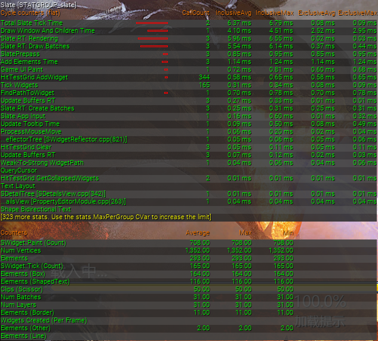
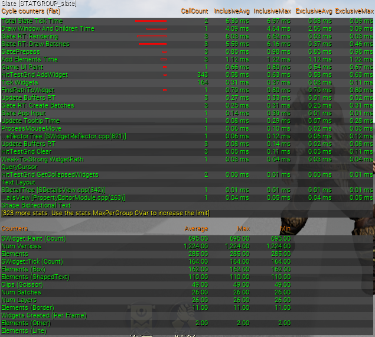
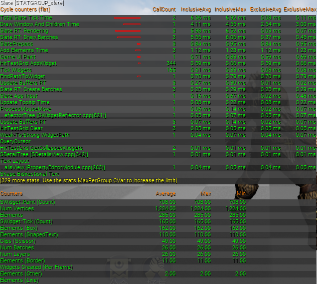
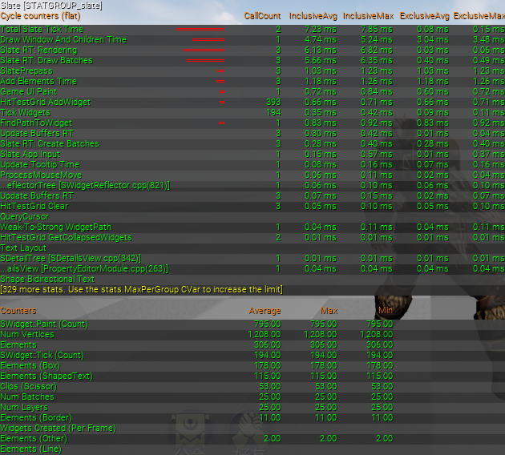
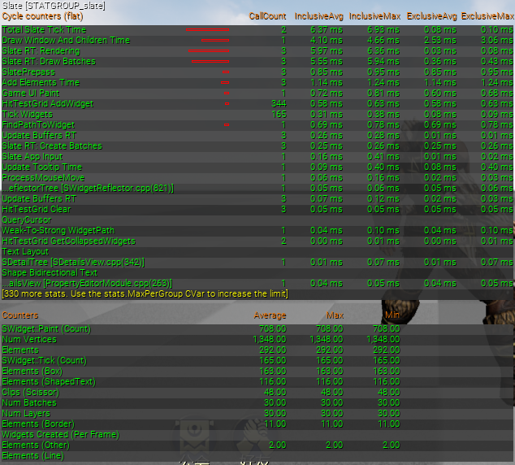
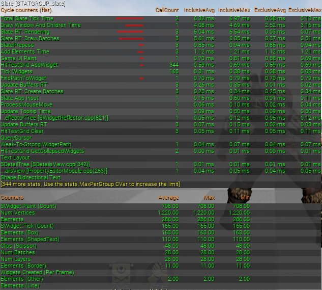
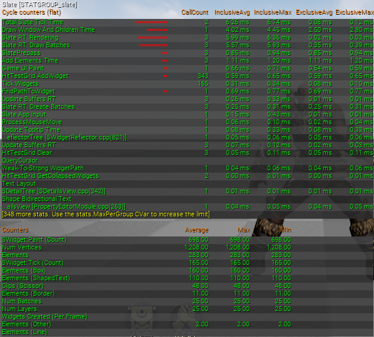
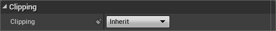

# UI 剔除的性能表现


## 前置说明

UI 剔除是指停止对某个 UI 的绘制，常用于 UI 的隐藏。表观上是某个 UI 变为不可见，但是更理想的情况是尽可能剔除绘制该UI带来的开销——因为表观上的不可见不等于不绘制，例如将 UI 的不透明度设为0，尽管它从表观上不可见，但是仍然产生绘制开销。

在 UI 的设计上，UE 和 Unity 的原理不同，UE 不存在 UI 摄像机的概念，也无法像 Unity 那样可以通过设置渲染层级过滤的方式来实现 UI 的剔除。已知的 UI 剔除方法有以下几种：

1. 将 可见性（Visibility） 属性设为 Collapsed

    注意这里的可见性是 UI 的一个属性，请与上面提到的 “可见/不可见” 进行区分。

2. 将 不透明度（Render Opacity） 属性设为 0

3. 将 颜色（Color and Opacity） 属性的 Alpha 分量设为 0

4. 将 形变（Render Transform） 属性的 缩放（Scale） 分量设为 0

5. 不启用裁剪，调整 形变（Render Transform） 属性的 位移（Translation） 分量，将 UI 移出视窗范围外。

6. 启用裁剪，调整 形变（Render Transform） 属性的 位移（Translation） 分量，将 UI 移出视窗范围外


## 测试数据

以下是各性能指标的测试数据：

| 剔除方法 | 绘制调用（Draw Call） | 游戏线程开销（毫秒） | 渲染线程开销（毫秒） |
| - | - | - | - |
| 无剔除 | 31 | 6\.37 | 5\.96 |
| 方法一 | 25 \(\-6\) | 6\.15 \(\-0\.22\) | 5\.98 \(\+0\.02\) |
| 方法二 | 26 \(\-5\) | 6\.36 \(\-0\.01\) | 5\.98 \(\+0\.02\) |
| 方法三 | 25 \(\-6\) | 7\.23 \(\+0\.86\) | 6\.13 \(\+0\.17\) |
| 方法四 | 30 \(\-1\) | 6\.37 | 5\.97 \(\+0\.01\) |
| 方法五 | 28 \(\-3\) | 6\.32 \(\-0\.05\) | 6\.04 \(\+0\.08\) |
| 方法六 | 25 \(\-6\) | 6\.26 \(\-0\.11\) | 5\.99 \(\+0\.03\) |

以上数据来源于 PC 端，通过控制台命令 `STAT Slate` 采集得到，详见以下截图：

<details>

<summary>无剔除</summary>



</details>

<details>

<summary>方法一：将可见性设置为 Collapsed</summary>



</details>

<details>

<summary>方法二：将不透明度设置为0</summary>



</details>

<details>

<summary>方法三：将颜色的 Alpha 分量设置为0</summary>



</details>

<details>

<summary>方法四：将形变的缩放分量设置为0</summary>



</details>

<details>

<summary>方法五：不启用裁剪并将 UI 移出视窗外</summary>



</details>

<details>

<summary>方法六：启用裁剪并将 UI 移出视窗外</summary>



</details>


## 测试数据分析

`STAT Slate` 得到的数据包含无关 UI 的测试结果，我们重点关注括号中的差值即可。由于方法1是引擎中最常规的 UI 剔除方法，以它为准可以得知受测试的 UI 有 6 个绘制调用，在游戏线程会产生约 0\.2 毫秒的开销。

针对各个性能指标进行分析：

+ 绘制调用：方法1，3和6最优

+ 游戏线程开销：方法1最优，方法6次之

+ 渲染线程开销：方法4最优，方法1，2和6次之（测试数据实际上是波动的，以上为截图结果，可以认为这四个数据是相同的。从测试结果当中可以看出，UI 剔除对于渲染线程的开销基本上没有优化效果，甚至还会增加开销）

综上，**方法1是最优方法，方法6次之**。

设置可见性为最优方法的原因主要是它能够确保不再产生 Prepass 阶段（来自游戏线程）的开销。通过 Prepass 部分的源码可知，可见性作为是否递归执行 Prepass 的依据，如果一个控件的可见性为 Collapsed，那么它和它所有子控件的 Prepass 都不再执行，从而有效降低游戏线程的开销。

除了可见性，决定是否进行 Prepass 的另一个条件是 `SWidget` 类的成员属性 `bNeedsPrepass`，它只会在 `InvalidatePrepass` 调用时被设为 `true`，而 `InvalidatePrepass` 的调用时机通常是在子控件增加或移出时，与可见性无关。因此也不必担心设置可见性会引起类似 Unity 中出现的重建问题。关键源码如下：

```c++
/** SWidget.cpp */

void SWidget::Prepass_Internal(float InLayoutScaleMultiplier)
{
    // ...
    for (int32 ChildIndex = 0; ChildIndex < MyChildren->Num(); ++ChildIndex)
    {
        // ...
        if (Child->Visibility.Get() != EVisibility::Collapsed)
        {
            Child->Prepass_Internal(ChildLayoutScaleMultiplier);
        }
        else
        {
            Child->InvalidatePrepass();
            Child->PrepassLayoutScaleMultiplier = ChildLayoutScaleMultiplier;
        }
    }
    // ...
}

void SWidget::InvalidatePrepass()
{
    SLATE_CROSS_THREAD_CHECK();
    bNeedsPrepass = true;
}
```

上面提到的裁剪，指的是 UE 的 Slate 裁剪（Slate Clipping）功能。它可以通过设置 裁剪（Clipping） 属性来控制是否开启。当父控件开启裁剪后，子控件超出父控件布局范围的部分就会被剔除，配合位移操作就能达到完全裁剪的效果。




## 参考资料

+ [Slate 裁剪系统（Slate Clipping System）](https://docs.unrealengine.com/en-US/ProgrammingAndScripting/Slate/ClippingSystem/index.html)
