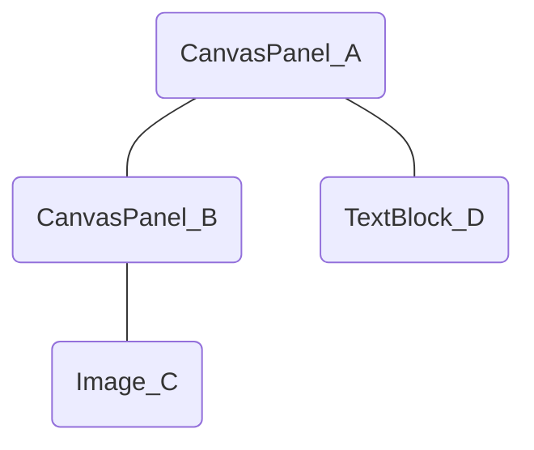

# UI 控件的复制


## 背景说明

UI 控件（Widget，简称“控件”）的复制是很常见的需求。例如一个界面包含一组复选框（CheckBox 或 Toggle），在这组复选框中，复选框的数目是不固定的，通常的做法是在界面中预留一个复选框作为模板，然后在运行时据此进行动态创建，而非直接在界面中放置足够数目的复选框。

虚幻引擎对于控件的设计，和 Unity 相比有着很大的差异。总体而言，控件的复制在虚幻引擎中是相当繁琐的操作。

在引擎中，注意区分非运行时和运行时两个概念。其中，非运行时仅限于编辑器环境，例如在控件蓝图（Widget Blueprint）中；而运行时可以是在编辑器环境下，例如 PIE，也可以是在非编辑器环境下，例如 Android，iOS 等移动端，或者 WindowsNoEditor 等脱离编辑器的 PC 端。引擎提供了非运行时控件的复制方法（请见 [非运行时控件的复制](#非运行时控件的复制)），至于运行时控件的复制，需要自行实现。

被复制的控件可能是一个面板（Panel）类型的控件，在这种情况下，除了它本身以外，它的所有子控件也都需要作为模板进行复制，得到各自的副本。为了区分，以下会将“被复制的控件”称为【模板根控件】，作为模板进行复制的控件统一称为【模板控件】，模板根控件对应的副本称为【副本根控件】，复制完成后作为副本的控件统一称为【副本控件】。


## 非运行时控件的复制

非运行时控件的复制，主要思路是**先将作为模板的控件导出（序列化）为文本，然后将文本导入（反序列化）以产生副本**。

### 来源

在控件蓝图（Widget Blueprint）的层级（Hierarchy）面板中，选中至少一个控件后，在右键菜单中选择“拷贝（Duplicate）”，就会触发这个功能。它调用了 `FWidgetBlueprintEditorUtils` 类的接口 `DuplicateWidgets`，请见引擎源码 WidgetBlueprintEditorUtils\.h 和 WidgetBlueprntEditorUtils\.cpp。因为 `FWidgetBlueprintEditorUtils` 类属于编辑器（Editor）模块，而且是私有的，所以只能在非运行时使用。

### 关于导出和导入

非运行时控件的复制使用了对象（UObject）的导出（序列化）和导入（反序列化）机制。在这种机制下，每个导出后的对象都会产生一个文本块，以关键字 `Begin Object` 为起始，以关键字 `End Object` 为结束（不区分大小写），文本块的主体为对象各个属性的条目；由于一个对象可能包含子对象，除了属性条目之外，文本块可能还会嵌套其他的文本块。

通常，文本块只包含差分内容，即只包含与默认值不同的属性条目和子对象文本块；与默认值相同的属性和子对象可以根据默认值进行复制，不需要导出和导入，从而减小文本块的体积。

例如模板根控件 A 是一个 CanvasPanel，它的结构如下：



将所有的模板控件导出后，产生的文本如下：

```ini
; CanvasPanel_A 的文本块
Begin Object Class=/Script/UMG.CanvasPanel Name="CanvasPanel_A"
    ; CanvasPanel_A 的子文本块，表示 CanvasPanel_A 包含一个子控件，通过子对象 CanvasPanelSlot_0 建立关联
    Begin Object Class=/Script/UMG.CanvasPanelSlot Name="CanvasPanelSlot_0"
    End Object
    ; CanvasPanel_A 的子文本块，表示 CanvasPanel_A 包含一个子控件，通过子对象 CanvasPanelSlot_1 建立关联
    Begin Object Class=/Script/UMG.CanvasPanelSlot Name="CanvasPanelSlot_1"
    End Object
    ; 子对象 CanvasPanelSlot_0 的文本块，具体描述其中的内容
    Begin Object Name="CanvasPanelSlot_0"
        ; 父控件为 CanvasPanel_A
        Parent=CanvasPanel'"CanvasPanel_A"'
        ; 子控件为 CanvasPanel_B
        Content=CanvasPanel'"CanvasPanel_B"'
    End Object
    ; 子对象 CanvasPanelSlot_1 的文本块，具体描述其中的内容
    Begin Object Name="CanvasPanelSlot_1"
        ; 父控件为 CanvasPanel_A
        Parent=CanvasPanel'"CanvasPanel_A"'
        ; 子控件为 TextBlock_D
        Content=TextBlock'"TextBlock_D"'
    End Object
    ; CanvasPanel_A 的 Slots 属性条目
    Slots(0)=CanvasPanelSlot'"CanvasPanelSlot_0"'
    Slots(1)=CanvasPanelSlot'"CanvasPanelSlot_1"'
    ; CanvasPanel_A 的 DisplayLabel 属性条目
    DisplayLabel="CanvasPanel_A"
End Object
; 模板根控件 CanvasPanel_A 槽的包装对象的文本块，详细说明请见【运行时控件的复制】
Begin Object Class=/Script/UMGEditor.WidgetSlotPair Name="WidgetSlotPair_0"
    ...
End Object
; CanvasPanel_B 的文本块
Begin Object Class=/Script/UMG.CanvasPanel Name="CanvasPanel_B"
    ; CanvasPanel_B 的子文本块，表示 CanvasPanel_B 包含一个子控件，通过子对象 CanvasPanelSlot_3 建立关联
    Begin Object Class=/Script/UMG.CanvasPanelSlot Name="CanvasPanelSlot_3"
    End Object
    ; 子对象 CanvasPanelSlot_3 的文本块，具体描述其中的内容
    Begin Object Name="CanvasPanelSlot_3"
        ; 父控件为 CanvasPanel_B
        Parent=CanvasPanel'"CanvasPanel_B"'
        ; 子控件为 Image_C
        Content=Image'"Image_C"'
    End Object
    ; CanvasPanel_B 的 Slots 属性条目
    Slots(0)=CanvasPanelSlot'"CanvasPanelSlot_3"'
    ; CanvasPanel_B 的 DisplayLabel 属性条目
    DisplayLabel="CanvasPanel_B"
End Object
; Image_C 的文本块
Begin Object Class=/Script/UMG.Image Name="Image_C"
    ; Image_C 的 DisplayLabel 属性条目
    DisplayLabel="Image_C"
End Object
; TextBlock_D 的文本块
Begin Object Class=/Script/UMG.TextBlock Name="TextBlock_D"
    ; TextBlock_D 的 Text 属性条目
    Text=NSLOCTEXT("UMG", "TextBlockDefaultValue", "Text Block")
    ; TextBlock_D 的 DisplayLabel 属性条目
    DisplayLabel="TextBlock_D"
End Object
```


## 运行时控件的复制

运行时控件的复制参考了引擎在非运行时复制控件的做法，基本思路一致。

### 前置准备

在进行导出和导出之前，需要创建一个槽（Slot）的包装类型。

槽是控件的一个 `UPanelSlot` 类型成员属性（请见引擎源码 Widget\.h）。它是两个控件之间，维护父子关系的纽带——父控件（通常是 `UPanelWidget` 的子类）通过成员属性 `Slots` 管理多个子控件的槽（请见引擎源码 PanelWidget\.h），并以此访问子控件，子控件则通过成员属性 `Slot` 访问父控件。为了区分，在下文中提到的【槽】，统一指控件的成员属性 `Slot`。

在复制过程中，面板类型控件的 `Slots` 属性会跟随控件进行复制，而 `Slot` 属性则不会跟随控件进行复制。对于除模板根控件以外的模板控件，虽然它们的 `Slot` 属性不会被复制，但是这些 `Slot` 属性已经在它们父控件的 `Slots` 属性中存在备份，并跟随父控件进行复制了；然而，对于模板根控件，它的父控件并不参与复制，因此它的 `Slot` 属性就会丢失。

此外，在复制过程中，槽不能脱离控件单独创建，这就意味着不能直接将模板根控件的槽以 `UPanelSlot` 类型的形式直接导出和导入，因此需要创建一个包装类型，代替 `UPanelSlot` 类型进行导出和导入。

对于非运行时控件的复制，引擎使用的包装类型为 `UWidgetSlotPair`，请见引擎源码 WidgetSlotPair\.h。`UWidgetSlotPair` 类属于编辑器模块，而且是私有的，无法直接使用，需要参考它自行实现一个包装类型。

包装类型的核心功能是将一个槽导出为文本进行存储，以及将文本导入到一个槽当中。包装类型提供这两个核心功能即可，具体的实现方式不唯一，以下是其中一种做法：

```cpp
UCLASS()
class UWidgetSlotPair : public UObject
{
    GENERATED_BODY()

public:
    // 导出属性，参考 FWidgetBlueprintEditorUtils::ExportPropertiesToText 的实现
    void ExportPropertiesToText(UPanelSlot* Slot)
    {
        if (Slot != nullptr)
        {
            // 通过迭代器遍历槽的属性
            for (TFieldIterator<FProperty> Iterator(Slot->GetClass(), EFieldIteratorFlags::ExcludeSuper); Iterator; ++Iterator)
            {
                FProperty* Property = *Iterator;
                /**
                 * 排除对象类型的属性
                 * 对象类型的属性主要有父控件指针（Parent）和子控件指针（Content）两个；因为模板根控件的父控件不参与复制，所以不会产生对应的副本控件，如果将 Parent 属性也导出的话，之后对副本根控件的槽导入属性时就会因为找不到对应的父控件而出错；此外 Content 属性指向模板根控件自身，也没有必要导出
                 */
                if (!Property->IsA<FObjectProperty>())
                {
                    FString Value;
                    // 将槽的属性导出为文本并存储
                    if (Property->ExportText_InContainer(0, Value, Slot, Slot, Slot, PPF_IncludeTransient))
                    {
                        Properties.Add(Property->GetFName(), Value);
                    }
                }
            }
        }
    }

    // 导入属性，参考 FWidgetBlueprintEditorUtils::ImportPropertiesFromText 的实现
    void ImportPropertiesFromText(UPanelSlot* Slot)
    {
        if (Slot != nullptr)
        {
            for (TPair<FName, FString> Pair : Properties)
            {
                // 将存储的属性导入到槽当中
                if (FProperty* Property = FindFProperty<FProperty>(Slot->GetClass(), Pair.Key))
                {
                    Property->ImportText(*Pair.Value, Property->ContainerPtrToValuePtr<uint8>(Slot), 0, Slot);
                }
            }
            // 导入属性后，需要调用 SynchronizeProperties 接口使属性生效
            Slot->SynchronizeProperties();
        }
    }

private:
    /**
     * 存储文本形式的槽属性：键为属性名称，值为属性值
     * 请确保它是一个蓝图属性（UProperty）
     */
    UPROPERTY()
    TMap<FName, FString> Properties;
}
```

### 导出（序列化）

导出过程的关键步骤如下：

1. 收集模板控件

    ```cpp
    // 模板根控件
    UWidget* TemplateRoot;
    // 除了模板根控件本身，它的所有子控件也需要进行导出
    TArray<UWidget*> TemplateWidgets;
    TemplateWidgets.Add(TemplateRoot);
    UWidgetTree::GetChildWidgets(TemplateRoot, TemplateWidgets);
    ```

2. 移除当前对象身上的“导出”和“导入”标签

    ```cpp
    /**
     * EObjectMark 的定义请见引擎源码 UObjectMarks.h
       * EObjectMark::OBJECTMARK_TagExp 为“导出”标签，在对象导出时加入
       * EObjectMark::OBJECTMARK_TagImp 为“导入”标签，在对象导入时加入
     * 这一步相当于重置每个对象，包括所有模板控件的导出和导入状态，以开始新一轮的导出和导入；理论上，对象的导出和导入应该在同一个线程中进行，以免产生冲突
     */
    UnmarkAllObjects(EObjectMark(OBJECTMARK_TagExp | OBJECTMARK_TagImp));
    ```

3. 收集在导出过程中，应当被过滤的对象

    ```cpp
    // 在第1步中收集到的模板控件，如果其中存在用户控件（UserWidget），在导出时这些用户控件就会被展开；然而这是不必要的处理，只需要让用户控件保持折叠的状态进行复制
    TArray<UObject*> IgnoredObjects;
    for (UWidget* TemplateWidget : TemplateWidgets)
    {
        const UUserWidget* TemplateUserWidget = Cast<UUserWidget>(TemplateWidget);
        if (TemplateUserWidget != nullptr && TemplateUserWidget->WidgetTree != nullptr)
        {
            IgnoredObjects.Add(TemplateUserWidget->WidgetTree);
            // GetObjectsWithOuter 的定义请见引擎源码 UObjectHash.h
            GetObjectsWithOuter(TemplateUserWidget->WidgetTree, IgnoredObjects);
        }
    }
    ```

    例如复制界面中的一个用户控件 A，它的子控件如下：

    ```mermaid
    graph TD
    A(UserWidget_A) --- B(CanvasPanel_RootWidget_A) --- C(...)
    ```

    在界面中，A 处于折叠的状态。正常情况，A 复制后的界面如下：

    ```mermaid
    graph TD
    View(View) --- R(CanvasPanel_RootWidget)
    R --- A0(UserWidget_A)
    R --- A1(UserWidget_A_copy)
    R --- E(...)
    ```

    如果不对 A 的子控件进行过滤，A 在复制的时候就会处于展开的状态，导致它的子控件也一并被复制。这时属于异常情况，A 复制后的界面如下：

    ```mermaid
    graph TD
    View(View) --- R(CanvasPanel_RootWidget_View)
    R --- A0(UserWidget_A)
    R --- A1(UserWidget_A_copy) --- B1(CanvasPanel_RootWidget_A_copy) --- C1(...)
    R --- E(...)
    ```

4. 将模板控件逐个导出，生成一段文本

	```cpp
    /**
     * FExportObjectInnerContext 的定义请见引擎源码 UnrealExporter.h
	 * 当前可导出对象的上下文，将需要过滤的对象作为构造函数的参数传入
     */
	FExportObjectInnerContext Context(IgnoredObjects);
    /**
     * FStringOutputDevice 的定义请见引擎源码 UnrealString.h
     * 它用作文本写入的缓冲区
     */
    FStringOutputDevice Archive;
    // “COPY”表示导出的目的是复制对象；不区分大小写
    const TCHAR* ExporterType = TEXT("COPY");
	/**
     * EPropertyPortFlags 的定义请见引擎源码 PropertyPortFlags.h
       * EPropertyPortFlags::PPF_ExportsNotFullyQualified 表示通过对象的作用域，如 Outer 来确定对象导出时的完整路径名称，例如“Outer3/Outer2/Outer1/xxx”而不是通过一个引擎默认的包（Package）来确定，例如“Engine/Transient/xxx”
       * EPropertyPortFlags::PPF_Copy 表示导出的目的是复制对象，而不是生成完整的二进制文件写出到本地；两种目的在导出时存在一些细节上的差异
       * EPropertyPortFlags::PPF_Delimited 表示在导出对象的属性时，使用双引号进行包装，例如对象的名称为 xxx，导出后为 Name="xxx"
     * 它用于告知引擎具体的导出行为
     */
    uint32 PortFlags = PPF_ExportsNotFullyQualified | PPF_Copy | PPF_Delimited;
    // 作为模板控件的作用域，用于确定它们的完整路径名称；因为它们的 Outer 是相同的，所以统一取模板根控件的 Outer 即可
    UObject* ExportRootScope = TemplateRoot->GetOuter();
    for (UWidget* TemplateWidget : TemplateWidgets)
    {
        // 导出其中的一个控件及其属性，将文本内容写入到缓冲区
        UExporter::ExportToOutputDevice(&Context, TemplateWidget, nullptr, Archive, ExporterType, 0, PortFlags, false, ExportRootScope);

        // 如果这个控件是模板根控件（判断方式不唯一，以下是其中一种做法），就需要额外将它的槽进行导出
        if (TemplateWidget == TemplateRoot && TemplateRoot->GetParent() != nullptr)
        {
            UWidgetSlotPair* SlotPair = NewObject<UWidgetSlotPair>();
            SlotPair->ExportPropertiesToText(TemplateWidget->Slot);
            // 导出模板根控件的槽
            UExporter::ExportToOutputDevice(&Context, SlotPair, nullptr, Archive, ExporterType, 0, PortFlags, false, nullptr);
        }
    }
    /**
     * 完成导出
     * FStringOutputDevice 是 FString 的一个子类，可以隐式转换为 FString
     */
    FString Serial = Archive;
	```

5. 创建一个运行时专用的导出器（Exporter）类型

    在第4步中，引擎可以自行寻找可用的导出器。默认情况下，引擎会使用一个 `UObjectExporterT3D` 类型的导出器，对对象，包括控件，进行导出。然而，`UObjectExporterT3D` 属于编辑器模块，在除 PIE 以外的运行时无法使用，因此需要专门为运行时创建一个导出器类型。

    `UObjectExporterT3D` 原本专用于将对象导出为 T3D 文件（后缀名为 \.t3d），在新建的导出器类型中，可以视情况而定是否增加 T3D 的支持。`UObjectExporterT3D` 的实现请见引擎源码 ObjectExporterT3D\.h 和 EditorExporters\.cpp。

    在新建的导出器类型中，只需要重写父类 `UExporter` 的虚函数 `ExportText`，提供将一个对象导出为文本的实现方法。该导出器可以仅支持控件类型，也可以支持所有的对象（控件也属于一种对象），请自行决定，以下是其中一种做法：

    ```cpp
    UCLASS()
    class UObjectExporter : public UExporter
    {
        GENERATED_BODY()

    public:
        UObjectExporter(const FObjectInitializer& ObjectInitializer)
        {
            // 支持所有的对象
            SupportedClass = UObject::StaticClass();
            bText = true;
            PreferredFormatIndex = 0;
            // 增加“COPY”类型的支持，用于对象的复制；不区分大小写
            FormatExtension.Add(TEXT("COPY"));
            // FormatDescription 的长度需要和 FormatExtension 的长度保持一致，具体的描述内容可以自行定义
            FormatDescription.Add(TEXT("UObject's text for copying"));
            // 视情况决定是否增加“T3D”类型的支持
            // FormatExtension.Add(TEXT("T3D"));
            // FOrmatDescription.Add(TEXT("UObject's text for T3D"));
        }

        /**
         * 将一个对象导出为文本的实现方法
         * 参考 UObjectExporterT3D::ExportText 的实现；其中，EmitBeginObject，ExportObjectInner 和 EmitEndObject 都是继承自父类 UExporter 的接口，可以直接访问
         */
        virtual bool ExportText(const FExportObjectInnerContext* Context, UObject* Object, const TCHAR* Type, FOutputDevice& Archive, FFeedbackContext* Warn, uint32 PortFlags = 0) override
        {
            EmitBeginObject(Archive, Object, PortFlags);
            ExportObjectInner(Context, Object, Archive, PortFlags);
            EmitEndObject(Archive);
            return true;
        }
    }
    ```

### 导入（反序列化）

导入过程的关键步骤如下：

1. 创建一个临时对象，作为副本控件的临时 Outer

    ```cpp
    /**
     * Outer 的名称可以自行定义，符合包的命名规则即可
     * 引擎会根据对象的 Outer 为其分配名称，同一个 Outer 下的对象名称不能出现重复；由于在导出过程中，副本控件需要通过名称来找到各自的父控件，使得至少有一段期间，它们的名称必须和对应的模板控件相同，在此期间，副本控件和模板控件不能同处于一个相同的 Outer 之下
     */
    UPackage* TemporaryOuter = NewObject<UPackage>(nullptr, TEXT("/Game/Transient"), RF_Transient);
    // 设为常驻对象，避免在导入过程中被引擎清理
    TemporaryOuter->AddToRoot();
    // 因为副本控件和模板控件所处的 Outer 不一致，所以需要将模板控件使用的本地化文本的命名空间同步给副本控件，以确保两者在本地化的处理上保持一致
    #if USE_STABLE_LOCALIZATION_KEYS
    /**
     * 请注意，这里使用了 TextNamespaceUtil::GetPackageNamespace，而非 TextNamespaceUtil::EnsurePackageNamespace，与引擎的做法稍有不同。因为后者只能在编辑器环境下使用，如果在非编辑器环境下使用，例如真机环境，Mobile Preview PIE 或者 Standalone PIE 模式下，就会引起崩溃
     * 相关引擎源码请见 TextPackageNamespaceUtil.h 和 TextPackageNamespaceUtil.cpp
     */
    FString PackageNamespace = TextNamespaceUtil::GetPackageNamespace(TemplateRoot);
    if (!PackageNamespace.IsEmpty())
    {
        TextNamespaceUtil::ForcePackageNamespace(TemporaryOuter, PackageNamespace);
    }
    #endif

    // 导入过程的具体实现，请见第2，第3，第4和第5步
    // ...

    // 完成导入，释放该临时对象
    TemporaryOuter->RemoveFromRoot();
    ```

2. 解析文本，逐个创建副本控件，并导入它们的属性

    ```cpp
    // 声明副本根控件槽的包装对象，之后用于向副本根控件导入槽属性
    UWidgetSlotPair* SlotPair = nullptr;
    // 存储副本控件及其属性：键为副本控件，值为属性文本块
    TMap<UWidget*, FString> CopiedWidgets;

    /**
     * 副本控件实例表
     * 通过 NewObject 创建副本控件时，可以将它们限定在这个表当中，如果出现重复调用 NewObject 的情况，就可以复用已经创建过的副本控件
     */
    FObjectInstancingGraph InstanceGraph;

    const TCHAR* SerialData = *Serial;
    // 将指针移至第一个不为空的字符处
    FParse::Next(&SerialData);

    FString ObjectLine;
    // 逐行解析文本
    while (FParse::Line(&SerialData, ObjectLine))
    {
        const TCHAR* ObjectLineData = *ObjectLine;
        UClass* ObjectClass = nullptr;
        /**
         * 检索到关键字“Begin Object”，表示当前行是一个对象文本块的开始；不区分大小写
         * 对于对象，通过关键字“Class=”解析出它的类型；不区分大小写
         * GetBEGIN 函数的定义请见引擎源码 Editor.h 和 ParamParser.cpp，它属于编辑器模块，不适用于运行时，请参考它自行实现一个可用于运行时的版本
         */
        if (GetBEGIN(&ObjectLineData, TEXT("OBJECT")) && ParseObject<UClass>(ObjectLineData, TEXT("CLASS="), ObjectClass, ANY_PACKAGE))
        {
            FName ObjectName;
            // 对于对象，通过关键字“Name=”解析出它的名称；不区分大小写
            FParse::Value(ObjectLineData, TEXT("NAME="), ObjectName);

            int32 Depth = 1;
            FString PropertyLine;
            // 截取当前对象属性和子对象所在的文本块
            FString PropertyText;            
            // 开始逐行解析当前对象的属性和子对象
            while (FParse::Line(&TextData, PropertyLine))
            {
                const TCHAR* PropertyLineData = *PropertyLine;
                bool bLineEnded = false;

                // 检索到关键字“Begin Object”，表示当前行是子对象文本块的开始，递归深度加1
                if (GetBEGIN(&PropertyLineData, TEXT("OBJECT")))
                {
                    ++Depth;
                }
                // 检索到关键字“End Object”，表示当前行是一个对象文本块的结束；如果递归深度大于1，表示子对象文本块的结束，否则表示当前对象文本块的结束
                else if (GetEND(&PropertyLineData, TEXT("OBJECT")))
                {
                    bLineEnded = true;
                    if (Depth <= 1)
                    {
                        break;
                    }
                }

                // 记录文本块
                PropertyText += FString::Printf(TEXT("%s\r\n"), *PropertyLine);

                // 如果是子对象文本块的结束，就将递归深度减1，进行下一行文本的解析
                if (bLineEnded)
                {
                    --Depth;
                }
            }

            /**
             * 如果当前对象是一个控件，就新建一个空控件，加入到容器当中
             * 虽然属性和子对象的文本块已经解析完成，但是还不能立即向新控件导入属性，因为它的子控件可能还未创建
             */
            if (ObjectClass->IsChildOf<UWidget>())
            {
                UWidget* CopiedWidget = NewObject<UWidget>(TemporaryOuter, ObjectClass, ObjectName, RF_Transactional, nullptr, true, &InstanceGraph);
                CopiedWidgets.Add(CopiedWidget, PropertyText);
            }
            /**
             * 如果当前对象是一个槽的包装对象，就新建一个空的槽包装对象
             * 对于槽的包装对象，可以立即导入属性，因为它不存在父子关系
             */
            else if (ObjectClass->IsChildOf<UWidgetSlotPair>())
            {
                SlotPair = NewObject<UWidgetSlotPair>(TemporaryOuter, ObjectClass, ObjectName, RF_Transactional, nullptr, true, &InstanceGraph);
                // 向槽的包装对象导入属性，具体实现请见第3步
                ImportObjectProperties(*PropertyText, ObjectClass, SlotPair, SlotPair, 0);
            }
        }
    }

    // 至此，所有副本控件都已经完成创建，可以进行属性导入
    for (TPair<UWidget*, FString> Pair : CopiedWidgets)
    {
        ImportObjectProperties(*Pair.Value, Pair.Key->GetClass(), Pair.Key, Pair.Key, 0);
    }
    ```

3. 实现属性和子对象的导入接口 `ImportObjectProperties`

    ```cpp
    /**
     * 参考引擎接口 ImportObjectProperties 的实现，请见引擎源码 Editor.h 和 EditorObject.cpp，它属于编辑器模块，请参考它实现一个运行时可用的版本
     * 因为引擎的 ImportObjectProperties 和 FImportObjectParams 不仅限于控件属性的导入，还涉及各种对象的属性导入，所以在实现自定义的版本时，可以适当做一些精简
     * 这个接口用于向一个对象导入它的属性和子对象，这个过程是递归的；为了区分，将第一次调用这个接口的对象称为【根对象】，在递归过程中调用这个接口的对象称为【当前对象】
     * 参数的对应关系：
       * Data 对应 FImportObjectParams::SourceText，表示当前对象属性和子对象的文本块
       * Class 对应 FImportObjectParams::ObjectStruct，表示当前对象的类型
       * Root 对应 FImportObjectParams::SubobjectRoot，表示根对象
       * Outer 对应 FImportObjectParams::SubobjectOuter，表示当前对象，即其属性和子对象的 Outer
       * Depth 对应 FImportObjectParams::Depth，表示递归深度，根对象从0开始
     */
    void ImportObjectProperties(const TCHAR*& Data, UClass* Class, UObject* Root, UObject* Outer, int32 Depth)
    {
        /**
         * 子对象实例表
         * 原理与第2步中 FObjectInstancingGraph 的使用类似，通过 NewObject 等方法创建子对象时，可以将它们限定在这个表当中
         */
        FObjectInstancingGraph InstanceGraph;
        /**
         * 使用根控件的名称作为子对象的根路径，相当于统一所有子对象的作用域
         * 例如根控件的名称为“Root”，那么之后创建的子对象，它们的完整路径名称就会形如“/Root/../../xxx”
         */
        InstanceGraph.SetDestinationRoot(Root);

        // 在递归过程中，ImportObjectProperties 的每一次调用都会引起 Data 指针的移动；当 Data 指针移至末尾时，表示递归过程结束
        if (Data == nullptr)
        {
            return;
        }

        FString Line;
        int32 LinesConsumed = 0;
        // 逐行解析文本块
        while (FParse::LineExtended(&Data, Line, LinesConsumed, true))
        {
            // 移除文本块尾部的空白字符和分号，以免影响解析
            {
                int32 Length = Line.Len();
                while (Length > 0 && (Line[Length - 1] == L';' || Line[Length - 1] == L'' || Line[Length - 1] == L'\t'))
                {
                    --Length;
                }
                if (Length != Line.Len())
                {
                    Line.LeftInline(Length, false);
                }
            }
            // 如果当前行只含无效字符，就进行下一行的解析
            if (Line.Len() <= 0)
            {
                continue;
            }

            const TCHAR* LineData = *Line;
            // 检索到关键字“Begin Object”，表示当前行是子对象文本块的开始
            if (GetBEGIN(LineData, TEXT("OBJECT")))
            {
                UClass* ChildClass = nullptr;
                {
                    bool bInvalid = false;
                    /**
                     * 通过关键字“Class=”检索子对象的类型
                     * 请注意，如果当前行不含关键字“Class=”，ParseObject 就会返回 false，这不属于异常情况，请见【关于导出和导入】中的文本示例；唯一的异常情况是当前行包含关键字“Class=”，却指向了一个不存在的类型，例如“Class=xxx”，xxx 是一个不存在的类型，这种情况通过参数 bInvalid 进行判断
                     */
                    ParseObject<UClass>(LineData, TEXT("CLASS="), ChildClass, ANY_PACKAGE, &bInvalid);
                    if (bInvalid)
                    {
                        UE_LOG(LogTemp, Error, TEXT("Invalid child's class"));
                        // 出现异常，终止递归过程
                        Data = nullptr;
                        return;
                    }
                }

                FName ChildName(NAME_None);
                // 通过关键字“Name=”检索子对象的名称
                FParse::Value(LineData, TEXT("NAME="), ChildName);
                // 正常情况下，关键字“Name=”必然存在，并指向有效的名称
                if (ChildName == NAME_None)
                {
                    UE_LOG(LogTemp, Error, TEXT("Invalid child's name"));
                    // 出现异常，终止递归过程
                    Data = nullptr;
                    return;
                }

                UObject* ChildTemplate = nullptr;
                bool bChildRedefining = false;
                // 如果子对象的类型为空，就说明当前行不含关键字“Class=”；根据【关于导出和导入】中的文本示例，正常情况下，该子对象的文本块已经完成过一次解析，因此会以某种方式被创建过一次
                if (ChildClass == nullptr)
                {
                    // 尝试从当前对象上查找子对象
                    ChildTemplate = StaticFindObjectFast(UObject::StaticClass(), Outer, ChildName);
                    // 如果能够从当前对象上找到子对象，说明子对象已经跟随当前对象完成了副本的创建
                    bChildRedefining = (ChildTemplate != nullptr);

                    UClass* WidgetOuterClass = Outer->GetClass();
                    UClass* WidgetParentClass = WidgetOuterClass->GetSuperClass();
                    // 如果无法从当前对象上找到子对象，就会尝试从当前对象父类的 CDO 中查找子对象；如果能够找到，它就会作为子对象的模板
                    if (ChildTemplate == nullptr)
                    {
                        ChildTemplate = StaticFindObjectFast(UObject::StaticClass(), WidgetParentClass->GetDefaultObject(), ChildName);
                    }
                    // 如果从当前对象和父类的 CDO 中都无法找到子对象，就说明文本块出现了错误，和预期不符
                    if (ChildTemplate == nullptr)
                    {
                        UE_LOG(LogTemp, Error, TEXT("Invalid child's template"));
                        // 出现异常，终止递归过程
                        Data = nullptr;
                        return;
                    }

                    // 子对象或者子对象的模板已经找到，记录它的类型
                    ChildClass = ChildTemplate->GetClass();
                }

                // 如果子对象能够从当前对象上找到，就说明它已经完成了副本的创建，在此基础上导入属性即可；递归深度加1
                if (bChildRedefining)
                {
                    ImportObjectProperties(Data, ChildClass, Root, ChildTemplate, Depth + 1);
                }
                // 如果子对象未能从当前对象上找到，或者当前行包含关键字“Class=”，就说明它尚未创建过副本；因此首先需要创建一个副本，然后再导入属性；递归深度加1
                else
                {
                    // 对象标签 RF_PropagateToSubObjects 的定义请见 ObjectMacros.h，它表示子对象创建时需要从父对象上继承的标签
                    UObject* NewChild = NewObject<UObject>(Outer, ChildClass, ChildName, Outer->GetMaskedFlags(RF_PropagateToSubObjects), ChildTemplate, Outer != nullptr, &InstanceGraph);
                    ImportWidgetProperties(Data, ChildClass, Root, NewChild, Depth + 1);
                }
            }
            // 检索到关键字“End Object”，表示当前行是一个对象文本块的结束；如果递归深度不大于0，表示根对象文本块的结束，否则表示当前（子）对象文本块的结束
            else if (GetEND(LineData, TEXT("OBJECT")) && Depth > 0)
            {
                break;
            }
            // 其他情况，表示当前行是当前对象的一个属性条目
            else
            {
                // 移除文本块首部的空白字符，以免影响属性的导入
                while (*LineData == L' ' || *LineData == L'\t')
                {
                    ++LineData;
                }

                TArray<FDefinedProperty> DefinedProperties;
                /**
                 * 调用 FProperty 的静态成员函数 ImportSingleProperty 即可
                 * 参数说明：
                   * PortFlags 表示导入行为的标签；其中 EPropertyPortFlags::PPF_Delimited 表示解析双引号内的属性值，与导出过程的第4步保持同步；EPropertyPortFlags::PPF_CheckReferences 表示检查对象类型的属性是否正确导入
                   * Warn 表示日志输出器的引用，使用引擎提供的全局输出器的 GWarn 即可
                 */
                FProperty::ImportSingleProperty(LineData, Outer, Class, Outer, (PPF_Delimited | PPF_CheckReferences), GWarn, DefinedProperties);
            }
        }
    }

    /**
     * 如果根对象不是 CDO，就对当前对象中的其他子对象进行实例化
     * 在【关于导出和导入】中，提到文本块仅包含与默认值不同的属性条目的子对象，因此在上面的过程中，只复制了文本块中包含，即与默认值不同的子对象，这一步完成与默认值相同的子对象的复制
     */
    if (!Root->HasAnyFlags(RF_ClassDefaultObject))
    {
        UObject* WidgetOuterArchetype = Outer->GetArchetype();
        Outer->GetClass()->InstanceSubobjectTemplates(Outer, WidgetOuterArchetype, WidgetOuterArchetype->GetClass(), Outer, &InstanceGraph);
    }
    // 通知当前对象进行属性导入的后处理
    Outer->PostEditImport();
    // 通知根对象检查子对象的更新
    Root->CheckDefaultSubobjects();
    ```

4. 恢复副本控件的槽，并更新名称

    ```cpp
    // 这一步不能与第2步合并，在同一个循环中完成，原因是在第2步的循环中，无法确保一个副本控件父控件的 Slots 属性已经完成导入
    for (TPair<UWidget*, FString> Pair : CopiedWidgets)
    {
        UWidget* CopiedWidget = Pair.Key;
        CopiedWidget->SetFlags(RF_Transactional);

        /**
         * 前面有提到，父控件的 Slots 属性相当于存储了子控件槽（Slot 属性）的备份，而父控件的 Slots 属性已经在第2步中完成导入，这时需要将导入结果同步给子控件的槽
         * 这里仅限除副本根控件以外的副本控件，因为副本根控件的父控件不在副本控件的清单中，所以无法在这一步完成槽的恢复
         */
        if (UPanelWidget* PanelWidget = Cast<UPanelWidget>(CopiedWidget))
        {
            TArray<UPanelSlot*> PanelSlots = PanelWidget->GetSlots();
            for (int32 Index = 0; Index < PanelWidget->GetChildrenCount(); ++Index)
            {
                PanelWidget->GetChildAt(Index)->Slot = PanelSlots[Index];
            }
        }

        FString OldName = CopiedWidget->GetName();
        // 模板控件和副本控件最终的 Outer 统一为模板控件所在的控件树（Widget Tree）
        UObject* WidgetTree = TemplateRoot->GetOuter();
        /**
         * FindNextValidName 是 FWidgetBlueprintEditorUtils 的成员函数，请见引擎源码 WidgetBlueprintEditorUtils.h 和 WidgetBlueprintEditorUtils.cpp，它属于编辑器模块，且为私有的成员函数，请参考它自行实现一个可用于运行时的版本
         * 从控件中，为副本控件找到一个不重复的可用名称，方式是原始名称之后添加序号（从0开始)；例如原始名称为“CanvasPanel_A”，如果已经被使用就尝试返回“CanvasPanel_A_0”，如果仍然已经被使用就尝试返回“CanvasPanel_A_1”，以此类推，直至找到未被使用的名称
         */
        FString NewName = FindNextValidName(WidgetTree, OldName);
        // 除了更新副本控件的名称以外，还将副本控件注册到控件树中，以恢复正确的 Outer；在此之后，TemporaryOuter 的任务就完成了
        CopiedWidget->Rename(*NewName, WidgetTree);
    }
    ```

5. 恢复副本根控件的槽

    ```cpp
    if (UPanelWidget* Parent = TemplateRoot->GetParent())
    {
        // 根据导出过程的第4步，如果模板根控件存在父控件，它的槽必然被导出，存在对应的包装对象
        check(SlotPair != nullptr);
        // 这一步不能与第4步合并，在同一个循环中完成，原因是在第4步的循环中，无法确保一个无法找到父控件的副本控件一定是副本根控件
        for (TPair<UWidget*, FString> Pair : CopiedWidgets)
        {
            UWidget* CopiedWidget = Pair.Key;
            // 根据第4步，副本根控件的槽尚未恢复，因此无法找到父控件，据此可以从副本控件中找到副本根控件，然后通过槽的包装对象恢复它的槽
            if (CopiedWidget->GetParent() == nullptr)
            {
                // 在实际开发中，副本根控件不一定拥有和模板根控件相同的父控件，以下仅作参考
                UPanelSlot* Slot = Parent->AddChild(CopiedWidget);
                SlotPair->ImportPropertiesFromText(Slot)
            }
        }
    }
    ```

### 优化

可以看出，控件复制是一个相当复杂的过程。与官方沟通过后了解到，引擎提供的非运行时控件复制，本身就存在效率低下的问题，这也是引擎没有提供运行时控件复制的原因。但是考虑到控件复制在项目开发中是一个很常规的需求，实现运行时的控件复制还是具有相当的必要性。

经过初步分析，控件复制的主要开销在于导出过程的第4步，导入过程的第2和第3步，因此在优化时，可以重点考虑如何减少这三步的执行次数。例如将一个控件复制多份时，不应该将整个导出和导入过程重复执行多次，可以参考以下的思路：

1. 导出过程只需要执行一次，导出后的文本可以重复使用；因为无论复制多少次，模板控件都是相同的

2. 进行导入过程的第2和第3步时，每解析一个对象的文本块，就可以根据复制次数创建多个副本；如此一来，这两步也只需要执行一次


## 其他做法

在实现运行时控件的复制时，曾经尝试过以下做法：

+ 使用引擎的 `DuplicateObject` 接口，对控件进行复制；`DuplicateObject` 接口的实现请见引擎源码 UObjectGlobals\.h

    ```cpp
    UWidget* TemplateRoot;
    // 副本根控件的 Outer，由于和模板根控件同属一个控件树，取模板根控件的 Outer（即所属的控件树）即可
    UObject* Outer = TemplateRoot->GetOuter();
    // 副本根控件的名称
    FName Name;
    // 通过 DuplicateObject 产生副本根控件
    UWidget* Copy = DuplicateObject<UWidget>(TemplateRoot, Outer, Name);
    ```

+ 使用引擎的 `NewObject` 接口，将模板根控件作为 `Template` 参数传入，新建一个对象；`NewObject` 接口的实现请见引擎源码 UObjectGlobals\.h

    ```cpp
    UWidget* TemplateRoot;
    UObject* Outer = TemplateRoot->GetOuter();
    FName Name;
    // 副本根控件的标签，与模板根控件保持相同即可
    EObjectFlags Flags = TemplateRoot->GetFlags();
    // 通过 NewObject 产生副本根控件
    UWidget* Copy = NewObject<UWidget>(Outer, Name, Flags, TemplateRoot);
    ```

+ 使用引擎的 `NewObject` 接口，`Template` 参数留空，新建一个对象；然后使用引擎 `UEngine` 类的 `CopyPropertiesForUnrelatedObjects` 接口将模板根控件的属性复制到新对象中；其中，`CopyPropertiesForUnrelatedObjects` 接口的第三个参数可以传入一个 `FCopyPropertiesForUnrelatedObjectsParams` 类型的参数，但是该结构体类型并没有设置深复制或者浅复制的属性，因此使用默认值即可

    ```cpp
    UWidget* TemplateRoot;
    UObject* Outer = TemplateRoot->GetOuter();
    // 首先通过 NewObject 产生一个新控件
    UWidget* Copy = NewObject<UWidget>(Outer);
    // 然后通过 UEngine::CopyPropertiesForUnrelatedObjects 将模板根控件的属性复制到副本根控件当中
    GEngine->CopyPropertiesForUnrelatedObjects(TemplateRoot, Copy);
    ```

以上三种做法存在相同的问题——虽然模板根控件本身可以被深复制，但是它的子控件和槽只能被浅复制。

以 [关于导出和导入](#关于导出和导入) 中的模板根控件 A 为例，如果只是对 A 进行复制，那么在 A 的副本当中，子控件 B，C 和 D 的副本就由浅复制所得，它们的内存地址与 A 中的子控件 B，C 和 D 是相同的。

这个问题源于对象的复制原理：如果一个子对象能够通过若干次 `GetOuter` 找到它的父对象，那么当父对象被复制时，子对象就会以深复制的方式被复制；否则，子对象就会以浅复制的方式被复制。

因为在一个控件树中，每个控件的 Outer 都是控件树，而且也不可能通过控件树的 Outer 找到各个控件的父控件，所以以上三种做法都无法满足子控件深复制的条件。

已知的改进方法为——通过递归，对模板根控件及其所有子控件进行逐个复制。以 [关于导出和导入](#关于导出和导入) 中的模板根控件 A 为例：

1. 复制 CanvasPanel\_A，得到副本 CanvasPanel\_A\_copy

2. 删除 CanvasPanel\_A\_copy 中的子控件 CanvasPanel\_B 和 TextBlock\_D，它们都是在第1步中通过浅复制产生的

3. 复制 CanvasPanel\_B，得到副本 CanvasPanel\_B\_copy

4. 将 CanvasPanel\_B\_copy 作为 CanvasPanel\_A\_copy 的子控件

5. 删除 CanvasPanel\_B\_copy 中的子控件 Image\_C，它是在第3步中通过浅复制产生的

6. 复制 Image\_C，得到副本 Image\_C\_copy

7. 将 Image\_C\_copy 作为 CanvasPanel\_B\_copy 的子控件

8. 复制 TextBlock\_D，得到副本 TextBlock\_D\_copy

9. 将 TextBlock\_D\_copy 作为 CanvasPanel\_A\_copy 的子控件

然而，这种做法并不严谨，因为引擎的父子对象机制比较复杂，以上做法不能保证除了子控件外的其他子对象都能进行深复制。


## 参考资料

+ [DuplicateObject 函数是深复制还是浅复制？](https://answers.unrealengine.com/questions/495993/does-duplicateobject-perform-a-shallow-or-deep-cop.html)
