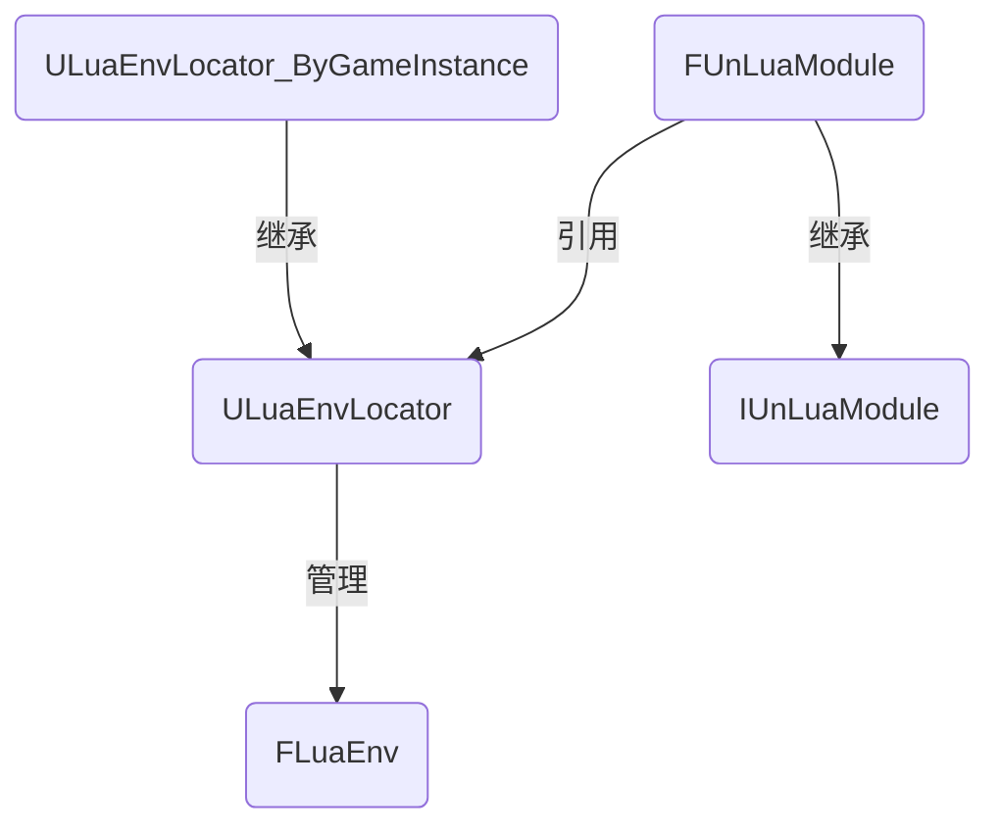

# UnLua2\.3\.3 更新说明


## 版本说明

更新前版本：2\.1\.4

更新后版本：2\.3\.3

中间版本：2\.2\.0、2\.2\.1、2\.2\.2、2\.2\.3、2\.2\.4、2\.3\.0、2\.3\.1、2\.3\.2


## 功能变化

以下变化涉及 UnLua 的使用方式。

### 多虚拟机的支持

从 2\.2\.0 版本开始，UnLua 增加了多虚拟机的支持，相关类型如下：

+ `FLuaEnv`：虚拟机类

    一个 `FLuaEnv` 类实例可以视为一个虚拟机，内部维护一个 `lua_State` 类型的变量。

    源码请见 LuaEnv\.h 和 LuaEnv\.cpp。

+ `ULuaEnvLocator`：虚拟机分配器类

    内部维护一个 `FLuaEnv` 类的实例。此外，它提供了 `Locate` 接口，用于返回一个蓝图对象（`UObject` 类型）所在的虚拟机；因为这是单虚拟机分配器，所以只能返回唯一的虚拟机。多虚拟机的管理需要在此基础上扩展。

    源码请见 LuaEnvLocator\.h 和 LuaEnvLocator\.cpp。

+ `ULuaEnvLocator_ByGameInstance`：多虚拟机分配器类

    它继承自 `ULuaEnvLocator` 类，是 UnLua 提供的，多虚拟机管理的一种方案。它采用了 “主-从虚拟机” 的设计思路——将从 `ULuaEnvLocator` 类继承过来的 `FLuaEnv` 类实例作为主（默认）虚拟机，然后增加一个映射表（`TMap` 类型），以游戏实例（`UGameInstance` 类型）为键，以虚拟机（`FLuaEnv` 类型）为值，存储从虚拟机。此外，它重写了 `Locate` 接口，返回一个对象所在的虚拟机，策略是先找到对象所在的游戏实例，再找到虚拟机，如果对象没有关联任何游戏实例，就返回主虚拟机。

    源码请见 LuaEnvLocator\.h 和 LuaEnvLocator\.cpp。

+ `IUnLuaModule`：虚拟机管理类基类

    尽管 `ULuaEnvLocator` 类提供了虚拟机的管理功能，但是严格来说，结合 `IUnLuaModule` 类派生类的功能，才是一套完整的虚拟机管理。基类声明了启动和关闭虚拟机管理的接口，以及获取虚拟机的接口。

    源码请见 UnLuaModule\.h。

+ `FUnLuaModule`：虚拟机管理类

    这是 UnLua 提供的虚拟机管理。它内部维护了一个 `ULuaEnvLocator` 类的实例，可以通过 `UUnLuaSettings` 类的 `EnvLocatorClass` 属性来指定虚拟机分配器类，默认是 `ULuaEnvLocator` 类。它也是 UnLua 插件模块的入口类，换言之，在引擎启动时，默认就会启动这套虚拟机管理；如果不想使用这套虚拟机管理，就应该在工程的 \.uproject 文件中，把 UnLua 插件的 `Enabled` 属性设置为 `false`，只在 \.target\.cs 或者 \.build\.cs 文件中添加必要的编译依赖就足够了。

    源码请见 UnLuaModule\.cpp。

以上类型的关系如下图所示：



### 虚拟机定制的支持

`FLuaEnv` 类替代了旧版本的 `FLuaContext` 类。与 `FLuaContext` 类相比，`FLuaEnv` 类是对外公开的，而且关键接口被设计为虚函数，因此虚拟机的定制化就变得非常方便。例如想要在 `FLuaEnv` 类中增加编辑器工具相关的支持，只需要增加一个 `FLuaEnv` 类的派生类，然后重写关键的接口，而不需要修改 `FLuaEnv` 类的源码。不过，因为 `ULuaEnvLocator` 和 `ULuaEnvLocator_ByGameInstance` 类内部都是只能创建 `FLuaEnv` 类的实例，并不能让开发者指定虚拟机的类型，所以**如果需要使用定制的虚拟机类型，就有必要自行实现一套虚拟机的分配和管理**。

### 虚拟机事件的变更

从 2\.2\.0 版本开始，在 `FUnLuaDelegates` 类中定义的，与虚拟机相关的事件都被废弃了，包括 `OnLuaContextInitialized`，`OnPreLuaContextCleanup`，`OnPostLuaContextCleanup` 和 `HotfixLua`，这些事件仍然有定义，但是没有被引用。因为虚拟机的启动和关闭是同步的，而且在正式项目中很可能需要定制虚拟机的管理，所以这些事件的存在意义不大。

### 配置参数的变更

从 2\.2\.0 版本开始，UnLua 增加了 `UUnLuaSettings` 和 `UUnLuaEditorSettings` 类的实现，让一些功能可配置。以下是常用的功能：

+ 虚拟机的自启动

    对应 `UUnLuaEditorSettings` 类的 `bAutoStartup` 属性，从 2\.2\.0 版本开始引入。

    实际上，在代码中修改这个属性是没有意义的，因为 UnLua 是在 UHT 阶段，从 DefaultUnLuaEditor\.ini 文件中读取这个属性，将属性值映射至 `AUTO_UNLUA_STARTUP` 宏，由 `AUTO_UNLUA_STARTUP` 宏来控制代码中的自启动逻辑的，如果 UnLua 无法在 DefaultUnLuaEditor\.ini 文件中找到这个属性，就会默认将 `AUTO_UNLUA_STARTUP` 宏设置为 `true`。因此，修改这个属性的方法只能是修改项目设置（需要重启引擎），或者修改源码 UnLua\.build\.cs 中，初始化 `AUTO_UNLUA_STARTUP` 宏的部分。

    `AUTO_UNLUA_STARTUP` 宏在 `FUnLuaModule` 类中使用，如果为 `true`，就会在引擎启动时注册一些事件监听，例如在 PIE 开始时启动 `FUnLuaModule` 类所管理的虚拟机，在 PIE 结束时关闭虚拟机。**如果使用定制的虚拟机管理，建议将这个宏关闭，以免 UnLua 启动额外的虚拟机**。

+ 虚拟机的热重载

    对应 `UUnLuaEditorSettings` 类的 `HotReloadMode` 属性，从 2\.2\.0 版本开始引入。

    热重载有三种模式：手动（Manual），自动（Auto）和禁用（Never），默认是手动模式。与 `bAutoStartup` 属性的原理类似，`HotReloadMode` 属性的值会在 UHT 阶段被映射至 `UNLUA_WITH_HOT_RELOAD` 宏中，手动模式和自动模式会将 `UNLUA_WITH_HOT_RELOAD` 宏的值设置为1，禁用模式则是0，源码请见 UnLua\.build\.cs。

    `UNLUA_WITH_HOT_RELOAD` 宏只是决定是否启用热重载，当启用热重载时，UnLua 还会判断是手动模式还是自动模式。如果是手动模式，就需要自行通过 `FLuaEnv` 类的 `HotReload` 接口触发热重载；如果是自动模式，UnLua 就会在检测到有 Lua 脚本修改时触发热重载。

+ 虚拟机分配器类

    对应 `UUnLuaSettings` 类的 `EnvLocatorClass` 属性，从 2\.2\.0 版本开始引入。

    因为 `EnvLocatorClass` 属性只能配置 `ULuaEnvLocator` 类及其派生类，并且只对 UnLua 提供的虚拟机管理生效，所以**如果使用定制的虚拟机管理，不打算实现 `ULuaEnvLocator` 类派生类的话，可以忽略这个配置参数**。

+ Lua 脚本定位器

    对应 `UUnLuaSettings` 类的 `ModuleLocatorClass` 属性，从 2\.2\.3 版本开始引入。

    除了 `ModuleLocatorClass` 属性，2\.2\.3 版本还引入了 `ULuaModuleLocator` 类，提供 Lua 脚本的定位功能，请见源码 LuaModuleLocator\.h 和 LuaModuleLocator\.cpp。`ULuaModuleLocator` 类通过蓝图类继承 `UnLuaInterface` 时重写的 `GetModuleName` 函数来获取 Lua 脚本的路径，理论上能够满足正常的开发需要，没有必要再调整；如果需要定制 Lua 脚本定位器，可以增加一个 `ULuaModuleLocator` 类的派生类，然后重写 `Locate` 接口，并且配置到 `ModuleLocatorClass` 属性中。

+ Lua 的入口文件

    对应 `UUnLuaSettings` 类的 `StartupModuleName` 属性，从 2\.2\.4 版本开始引入。

    `StartupModuleName` 属性的配置格式与 Lua 中 `require` 函数参数的格式相同，例如入口文件的路径是 MyProject/Content/Script/LuaMain\.lua，那么配置 LuaMain 即可（注意去掉 \.lua 后缀）。

    **对于多虚拟机，或者定制虚拟机管理的情况，`StartupModuleName` 属性是不适用的**，因为它需要配合 `ULuaEnvLocator` 类使用，原理是在启动虚拟机后，调用 `FLuaEnv` 类实例的 `Start` 函数，传入 `StartupModuleName` 属性的值，相当于执行一次 `require` 函数，这个处理通用于所有的虚拟机，源码请见 LuaEnvLocator\.cpp。

+ Lua 的死循环检测

    对应 `UUnLuaSettings` 类的 `DeadLoopCheck` 属性，从 2\.2\.2 版本开始引入。

    `DeadLoopCheck` 属性可以理解为一个时间限制（秒），当执行 Lua 脚本时，如果主线程阻塞时间超过这个限制，就会认为 Lua 脚本中出现死循环，从而中断 Lua 脚本的执行，避免引擎卡死；如果 `DeadLoopCheck` 属性的值小于或者等于0，就不启用死循环检测。死循环检测在 `FUnLuaModule` 类中有所应用，**使用定制的虚拟机管理时，建议复刻这一部分的实现**。

+ 预绑定的蓝图类

    对应 `UUnLuaSettings` 类的 `PreBindClasses` 属性，从 2\.3\.0 版本开始引入。

    蓝图类绑定 Lua 脚本的机制是，当蓝图类加载后进行一次绑定，当蓝图类卸载，或者虚拟机关闭时解除绑定。这对于纯蓝图类而言是没问题的，但是对于 C\+\+ 蓝图类，例如 `UAnimNotify` 和 `UAnimNotifyState`，就有所限制。因为 C\+\+ 蓝图类只会在引擎启动时加载一次，此后就常驻于内存，直至引擎关闭，所以在 PIE 模式下，就会出现这样的问题：第一次 PIE 结束后，虚拟机关闭，解除了 C\+\+ 蓝图类的绑定，当第二次 PIE 开始，虚拟机重新启动后，由于 C\+\+ 蓝图类没有重新加载而无法重新绑定。`PreBindClasses` 属性正是为了解决这个问题，它用于配置始终需要绑定的 C\+\+ 蓝图类，每当有虚拟机启动时，都执行一次绑定。这部分逻辑实现在 `FUnLuaModule` 类中，**使用定制的虚拟机管理时，建议复刻这一部分的实现**。

    UnLua 默认预绑定的蓝图类有 `UAnimNotify`，`UAnimNotifyState` 和 `UBlueprintFunctionLibrary`，请见源码 UnLuaSettings\.cpp。

官方文档请见 https://github.com/Tencent/UnLua/blob/master/Docs/CN/Settings.md 。

### 静态导出的变更

从 2\.2\.0 版本开始，UnLua 陆续调整了静态导出至 Lua 虚拟机中的内容，主要如下：

+ 全局函数的变更

    从 2\.2\.0 版本开始，去除了 `RegisterEnum`，`RegisterClass`，`UnLua_AddToClassWhiteSet`，`UnLua_RemoveFromClassWhiteSet` 和 `UnLua_UnRegisterClass` 函数的导出。在旧版本中，这些函数的导出在 `FLuaContext` 类中实现，请对比源码 LuaContext\.cpp 和 LuaEnv\.cpp。

    `GetUProperty` 和 `SetUProperty` 函数的导出得到保留，其实现被移至 UnLuaLib\.cpp 中。`LoadObject`，`LoadClass` 和 `NewObject` 函数的导出也得到保留，其实现则是被移至 UELib\.cpp 中。

+ 全局表 `UnLua` 中的函数变更

    从 2\.2\.3 版本开始，全局表 `UnLua` 中增加了 Log，Warning 和 Error 三种级别的日志输出接口，对应函数 `Log`，`LogWarn` 和 `LogError`，源码请见 UnLuaLib\.cpp。

    从 2\.2\.3 版本开始，不再采用将 UnLua\.lua 复制到 Content/Script 目录下的做法，而是通过硬编码的方式将 UnLua\.lua 注入到虚拟机中，即把 `Class` 函数加入全局表 `UnLua`，源码请见 UnLuaLib\.cpp，`LegacySupport` 函数。

    以下是全局表 `UnLua` 中的内容：

    | 名称 | 类型 | 说明 | 相关源码 |
    | - | - | - | - |
    | `Class` | `function` | 用于创建一个可以绑定蓝图类的 Lua 类 | UnLuaLib\.cpp，`LegacySupport` 函数 |
    | `PackagePath` | `function` | 用于返回 Lua 的 `package.path` | UnLuaLib\.cpp，`SetPackagePath` 函数 |
    | `Log` | `function` | 用于打印 Log 级别的日志 | UnLuaLib\.cpp，`LogInfo` 函数 |
    | `LogWarn` | `function` | 用于打印 Warning 级别的日志 | UnLuaLib\.cpp，`LogWarn` 函数 |
    | `LogError` | `function` | 用于打印 Error 级别的日志 | UnLuaLib\.cpp，`LogError` 函数 |
    | `HotReload` | `function` | 用于执行一次热重载 | UnLuaLib\.cpp，`HotReload` 函数 |
    | `Ref` | `function` | 用于手动为一个蓝图对象添加一个引用 | UnLuaLib\.cpp，`Ref` 函数 |
    | `Unref` | `function` | 用于手动移除一个通过 `Ref` 函数添加的引用 | UnLuaLib\.cpp，`Unref` 函数 |

    全局表 `UnLua` 除了包含以上内容外，还重写了 `__index` 元方法，实现按需加载 UnLua 插件 Content/Script/UnLua 目录下的额外脚本，加载成功后，会将返回值缓存在全局表 `UnLua` 当中。以下是 2\.3\.3 版本提供的额外脚本：

    | 脚本 | 功能 | 用法 |
    | - | - | - |
    | HotReload\.lua | 热重载 | 通过 `UnLua.HotReload` 的写法访问该脚本加载后的内容 |
    | Input\.lua | 输入 | 通过 `UnLua.Input` 的写法访问该脚本加载后的内容 |
    | EnhancedInput\.lua | 增强输入 | 通过 `UnLua.EnhancedInput` 的写法访问该脚本加载后的内容 |

### 热重载

从 2\.2\.0 版本开始，热重载改为由 Lua 实现，参考了云风的方案，增加了可以额外加载的 Lua 脚本 HotReload\.lua。

从 2\.3\.0 版本开始，不再自动将 HotReload\.lua 复制到 Content/Script 目录下，而是按需加载 UnLua 插件 Content/Script/UnLua 目录下的 HotReload\.lua。当 `UNLUA_WITH_HOT_RELOAD` 宏开启时，会将全局的 `require` 函数替换为 HotReload\.lua 中实现的 `require` 函数，以便热重载功能记录加载过的 Lua 脚本。源码请见 UnLuaLib\.cpp，`HotReload` 和 `Open` 函数。

### Lua 委托的传递

从 2\.2\.0 版本开始，增加了 Lua 委托的包装类型 `ULuaDelegateHandler` 和注册类型 `FDelegateRegistry`，完善了 Lua 委托在 Lua 和 C\+\+ 之间的传递。在调用 Lua 的回调函数时，会将回调函数绑定的蓝图对象作为第一个参数传入。

示例代码如下：

```lua
-- Lua 委托的固定形式，返回一个 table，第一个元素是绑定的蓝图对象，第二个元素是 Lua 的回调函数
local delegate = { boundObject, callback }

-- 在旧版本中，UnLua 只向回调函数传递委托所需要的参数
local function callback(...)
end

-- 在新版本中，UnLua 会将绑定的蓝图对象作为第一个参数传递给回调函数
local function callback(boundObject, ...)
end
```

### Lua 类 Initialize 函数的执行时机

从 2\.1\.4 版本开始，调整了 Lua 类中 `Initialize` 函数的执行时机，使得在 `Initialize` 函数中可以通过 `self.Object` 访问有效的蓝图对象，而在此前的版本中则不能。因此可以在 `Initialize` 函数中进行与蓝图对象相关的初始化。

示例代码如下：

```lua
function MyClass:Initialize()
    -- 在 2.1.4 之前的版本中，这是错误的做法，因为此时 self.Object 还未完成构建
    -- 在 2.1.4 及之后的版本中，这是正确的做法，因为此时 self.Object 已经完成构建
    self.Object:Initialize()
end
```

### Lua 源码的编译

从 2\.2\.4 版本开始，将 Lua 版本升级为 5\.4\.3。此外重新提供了编译好的动态链接库，默认不再需要开发者自行编译源码。

编译 Lua 源码需要配置 CMake 环境，对此官方尚未提供文档。


## 其他调整

以下变化不涉及 UnLua 的使用方式，不过如果需要进行深度定制，就有必要进行了解。

### 反射类型重构

从 2\.2\.0 版本开始，`FReflectionRegistry` 类被拆分成 `FClassRegistry` 和 `FEnumRegistry` 两个类。源码请见 ClassRegistry\.h，ClassRegistry\.cpp，EnumRegistry\.h 和 EnumRegistry\.cpp。

从 2\.3\.2 版本开始，增加了 `FPropertyRegistry` 类，用于替代 `IPropertyCreator` 和 `FPropertyCreator` 类。源码请见 PropertyRegistry\.h 和 PropertyRegistry\.cpp。

### Lua 类模板的迁移

从 2\.3\.0 版本开始，Lua 类模板被移至 UnLua 插件的 Config/LuaTemplates 目录下，并且增加了蓝图类的通用代码模板。

当前提供的 Lua 类模板如下：

| 脚本 | 功能 |
| - | - |
| Actor\.lua | 用于绑定一个 `AActor` 类或其派生类 |
| ActorComponent\.lua | 用于绑定一个 `UActorComponent` 类的派生类 |
| AnimInstance\.lua | 用于绑定一个 `UAnimInstance` 类或其派生类 |
| AnimNotifyState\.lua | 用于绑定一个 `UAnimNotify` 类或其派生类 |
| UserWidget\.lua | 用于绑定一个 `UUserWidget` 类的派生类 |
| Object\.lua | 通用模板，用于绑定一个 `UObject` 类的派生类 |
