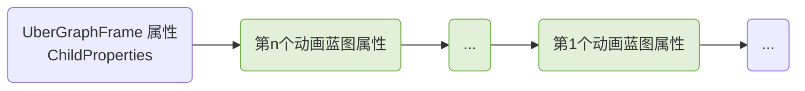

# 控件动画与控件蓝图的分离


## 运行时控件动画的加载和恢复

在运行时首次加载完一个控件蓝图类（Widget Blueprint Class）后，需要加载对应的控件动画资产，然后将资产中的动画恢复到蓝图类中。

这个过程主要分以下两个步骤：

1. 替换蓝图类中 **动画的蓝图属性**

    这一步确保外部可以通过反射，从蓝图类中访问新添加的动画。

    尽管动画会被保存成独立的资产，但是在编辑和保存蓝图时，可能会有动画残留在蓝图中，导致蓝图类中存在旧的动画蓝图属性。这些旧的动画蓝图属性需要被清理，以免与新添加的动画蓝图属性产生冲突。

2. 替换蓝图类中 **动画的实例**

    这一步确保引擎可以从蓝图类中访问 `UWidgetAnimation` 类型的动画实例。

    与动画蓝图属性的情况相似，蓝图类中可能存在旧的动画实例，它们也是需要被清理。

原则上，这两个步骤的执行顺序可以随意调换。不过第一步替换动画蓝图属性，需要知道蓝图类中旧动画的信息，而通过旧动画实例来获取信息是更高效的操作，因此建议按照 **先替换动画蓝图属性，再替换动画实例** 的顺序执行。

代码示例如下：

```cpp
// 控件蓝图类
UWidgetBlueprintGeneratedClass* const BlueprintClass;
// 来自动画资产的动画
const TArray<TObjectPtr<UWidgetAnimation>> TemplateAnimations;
// 第一步：替换蓝图类中的动画蓝图属性
ReplaceAnimationProperties(BlueprintClass, TemplateAnimations);
// 第二步：替换蓝图类中的动画实例
ReplaceAnimationInstances(BlueprintClass, TemplateAnimations);
```

### 替换动画的蓝图属性

蓝图类所包含的蓝图属性，记录在一个 **蓝图属性链表** 。其中成员属性 `ChildProperties`（继承自 `UStruct` 类）是链表的头指针。

替换动画蓝图属性的关键是在蓝图类的蓝图属性链表中，找到一段 **合适且连续** 的位置，即 “动画蓝图属性序列”，确保插入新的动画蓝图属性后，**链表中各蓝图属性的相对顺序保持不变** ，否则在蓝图类销毁的时候，就会出现蓝图属性 GC 出错的问题。

请注意，链表的顺序和蓝图属性的添加顺序 **相反** ，先添加的蓝图属性位于靠后的位置。动画蓝图属性通常是倒数第二添加的，倒数第一添加的是一个 UberGraphFrame 属性，可能有也可能没有，因此动画蓝图属性可能位于链表的第一段或者第二段。

> 为什么要找出 UberGraphFrame 属性？
>
> 根据 `FKismetCompilerContext::CompileClassLayout` 函数的实现，链表中的第一个蓝图属性，即最后一个添加的蓝图属性，很可能是 `FStructProperty` 类型的 UberGraphFrame 属性。结合 `FWidgetBlueprintCompilerContext::CreateClassVariablesFromBlueprint` 函数的实现，如果 UberGraphFrame 属性存在，它必然是动画蓝图属性序列的上一个蓝图属性；假如链表中不含旧的动画蓝图属性，那么它的下一个蓝图属性必然是动画蓝图属性序列的下一个蓝图属性。

蓝图属性链表的示意如下（标绿色的是动画蓝图属性序列）：



代码示例如下：

```cpp
void ReplaceAnimationProperties(UWidgetBlueprintGeneratedClass* const BlueprintClass, const TArray<TObjectPtr<UWidgetAnimation>>& TemplateAnimations)
{
    const int32 OldAnimationNum = BlueprintClass->Animations.Num();
    const bool bWithOldAnimations = (OldAnimationNum > 0);
    // 动画蓝图属性序列的上一个蓝图属性
    FField* AnimationPrevious = nullptr;
    // 动画蓝图属性序列的下一个蓝图属性
    FField* AnimationNext = nullptr;
    /**
     * 为了减少链表的遍历次数，在一次遍历中完成以下操作：
       1. 删除旧的动画蓝图属性
       2. 找到 UberGraphFrame 蓝图属性
       3. 找到 AnimationPrevious 和 AnimationNext
     */
    {
        TSet<FName> OldAnimationNames;
        if (bWithOldAnimations)
        {
            OldAnimationNames.Reserve(OldAnimationNum);
            for (const TObjectPtr<UWidgetAnimation>& OldAnimation : BlueprintClass->Animations)
            {
                // BlueprintClass->Animations 中的动画实例，名称带有后缀 '_INST'，而动画蓝图属性的名称则没有这个后缀
                FString OldAnimationName(OldAnimation->GetName());
                OldAnimationName.LeftChopInline(5);
                OldAnimationNames.Add(FName(OldAnimationName));
            }
        }

        // UberGraphFrame 属性的名称
        const FName& UberGraphFrameName = UWidgetBlueprintGeneratedClass::GetUberGraphFrameName();
        // UberGraphFrame 属性最多只有一个
        bool bFoundUberGraphFrame = false;

        FField* HeadProperty = nullptr;
        FField* PreviousProperty = nullptr;
        FField* CurrentProperty = Class->ChildProperties;
        while (CurrentProperty)
        {
            FField* const NextProperty = CurrentProperty->Next;
            // 需要删除旧动画蓝图属性的情况，通过 bWithOldAnimations 优化判断
            if (bWithOldAnimations && CurrentProperty->IsA<FObjectProperty>() && (OldAnimationNames.Remove(CurrentProperty->GetFName()) > 0))
            {
                delete CurrentProperty;
                if (PreviousProperty)
                {
                    PreviousProperty->Next = NextProperty;
                    // 如果链表中有旧的动画蓝图属性，就以它的上一个蓝图属性作为 AnimationPrevious
                    AnimationPrevious = PreviousProperty;
                }
                // 如果链表中有旧的动画蓝图属性，就暂时以它的下一个蓝图属性作为 AnimationNext
                AnimationNext = NextProperty;
            }
            else
            {
                if (!bFoundUberGraphFrame && CurrentProperty->GetFName() == UberGraphFrameName && CurrentProperty->IsA<FStructProperty>())
                {
                    AnimationPrevious = CurrentProperty;
                    AnimationNext = NextProperty;
                    bFoundUberGraphFrame = true;
                }
                PreviousProperty = CurrentProperty;
                // 第一个有效的 PreviousProperty 是链表的头节点
                if (!HeadProperty)
                {
                    HeadProperty = PreviousProperty;
                }
            }
            CurrentProperty = NextProperty;
        }
        /**
         * 此时 HeadProperty 可能还是空指针，对应以下两种情况：
           1. 链表本身是空的
           2. 链表中只含有旧的动画蓝图属性
         * 对于这两种情况，在完成新动画蓝图属性的添加后，需要让链表的头指针指向最后一个添加的新动画蓝图属性
         */
        Class->ChildProperties = HeadProperty;
    }
    /**
     * 找不到 AnimationPrevious 时，有以下两种情况：
       1. 链表中既不含旧的动画蓝图属性，也不含 UberGraphFrame 属性
       2. 旧的动画蓝图属性序列位于链表的第一段（最前端）
     * 这两种情况的处理方式相同，因为在这两种情况下并不存在 AnimationPrevious，
     * 
     * 找不到 AnimationNext 时，有以下两种情况：
       1. 链表中既不含旧的动画蓝图属性，也不含 UberGraphFrame 属性
       2. 旧的动画蓝图属性序列位于链表的最后一段（最末端）
     * 第一种情况，取链表的第一个蓝图属性作为 AnimationNext
     * 第二种情况，并不存在 AnimationNext，因此忽略
     */
    if (AnimationNext = nullptr && !bWithOldAnimations)
    {
        AnimationNext = Class->ChildProperties;
    }

    // 创建新的动画蓝图属性
    {
        // 插入新的动画蓝图属性，会让链表往链表头方向延伸，因此动画蓝图属性序列的头部只需要与链表对接一次
        bool bAnimationNextLinked = false;
        // 上一个创建的新的动画蓝图属性，在链表中是下一个蓝图属性
        FField* PreviousAnimation = nullptr;
        for (const TObject<UWidgetAnimation>& TemplateAnimation = TemplateAnimations)
        {
            // 以下代码参考自 FKismetCompilerUtilities::CreatePropertyOnScope 函数的实现
            FObjectProperty* const Property = new FObjectProperty(BlueprintClass, TemplateAnimation, RF_Public);
            Property->SetPropertyClass(UWidgetAnimation::StaticClass());
            Property->SetPropertyFlags(CPF_HasGetValueTypeHash);
            // 以下代码参考自 FKismetCompilerContext::CreateVariable 函数的实现
            Property->SetFlags(RF_LoadCompleted);
            // 以下代码参考自 FWidgetBlueprintCompilerContext::CreateClassVariablesFromBlueprint 函数的实现
        #if WITH_EDITOR
            Property->SetMetaData(TEXT("DisplayName"), *TemplateAnimation->GetDisplayName().ToString());
            Property->SetMetaData(TEXT("Category"), TEXT("Animations"));
        #endif
            Property->SetPropertyFlags(CPF_Transient | CPF_BlueprintVisible | CPF_BlueprintReadOnly | CPF_RepSkip);

            if (!bAnimationNextLinked)
            {
                // 完成动画蓝图属性序列头部与链表的对接
                Property->Next = AnimationNext;
                bAnimationNextLinked = true;
            }
            if (PreviousAnimation)
            {
                Property->Next = PreviousAnimation;
            }
            PreviousAnimation = Property;
        }

        /**
         * PreviousAnimation 此时指向最后一个新创建的动画蓝图属性
         * PreviousAnimation 可能是空指针，对应无新增动画的情况；对于这种情况，直接跳过即可，因为在此前遍历链表的过程中，已经确保链表结构的完整
         */
        if (PreviousAnimation)
        {
            if (AnimationPrevious)
            {
                // 将动画蓝图属性序列的尾部与链表对接，完成动画蓝图属性的插入
                AnimationPrevious->Next = PreviousAnimation;
            }
            else
            {
                /**
                 * 针对动画蓝图属性位于链表第一段（最前端）的情况，将链表的头
                   指针指向 PreviousAnimation，以完成动画蓝图属性的插入
                 * 该情况也包含 ChildProperties 是空指针的情况，因为链表为
                   空，或者链表中只含旧动画蓝图属性时，必然找不到 AnimationPrevious
                 */
                BlueprintClass->ChildProperties = PreviousAnimation;
            }
        }
    }

    /**
     * 更新蓝图属性的链接信息，完成蓝图属性的替换
     * 这一步更新 BlueprintClass 的成员属性 PropertyLink，RefLink，PostConstructLink 和 DestructorLink
     */
    BlueprintClass->StaticLink(true);
}
```

### 替换动画的实例

蓝图类所包含的动画实例，记录在成员属性 `Animations`（来自 `UWidgetBlueprintGeneratedClass` 类）中，类型是 `TArray<TObjectPtr<UWidgetAnimation>>` 。

请注意，动画实例的名称统一带有后缀 **\_INST** 。

代码示例如下：

```cpp
void ReplaceAnimationInstances(UWidgetBlueprintGeneratedClass* const BlueprintClass, const TArray<TObjectPtr<UWidgetAnimation>>& TemplateAnimations)
{
    BlueprintClass->Animations.Reset(TemplateAnimations.Num());
    for (const TObjectPtr<UWidgetAnimation>& TemplateAnimation : TemplateAnimations)
    {
        FString ClonedAnimationName(TemplateAnimation->GetName());
        ClonedAnimationName.AppendChars(TEXT("_INST"), 5);
        UWidgetAnimation* const ClonedAnimation = DuplicateObject<UWidgetAnimation>(TemplateAnimation, BlueprintClass, FName(*ClonedAnimationName));
        BlueprintClass->Animations.Add(ClonedAnimation);
    }
}
```
