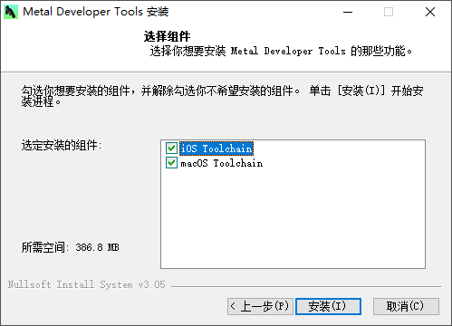
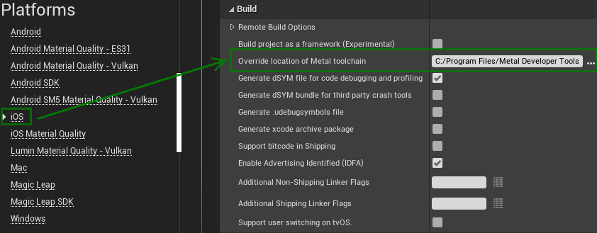

# 在 Windows 系统上构建 Metal Library

对于 Apple 系列的平台，通常需要将 Shader 编译为 Metal Library，而非烘焙为 Shader Bytecode。Metal Library 相较于 Shader Bytecode 有更多的优势，例如编译效率更高。

在4.26版本之前的引擎中，远程打包方式对于构建 Metal Library 的支持度很低。如果需要构建 Metal Library，一般的做法是完全使用 Mac 版本引擎进行打包，或者将 Shader 源文件发送至 Mac 设备上进行远程编译。两种做法在本质上是相同的，都是利用 Mac 系统的 Metal 命令行工具完成 Metal Library 的构建，而且都需要额外维护一个 Mac 版本的引擎。

从4.26版本开始，引擎增加了对于 Metal Developer Tools 的支持。Metal Developer Tools 是 Apple 发布的一个用于在 Windows 系统上构建 Metal Library 的工具，相当于是 Windows 版本的 Metal 命令行工具。利用这个工具，即便使用远程打包，也能完成 Metal Library 的构建，无需再借助 Mac 版本的引擎进行打包。

要使用 Metal Developer Tools，首先需要从 Apple 开发者官网上下载，然后传送至 Windows 设备上安装。安装时，请**确保同时安装 iOS Toolchain 和 macOS Toolchain 两个组件**，否则引擎会无法识别已安装的 Metal Developer Tools。



安装完成后，运行项目，在 `项目设置 / iOS / Build` 中找到配置项 `Override location of Metal toolchain `，填入 Metal Developer Tools 的安装目录。



或者直接在 DefaultEngine.ini 中增加以下内容，两种做法是等价的：

```
[/Script/IOSRuntimeSettings.IOSRuntimeSettings]
WindowsMetalToolchainOverride={Metal Developer Tools 安装目录}
```

配置完成后，使用 Windows 设备做远程打包时，就能自动完成 Metal Library 的构建，而不是产生 Shader Bytecode 了。


## 参考资料

+ [Metal 简介](https://developer.apple.com/metal/)

+ [Windows metal shader compilation in 4.26](https://forums.unrealengine.com/t/windows-metal-shader-compilation-in-4-26/155048)

+ [使用 Metal 命令行编译 Native Shader Library](https://developer.apple.com/documentation/metal/libraries/building_a_library_with_metal_s_command-line_tools)

+ [虚幻引擎4.26的发布说明](https://docs.unrealengine.com/en-US/WhatsNew/Builds/ReleaseNotes/4_26/index.html)

+ [将 Windows Metal Shader 编译器用于 iOS](https://docs.unrealengine.com/en-US/SharingAndReleasing/Mobile/iOS/WindowsMetalShader/index.html)
