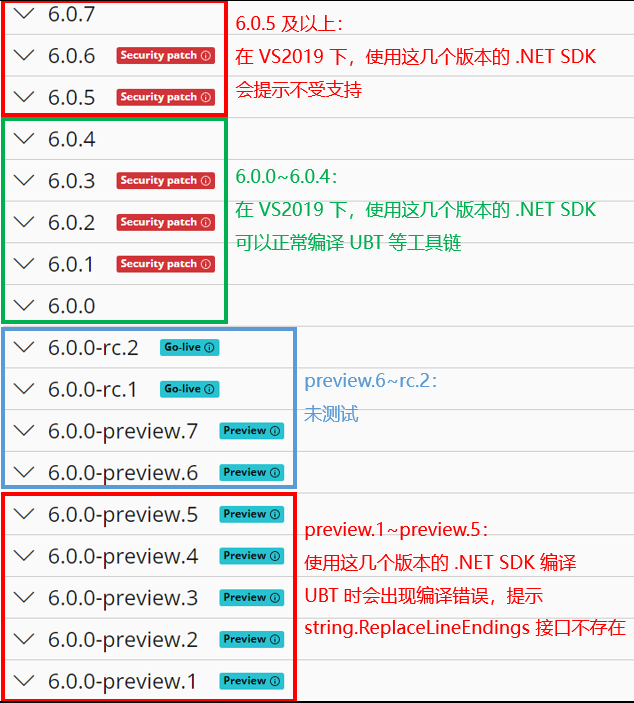

# Windows 系统 Visual Studio 的安装


## Visual Studio 2019 的安装

以下是必须安装的工作负荷和组件：

+ Visual Studio 核心编辑器

+ 使用 C\+\+ 的游戏开发

    + 【自动包含】C\+\+ 核心功能

    + 【自动包含】Windows 通用 C 运行时

    + 【自动包含】C\+\+ 2019 可再发行程序包更新

    + 【自动包含】MSVC v142 \- VS 2019 C\+\+ x64/x86 生成工具(最新)

    + 【手动包含】Windows 10 SDK (10\.0\.19041\.0)

+ 使用 C\+\+ 的桌面开发

    + 【自动包含】C\+\+ 核心桌面功能

    + 【手动包含】MSVC v142 \- VS 2019 C\+\+ x64/x86 生成工具(最新)

    + 【手动包含】Windows 10 SDK (10\.0\.19041\.0)

    + 【手动包含】MSVC v142 \- VS 2019 C\+\+ ARM64 生成工具(最新)

+ 通用 Windows 平台开发

    + 【自动包含】Blend for Visual Studio

    + 【自动包含】\.NET Native 和 \.NET Standard

    + 【自动包含】NuGet 包管理器

    + 【自动包含】通用 Windows 平台工具

    + 【自动包含】Windows 10 SDK (10\.0\.19041\.0)

+ 单个组件

    + C\# 和 Visual Basic Roslyn 编译器

    + MSBuild

    + \.NET Framework 4\.5 目标包

    + \.NET Framework 4\.6\.2 目标包

    + \.NET Framework 4\.6\.2 SDK

    + MSVC v142 \- VS 2019 C\+\+ ARM64 生成工具(最新)

备注：

+ Windows 10 SDK 的版本并不是固定的，请根据实际情况选择合适的版本

+ 以下工作负荷和组件从 UE5 开始才需要安装，在 UE4 中不需要安装：

    + 使用 C++ 的桌面开发

    + 通用 Windows 平台开发

    + .NET Framework 4.5 目标包

    + MSVC v142 - VS 2019 C++ ARM64 生成工具(最新)


## Visual Studio 2022 的安装

以下是必须安装的工作负荷和组件：

+ Visual Studio 核心编辑器

+ 使用 C++ 的游戏开发

    + 【自动包含】C\+\+ 核心功能

    + 【自动包含】Windows 通用 C 运行时

    + 【自动包含】C\+\+ 2022 可再发行程序包更新

    + 【手动包含】MSVC v143 \- VS 2022 C\+\+ x64/x86 生成工具(最新)

    + 【手动包含】Windows 11 SDK (10\.0\.22000\.0)

+ 使用 C++ 的桌面开发

    + 【自动包含】C\+\+ 核心桌面功能

    + 【手动包含】MSVC v143 \- VS 2022 C\+\+ x64/x86 生成工具(最新)

    + 【手动包含】Windows 11 SDK (10\.0\.22000\.0)

+ 通用 Windows 平台开发

    + 【自动包含】Blend for Visual Studio

    + 【自动包含】\.NET Native 和 \.NET Standard

    + 【自动包含】NuGet 包管理器

    + 【自动包含】通用 Windows 平台工具

    + 【自动包含】Windows 11 SDK (10\.0\.22000\.0)

+ \.NET 桌面开发

    + 【自动包含】\.NET 桌面开发工具

    + 【自动包含】\.NET Framework 4\.7\.2 开发工具

    + 【自动包含】C\# 和 Visual Basic

    + 【手动包含】\.NET 分析工具

    + 【手动包含】Blend for Visual Studio

    + 【手动包含】SQL Server Express 2019 LocalDB

    + 【手动包含】MSIX Packaging Tools

+ 单个组件

    + \.NET Framework 4\.6\.2 目标包

    + \.NET Framework 4\.6\.2 SDK

    + MSVC v143 \- VS 2022 C\+\+ ARM64 生成工具(最新)

    + MSVC v143 \- VS 2022 C\+\+ ARM64 生成工具(v14\.33\-17\.3)

    + MSVC v143 \- VS 2022 C\+\+ x64/x86 生成工具(v14\.33\-17\.3)

备注：

+ 如果使用 VS2022 运行 UE5\.0 的引擎或者游戏工程，还需要安装以下组件，否则在生成解决方案时就会出现错误

    + \.NET Core 3\.1 Runtime (Out of support)

+ 使用 VS2022 编译 UE5\.0 时，可能会遇到 MSB3073 错误，或者提示 UBT 错误 'Unhandled exception: Dependency file "xxx" version ("1\.2") is not supported version'；原因是 VS2022 默认安装的 MSVC 编译器版本过高；解决方法是安装一个低版本的 MSVC 编译器，在 BuildConfiguration\.xml 中进行指定，然后重新编译引擎

    可以选用以下版本的 MSVC 编译器：

    + 14\.29\.30133: MSVC v142 \- VS 2019 C\+\+ v14\.29\-16\.11

    + 14\.30\.30705: MSVC v143 \- VS 2022 C\+\+ v14\.30\-17\.0

    + 14\.31\.31103: MSVC v143 \- VS 2022 C\+\+ v14\.31\-17\.1

    BuildConfiguration\.xml 的修改如下：

    ```xml
    <?xml version="1.0" encoding="utf-8" ?>
    <Configuration xmlns="https://www.unrealengine.com/BuildConfiguration">
        <ProjectFileGenerator>
            <Format>VisualStudio2022</Format>
        </ProjectFileGenerator>
        <WindowsPlatform>
            <Compiler>VisualStudio2022</Compiler>
            <CompilerVersion>14.30.30705</CompilerVersion>
        </WindowsPlatform>
    </Configuration>
    ```


## UE5.1 和 Visual Studio 版本的选用

最适合 UE5\.1 的 VS 版本是 2022。原因是在 UE5\.1 中，UBT（UnrealBuildTool），UHT（UnrealHeaderTool）等核心工具统一使用了 \.NET SDK 6\.0 来开发，而 VS2019 对 \.NET SDK 6\.0 的支持并不好；如果将这些工具的 \.NET 目标（Target）版本改为 5\.0，改用 \.NET SDK 5\.0 编译这些工具（具体做法是在对应的 csproj 文件，例如 UnrealBuildTool\.csproj 文件中，将 `TargetFramework` 字段从 `net6.0` 改成 `net5.0`），就会导致编译错误，提示 \.NET SDK 6\.0 的 API 缺失。

VS2019 能够支持低版本的 \.NET SDK 6\.0，高版本和预览版本则不支持，测试结果如下图所示：



因此，选用 VS2019 配合 6\.0\.0 ~ 6\.0\.4 版本的 \.NET SDK，同样能够满足 UE5\.1 的正常使用。需要注意，即便安装了合适的 \.NET SDK 6\.0，使用 VS2019 打开 UE5\.sln 时仍然会有部分工具链项目无法加载（只能加载 70 个项目，而 UE5\.1 总共有 128 个项目），这就要求用户自行进入 Engine/Source/Programs 目录下，打开工具链项目的 sln 文件进行编译。而选用 VS2022 则能够正常加载所有项目，比 VS2019 更加方便。


## 参考资料

+ [UE4.27 - 设置 Visual Studio](https://docs.unrealengine.com/4.27/en-US/ProductionPipelines/DevelopmentSetup/VisualStudioSetup/)

+ [UE5.1 - 设置 Visual Studio](https://docs.unrealengine.com/5.1/en-US/setting-up-visual-studio-development-environment-for-cplusplus-projects-in-unreal-engine/)

+ [当前的 .NET SDK 不支持 .NET 6.0 的解决方法](https://stackoverflow.com/questions/72365082/the-current-net-sdk-does-not-support-targeting-net-6-0-either-target-net-5-0)

+ [UE5编译报错：Error MSB3073](https://zhuanlan.zhihu.com/p/562697309)

+ [Fatal compilation bug fix: support VS2022 *.gen.json version 1.2](https://github.com/EpicGames/UnrealEngine/pull/9067)

+ [Download .NET 6.0](https://dotnet.microsoft.com/en-us/download/dotnet/6.0)
